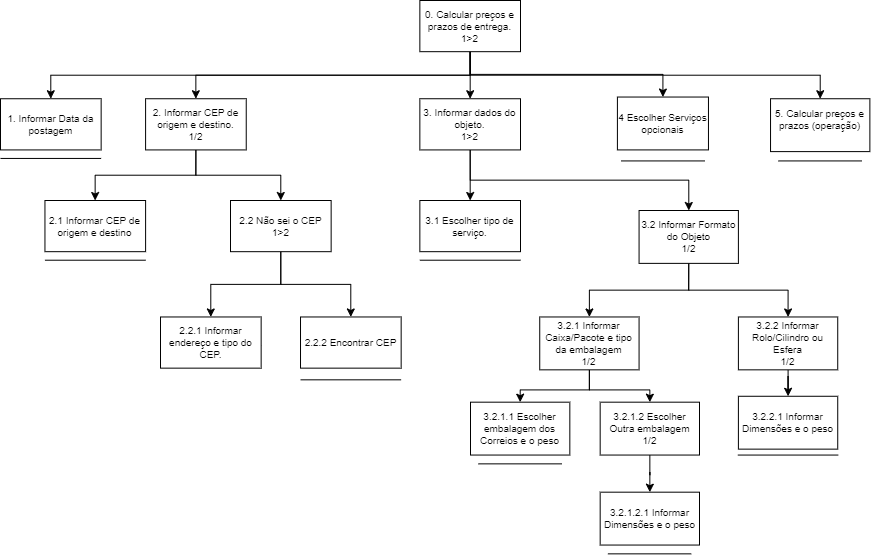
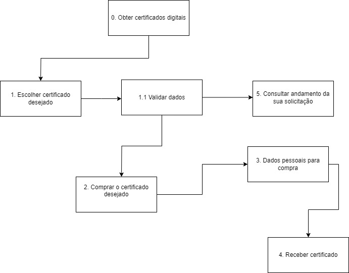
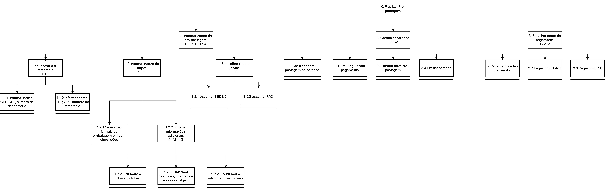
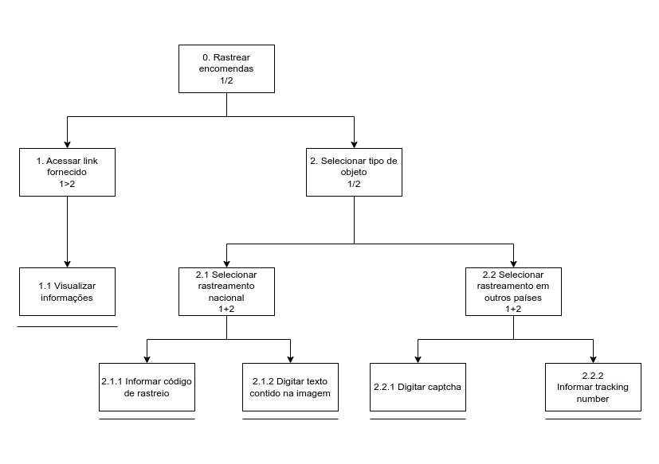

# Análise Hierárquica de Tarefas (HTA)

## Introdução
A Análise Hierárquica de Tarefas (HTA) é uma metodologia desenvolvida na década de 1960, com o intuito de compreender a execução de tarefas complexas e não repetitivas, examinando primeiramente objetivos de alto nível e os decompondo até o nível mais baixo, que é uma operação. De acordo com Barbosa et al. (2021), ao se basear na psicologia funcional, a HTA é capaz de relacionar os objetivos, motivações e consequências do que as pessoas fazem. Dessa forma, a HTA permite uma compreensão detalhada das atividades humanas, auxiliando na identificação de dificuldades e na proposição de melhorias tanto em sistemas quanto em procedimentos operacionais. Essa análise pode ser feita em forma de diagrama de hierarquia entre os objetivos ou em forma de tabela, ainda seguindo uma sequência, especificando problemas e recomendações para cada objetivo ou operação. 

## Metodologia

Nessa técnica de análise de tarefas, a análise é feita a partir de um diagrama, os elementos desse diagrama são classificados como objetivos e operações, cada objetivo pode ser dividido entre subobjetivos e outras operações. Além dos elementos, o diagrama de HTA também possui relações entre os subobjetivos. A descrição está representada na figura 1.

As relções entre os subobjetivos formam um plano, esse plano é utilizado para definiar a ordem em que os subobjetivos devem ser realizados. A descrição das ordens é definida por:

- **1>2**: Significa que os subobjetivos e operações devem ser realizados de forma sequencial, uma após o outro;
- **1/2**: Significa que deve haver uma escolha entre os subobjetivos e operações, fazendo com que o usuário realize a ação escolhida por ele;
- **1+2**: Significa que os subobjetivos e operações podem ser realizados em qualquer ordem, de forma paralela.

 Figura 1: Elementos e relações em um diagrama HTA. 

 Fonte: Barbosa e Silva, 2021. 

Na tabela 1 está descrito as tarefas analisadas pelos integrantes do grupo.

Tabela 1: Análises realizadas.

| Tarefa | Responsável |
| --- | --- |
| Calcular preços e prazos de entrega | Cláudio |
| Realizar compras na loja online | Elias |
| Emitir certificados digitais | Gabriel B. Bertolazi |
| Realizar pré-postagem | Gabriel F. J. Silva|
| Gerenciar minhas importações| Pablo |
| Rastrear encomendas | Ricardo |

Fonte: [Gabriel F. J. Silva](https://github.com/MMcLovin), 2024.

## Análise das tarefas

### 1. Calcular preços e prazos de entrega
Abaixo, na Tabela 2, temos a representação da HTA em forma de tabela e na figura 2, a HTA em forma de diagrama para a tarefa de calcular preços e prazos pelo site dos Correios.

Figura 2: HTA para calcular preços e prazos de entrega.

Fonte: [Claudio Henrique](https://github.com/claudiohsc), 2024.

Para uma melhor vizualização, abra a imagem por [aqui](../../assets/analiseHTA/HTA-precos-prazos.png).

Tabela 2: HTA em tabela para realizar cálculo de preços e prazos de entrega.

| objetivos / operações | problemas e recomendações |
| --- | --- |
| 0. Cálcular preços e prazos de entrega 1 > 2 | **input**: data da postagem, CEP, dados gerais do objeto e serviços opcionais  **plano**: preencher data da postagem, informar CEP de origem e destino, preencher dados do objeto e escolher serviços opcionais |
| 1. Informar Data da postagem |  |
| 2. Informar CEP de origem e destino 1 / 2 | **input**: CEP de origem e destino  **plano**: informar CEP de origem e destino e encontrar CEP (não sei o CEP) |
| 2.1 Informar CEP de origem e destino | |
| 2.2 Não sei o CEP 1>2 |**input**: Endereço de origem ou destino, e tipo do CEP  **plano**: Informar endereço e tipo do CEP, e encontrar o CEP   **feedback**: Abre um pop-up para encontrar o CEP com base no endereço  |
| 2.2.1 Informar endereço e tipo do CEP | |
| 2.2.2 Encontrar CEP | |
| 3. Informar dados do objeto 1>2| **input**: tipo  de serviço, formato e dimensões do objeto **plano**: escolher tipo de serviço e informar formato do objeto  **feedback**: os campos variam conforme o tipo de escolha do usuário|
| 3.1 Escolher tipo de serviço |**feedback**: novos campos de informações aparecem dependendo da escolha do serviço |
| 3.2 Informar Formato do Objeto 1/2 | **input**: selecionar caixa/pacote, rolo/cilindro ou esfera  **plano**: informar formato e tipo da embalagem  **feedback**: os campos variam conforme o tipo de escolha do usuário |
| 3.2.1 Informar Caixa/Pacote e tipo da embalagem 1/2 |**input**: selecionar caixa/pacote, tipo da embalagem e dimensões **plano**: Escolher tipo da embalagem, peso e dimensões **feedback**: os campos variam conforme o tipo de escolha do usuário|
| 3.2.1.1 Escolher embalagem dos Correios e o peso |**problema 1**: o sistema apresenta somente um peso máximo para todo tipo de embalagem **problema 2**: o sistema permite a finalização sem marcar uma embalagem gerando um valor errado **recomendação 1**: apresentar peso máximo para cada embalagem  **recomendação 2**: apresentar os campos obrigatórios |
| 3.2.1.2 Escolher Outra embalagem 1/2 | **input**: selecionar outra embalagem e informar dimensões e peso do objeto **plano**: informar as dimensões e peso do objeto **feedback**: apresenta um novo campo para inserir as dimensões e peso |
| 3.2.1.2.1 Informar dimensões e o peso | **problema 1**: o sistema não apresenta quais campos são obrigatórios **problema 2**: o sistema não trata dos mínimos e máximos permitidos no momento do input **recomendação 1**: informar quais campos são obrigatórios no início **recomendação 2**: apresentar os mínimos e máximos em tempo real |
| 3.2.2 Informar Rolo/Cilindro ou Esfera 1/2 |**input**: selecionar Rolo/Cilindro ou Esfera, informar dimensões e peso **plano**: informar dimensões e peso **feedback**: apresenta os campos necessários |
| 3.2.2.1 Informar dimensões e o peso|**problema 1**: o sistema não apresenta quais campos são obrigatórios **problema 2**: o sistema não trata dos mínimos e máximos permitidos no momento do input **recomendação 1**: informar quais campos são obrigatórios no início **recomendação 2**: apresentar os mínimos e máximos em tempo real |
| 4 Escolher Serviços opcionais | **problema**: o sistema não especifica qual o valor mínimo que pode ser declarado  **recomendação**: apresentar na descrição o valor mínimo permitido para declaração|
| 5. Calcular preços e prazos | |

Fonte: [Claudio Henrique](https://github.com/claudiohsc), 2024.

### 2. Realizar compras na loja online

Nesta tarefa o usuário deve fazer a utilização da loja online dos correios e realizar uma compra. Para esta análise foi tido como base algumas heurísticas de Nielsen como: 
Prevenção de erros, estética, design minimalista, ajuda para a recuperação de erros e controle e liberdade para o usuário.

Figura 3: Diagrama HTA da utilização da loja online.

Fonte: [Elias F. Oliveira](https://github.com/EliasOliver21), 2024.

Tabela 3: Especificação do diagrama da análise HTA .

| objetivos / operações | problemas e recomendações |
| --- | --- |
|0. Acessando Página Inicial 1>2|**feedback:** Página a ser mostrado quando o usuário acessa o site.  **Problemas:** Design, interatividade e disposição do site não é agradável e não traz uma interface simples e minimalista.|
| 1. A Loja 1+2|**feedback:**É apresentada uma breve descrição do site.|
|1.1 Descrição do Site 1+2||
|2. Cesta de Compras1+2||
|2.1 Itens adicionados a cesta/Carrinho de compras|**Input:** Selecione um produto e adicione-o ao carrinho caso não esteja logado insira um CEP válido. **feedback:** É mostrado os itens adicionados ao carrinho/cesta.  **Problemas:**Ao Fechar um pedido mas não ir até a etapa final de confirmação e retornar a página inicial o produto desaparece do carrinho de compras.|
|2.1.1 Fechar Pedido|**feedback:** O usuário é redirecionado para a finalização da compra e etapas de verificação de dados e pagamento.   **Problemas:** Ao inicar o processo de finalização de uma compra caso queira editar depois de selecionar uma opção de pagamento, mesmo não cheganda a etapa de confirmação final não é possível retornar as etapas anteriores.|
|2.1.2 Recalcular Frete|**Input:** Insira um CEP válido no campo.  **feedback:**É verificado o valor do frete com outro cep adicionado.|
|2.1.2.1 Informar e Calcular valor do frete|**Input:** Insira um Cep válido para calcular o valor da entrega.|
|2.1.2.2 Buscar Cep|**Plano:** Descobrir o CEP do usuário. **feedback:**O usuário é redirecionado para o site dos correios na página busca CEP.|
|2.1.3 Excluir Item|**Plano:**Retirar um item do carrinho de compras. **Input:**Clicar em excluir no item que deseja remover. **feedback:**Item é removido do carrinho.|
|3. Atendimento 1+2||
|3.1 Contatos de suporte ao usuário|**Plano:**Suporte ao usuário. **feedback:**É mostrado diferentes forma de contato com o suporte do correios.|
|4. Meus Dados 1+2||
|4.1 Login/Cadastro||
|4.1.1 Informações pessoais|**Plano:**Visualizar informações do cadastro. **feedback:**É apresentada as informações do usuário. **Problemas:** Não possui uma opção para sair do perfil de usuário que esta logado apenas apresentando essa opção na etapa final de fechamento de uma compra na página de cesta de compras.|
|4.1.2 Editar dados pessoais|**Plano:**Alterar dados pessoais. **Input:** O usuário deve inserir ou alterar os dados desejados e confirmar. **feedback:**É apresentado todos os dados e ao final da tela uma opção de recuperação de senha.|
|5. Buscar Produtos 1+2||
|5.1 Aplicar filtro/preferência|**Input:** Digite o nome de algum priduto que deseja visualizar e filtre o resultado caso deseje. **feedback:**É apresentado os produtos que coincidem com a pesquisa, ou caso não seja encontrado o usuário pode inserir um email e selecionar um prazo para receber uma notificação quando aquela pesquisa retorne algum produto no site. |
|5.2 Escolher Produto|**Plano:**Selecionar um produto. **Input:**Clique em um produto desejado.  **feedback:**É mostrado a descrição com nome foto e informações detalhadas sobre o produto e a opção de compra para adicionar ao carrinho.|
|5.3 Comprar Produto||

Fonte: [Elias F. Oliveira](https://github.com/EliasOliver21), 2024.

### 3. Emitir certificados digitais

Figura 4: Figura da realização do HTA da emição de certificados.

Fonte: [Gabriel B. Bertolazi](https://github.com/Bertolazi), 2024.

Tabela 4: Tabela da realização do HTA da emição de certificados.

| objetivos | operações **problema**s e recomendações |
| --- | --- |
| 0. Emitir certificados digitais | **Plano:** levar a pessoa para a escolha do certificado. |
| 1. Escolher certificado desejado | **Problemas:** Não interativo tendo que colocar duas vezes o certificado desejado. |
| 1.1 Validar dados | **Input:** Digitar CPF e clicar se tem CNH ou não. |
| 2. Comprar certificado desejado | **Input:** Clicar o certificado desejado  **Problemas:** De novo não-interativo sendo a terceira vez que tem que escolher. |
| 3. Dados pessoais para compra | **Input:** Dados pessoais para compra CEP, CPF, nome e email. |
| 4. Receber certificado | |
| 5. Consultar andamento da sua solicitação | **Input:** CPF |

Fonte: [Gabriel B. Bertolazi](https://github.com/Bertolazi), 2024.

### 4. Realizar pré-postagem

Abaixo, na Tabela 5, temos a representação da HTA em forma de tabela e na figura 5, a HTA em forma de diagrama para a tarefa de realizar uma pré-postagem pelo site dos correios.

Figura 5: HTA para realizar uma pré-postagem.

Fonte: [Gabriel F. J. Silva](https://github.com/MMcLovin), 2024.

Para uma melhor vizualização, abra a imagem por [aqui](../../assets/analiseHTA/Pre-postagemHTA.jpg).

Tabela 5: HTA em tabela para realizar uma pré-postagem.

| objetivos | operações **problema**s e recomendações |
| --- | --- |
| 0 Realizar pré-postagem 1 > 2 > 3| **input**: dados da pré-postagem e meio de pagamento  **plano**: preencher dados da pré-postagem, gerenciar o carrinho e concluir a compra |
| 1 informar dados da pré-postagem 1 + 2| **input**: dados do remetente, destinatario e objeto  **plano**: informar dados do remetente e destinatário, informar dados do objeto, escolher o tipo de serviço e adicionar a pré-postagem ao carrinho  **recomendação**: informar ao usuário quais campos são obrigatórios |
| 1.1 informar destinatario e remetente |  **input**: Nome, Email, Telefone, CEP, Endereçõ e CPF  **feedback**: os dados inseridos são salvos e disponibilizados para edição pelo usuário  **plano**: informar nome, CEP e número do remetente e destinatário |
| 1.1.1 informar dados do remetente | |
| 1.1.2 informar dados do destinatario | |
| 1.2 informar dados do objeto 1 + 2 | **input**: formato e dimensões da embalagem e informações adiconais sobre o objeto  **plano**: selecionar o tipo da embalagem (carta, caixa ou cilindro) e as respectivas dimensões |
| 1.2.1 selecionar a embalagem do objeto e inserir dimensões | |
| 1.2.2 fornecer informações adicionais (1 / 2) > 3| **plano**: Informar dados da nota fiscal ou descrição do objeto, quantidade ou valor e clicar em inserir informações  **feedback**: os campos de dimensão variam conforme o tipo de embalagem escolhida e as informações adicionais são salvas em uma tabela ao final da página  **recomendação**: avisar o usuário que é necessário clicar em "adicionar" para registrar as informações inseridas nos campos|
| 1.2.2.1 Número e chave da NF-e | |
| 1.2.2.2 Informar descrição, quantidade e valor do objeto | |
| 1.2.2.3 Confirmar e adicionar informações | |
| 1.3 Escolher o tipo do serviço 1 / 2| **plano**: escolher entre o serviço SEDEX e PAC  **feedback**: o serviço escolhido é salvo e disponibilizado para vizualização e edição pelo usuário  **recomendação**: avisar o usuário caso um dos serviços não esteja disponível na região |
| 1.3.1 Escolher SEDEX | |
| 1.3.2 Escolher PAC | |
| 1.4 Adicionar pré-postagem ao carrinho | |
| 2 Gerenciar carrinho 1 / 2 / 3| **plano**: Prosseguir com a conclusão do pagamento ou inserir uma nova pré-postagem ou editar limpar os itens do carrinho  **feedback**: a tabela de itens no carrinho é atualizada de acordo com as ações do usuário  **problema**: não é possível apagar 1 item do carrinho quando há apenas 1 item  **recomendação**: identificar e mostrar o erro de não exclusão para o usuário |
| 2.1 Prosseguir com pagamento | |
| 2.2 Inserir nova pré-postagem | |
| 2.3 Limpar carrinho | |
| 3 Escolher a forma de pagamento 1 / 2 / 3|  **input**: dados do cartão de crédito  **feedback**: a página é atualizada conforme o meio de pagamento escolhido **plano**: escolher netre pagar com cartão de crédito, boleto ou PIX  **recomendação**: caso não seja possivel selecionar uma opção em específico explicar para o usuário o motivo |
| 3.1 Pagar com cartão de crédito| |
| 3.2 Pagar com boleto| |
| 3.3 Pagar com PIX| |

Fonte: [Gabriel F. J. Silva](https://github.com/MMcLovin), 2024.

### 5. Gerenciar minhas importações

Na Tabela 6 apresentada a seguir, é possível visualizar a representação da HTA (Hierarchical Task Analysis) em formato tabular. Já na Figura 6, a mesma HTA é exibida em formato de diagrama, ilustrando o processo de gerenciar minhas importações no site dos Correios.

Figura 6: Diagrama HTA para gerenciar minhas importações.

Fonte: [Pablo S. Costa](https://github.com/pabloheika), 2024.

Tabela 6: Especificação do diagrama da análise HTA .

| Objetivos / Operações | Problemas e recomendações |
| --- | --- |
| 0. Gerenciar minhas importações 1>2>(3+4) | **plano**: Acessar o site dos correios para obter os status das importações realizadas. |
| 1. Acessar meus correios (2/3)>1 | **feedback:** Página a ser mostrado quando o usuário acessa o site.  **input**: Ir para a página específica da autenticação.  **plano**: Ter acesso a área restrita. |
| 1.1 Realizar a autenticação | **input**: Entrar com usuário e senha.  **feedback**: Encaminhado para sistema Meus Correios. |
| 1.2 Cadastrar | **input**: Entrar com dados pessoas em formulário.  **feedback**: Cadastro realizado valide seu usuário. |
| 1.3 Recuperar a senha | **input**: Entrar com meio de recuperação, documento, código de verificação e nova senha.  **plano**: Recuperar credenciais esquecidas.  **feedback**: Senha alterada com sucesso, realize o login. |
| 2. Acessar minhas importações | **feedback**: Informações importantes sobre prazos e consequências. |
| 3. Buscar importação 1/2 | **plano**: Ver o status da importação e tomar providencias. |
| 3.1 Inserir código da encomenda | **input**: Código da encomenda.  **feedback**: Importação atrelado ao usuário.  **problema:** O sistema nem sempre atrela o documento pessoal, sendo necessários realizar a mão. |
| 3.2 Selecionar importação | **feedback**: Ver status e andamentos. |
| 4. Emitir boleto | **plano**: Gerar boleto de cobrança para liberar a encomenda.   **feedback**: DIS emitido aguardando pagamento. |

Fonte: [Pablo S. Costa](https://github.com/pabloheika), 2024.

### 6. Rastrear encomendas

Figura 7: Diagrama HTA para rastreamento de encomendas.

Fonte: [Ricardo Augusto](https://github.com/avmricardo), 2024.

Tabela 7: Especificação do diagrama da análise HTA .

| Objetivos / Operações | Problemas e recomendações |
| --- | --- |
|0. Rastrear encomendas 1/2|**input**: Código de rastremanto nacional ou internacional e texto fornecido em imagem. **feedback**: Informações sobre a localização do objeto rastreado. **plano**: Acessar link fornecido **ou** navegar pelo site.|
|1. Acessar link fornecido 1>2 | |
|1.1 Visualizar informaçoes | **feedback**: Visualizar dados de posição do objeto.|
| 2. Selecionar tipo de objeto 1/2 | **input**: Ir para a página específica do objeto selecionado para rastrear. **plano**: Selecionar o tipo de rastreamento nacional ou internacional.|
|2.1 Selecionar rastreamento nacional 1+2 | **plano**: Informar código de rastreamento e digitar texto da imagem, independente da ordem.   **feedback**: Padronizar tela com cores e identidade visual do restante do site |
| 2.1.1 Informar código de rastreio | |
| 2.1.2 Digitar texto contido na imagem |  |
| 2.2 Selecionar rastreamnto em outros países 1+2 | **plano**: Digitar captcha da imagem e informar tracking number do objeto, independente da ordem.   **feedback**: Padronizar tela com cores e identidade visual do restante do site |
| 2.2.1 Digitar captcha |  |
| 2.2.2 Informar tracking number |  |

Fonte: [Ricardo Augusto](https://github.com/avmricardo), 2024.

## Bibliografia

> - 

## Histórico de Versões

| Versão | Data | Descrição | Autor(es) | Revisor(es) |
| :----: | :--: | --------- | ----------- | ------ |
| `1.0`  | 05/05/2024 | Criação do documento | [Gabriel F. J. Silva](https://github.com/MMcLovin), [Ricardo Augusto](https://www.github.com/avmricardo) |  |