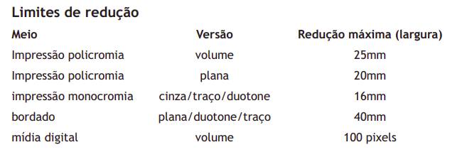
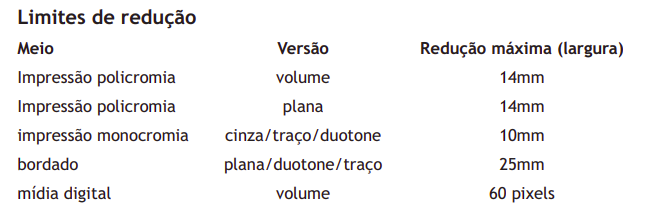
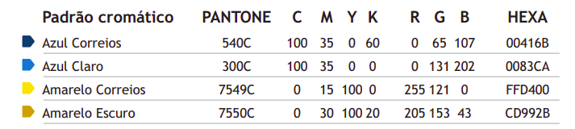

# Guia de Estilo

## Introdução

Segundo Barbosa e Silva (2021), um guia de estilo é um registro das principais decisões de design tomadas de modo que elas sejam incorporadas na versão final do produto. Este guia tem a finalidade de ser uma referência de consulta fácil e rápida, sendo também uma forma de comunicação entre a equipe de design e a equipe de desenvolvimento do projeto.

### Objetivo do Guia de Estilo

O objetivo deste guia de estilo é fornecer diretrizes e padrões que garantam consistência, usabilidade e eficiência nas interfaces digitais. Ele busca estabelecer uma linguagem visual e de interação coerente, facilitando a compreensão do sistema pelo usuário e promovendo uma experiência mais intuitiva e agradável. Além disso, um guia de estilo visa promover a identidade da marca ou produto, refletindo seus valores e princípios através de elementos visuais e de interação consistentes. Ao seguir as orientações do guia de estilo, os designers e desenvolvedores podem criar interfaces mais coesas e acessíveis, contribuindo para a satisfação e fidelização dos usuários.

### Organização e conteúdo do guia de estilo

A estrutura deste guia de estilo está sendo baseada nas definições de Marcus (1991) e Mayhew (1999). Irá ser abordado os seguintes tópicos:

- Resultados de análise;
- Elementos de interface;
- Elementos de interação;
- Elementos de ação;
- Vocabulário e padrões.

### Público-alvo do guia de estilos

Este guia de estilo foi elaborado com a finalidade de auxilar alguns grupos de pessoas, como por exemplo:

- Usuários dos correios;
- Empresas que dependem dos Correios para logística e entregas comerciais;
- Desenvolvedores do site dos correios;
- Equipe de design;
- Estudantes de Interação Humano-Computador que podem vir a consultar esse artefato futuramente.

### Como utilizar o guia de estilo

Ao seguir as diretrizes estabelecidas no guia, designers e desenvolvedores podem criar interfaces que refletem a identidade visual da marca dos Correios, enquanto atendem às necessidades e expectativas do público-alvo. Isso inclui a adoção de elementos visuais coerentes, como cores, tipografia e ícones, além de padrões de interação que promovem a navegabilidade intuitiva e o acesso rápido às funcionalidades do site. Além disso, o guia de estilo também orienta a manutenção e atualização do site, garantindo que novas funcionalidades sejam integradas de forma harmoniosa e acessível. Ao utilizar o guia de estilo, os profissionais envolvidos no desenvolvimento do site dos Correios podem assegurar uma experiência unificada e satisfatória para todos os usuários, contribuindo para a eficiência operacional e a reputação da instituição.

### Como manter o guia

Para manter o guia de estilos atualizado e eficaz, é fundamental estabelecer um processo contínuo de revisão e atualização. Isso envolve a revisão periódica das diretrizes existentes para garantir sua relevância e alinhamento com as tendências de design e as necessidades do público-alvo. Além disso, é importante incorporar feedback dos usuários e das equipes envolvidas no desenvolvimento do site, a fim de identificar áreas de melhoria e novas demandas. Manter uma documentação clara e acessível do guia de estilos também é essencial, facilitando o acesso e a compreensão por parte dos colaboradores.

## Resultado de Análise

### Descrição do ambiente de trabalho do usuário

## Elementos de interface

### Disposição espacial e grid

Os correios disponibilizam um documento que define os limites de dimensões da logo de seu site, esse logo pode ter uma assinatura horizontal ou centralizada. As figuras abaixo especificam essas definições.

Figura 1 - Representação da assinatura horizontal dos correios.

Fonte: [Correios](https://www.correios.com.br/acesso-a-informacao/institucional/arquivos/arquivo-da-marca-correios), 2024.

Figura 2 - Limites da assinatura horizontal dos correios.

Fonte: [Correios](https://www.correios.com.br/acesso-a-informacao/institucional/arquivos/arquivo-da-marca-correios), 2024.

Figura 3 - Representação da assinatura centralizada dos correios.

Fonte: [Correios](https://www.correios.com.br/acesso-a-informacao/institucional/arquivos/arquivo-da-marca-correios), 2024.

Figura 4 - Limites da assinatura centralizada dos correios.

Fonte: [Correios](https://www.correios.com.br/acesso-a-informacao/institucional/arquivos/arquivo-da-marca-correios), 2024.

### Janelas

Na figura abaixo está o link para o figma contendo prints do site dos correios das janelas de algumas funcionalidades, assim como a janela da tela inicial do site.

Figura 5 - Janelas das funcionalidades dos correios.

<iframe style="border: 1px solid rgba(0, 0, 0, 0.1);" width="800" height="450" src="https://www.figma.com/embed?embed_host=share&url=https%3A%2F%2Fwww.figma.com%2Fdesign%2F59ERkCNHvknsvOZFVYJExR%2Fguia_de_estilo%3Ft%3DDgRc9kCxhHcVEZ8C-1" allowfullscreen></iframe>

Fonte: [Ricardo Augusto](https://www.github.com/avmricardo), 2024.

### Tipografia

A tipografia do site dos correios, como fonte e tamanho, está descrita na figura abaixo. A mesma fonte é utilizada em todo o site, variando seu tamanho de acordo com o local em que o texto aparece.

Tabela 1 - Tipografia utilizada no site dos correios.

| Fonte | Size | Style |
|:-:|:-:|:-:|
| Trebuchet MS | 36px | Normal 
| Trebuchet MS | 24px | Normal 
| Trebuchet MS | 22px | Normal 
| Trebuchet MS | 17px | Normal 
| Trebuchet MS | 16px | Normal |
| Trebuchet MS | 13px | Normal 
| Trebuchet MS | 12px | Normal 

Fonte: [Ricardo Augusto](https://www.github.com/avmricardo), 2024.

### Símbolos não tipográficos

Para acessar algumas funcionalidades, o site dos correios utiliza de símbolos não tipográficos, que são elementos gráficos que não são letras, números ou caracteres, mas que têm um significado específico dentro de um contexto de comunicação. Esses elementos ajudam o usuário a encontrar as funcionalidades do site de forma efeiciente e bastante acessível, além dessas vantagens de transmissão de informações, os símbolos não tipográficos contribuem para a estética do site como um todo, eles podem ajudar a quebrar blocos de texto, criar pontos de foco e tornar a interface mais atraente e convidativa para os usuários.

Alguns símbolos não tipográficos utilizados no site dos correios são mostrados na figura 6.

Figura 6 - Símbolos não tipográficos dos correios.

Fonte: [Ricardo Augusto](https://www.github.com/avmricardo), 2024.

### Cores

As cores utilizadas no site dos correios podem ser encontradas na figura 7.

Figura 7 - Cores utilizadas no site dos correios.

Fonte: [Correios](https://www.correios.com.br/acesso-a-informacao/institucional/arquivos/arquivo-da-marca-correios), 2024.

## Elementos de interação

### Estilos de interação

No site dos Correios é oferecido uma variedade de serviços que facilitam a vida dos usuários, permitindo-lhes rastrear encomendas, enviar e receber correspondências, realizar compras, acessar soluções de logística, obter atendimento ao cliente e acesso à informação, utilizar acessos rapidos e pré-postagem .Os quais são feitos através de menus, botões, hiperlinks e campos de preenchimento (inputs).

### Seleção de um estilo

O site dos Correios adota uma paleta de cores padronizadas, o que contribui para a identidade visual da marca. No entanto, a interface apresenta uma quantidade excessiva de informações, resultando em uma aparência visualmente saturada que pode sobrecarregar os usuários. Além disso, observa-se uma falta de coesão nos designs empregados nos diversos serviços oferecidos, com variações que sugerem diferentes eras de design. Essa inconsistência pode transmitir a impressão de que algumas seções do site são obsoletas e carecem de atualização. A harmonização dos elementos visuais e a simplificação da interface seriam passos valiosos para modernizar o site e melhorar a experiência do usuário.

### Aceleradores (teclas de atalho)

Ao analisar os recursos de navegação disponíveis no site dos Correios, observa-se a citação de aceleradores de teclado que são padrão em muitos navegadores contemporâneos. Os usuários têm à disposição as combinações Ctrl - e Ctrl +, que permitem ajustar o nível de zoom da página, facilitando a leitura e a visualização do conteúdo. Esses comandos são intuitivos e amplamente utilizados, o que contribui para uma experiência de usuário familiar e eficiente.

No entanto, nota-se a ausência de atalhos de teclado específicos do site, o que poderia ser uma oportunidade de melhoria. A introdução de aceleradores personalizados poderia enriquecer a usabilidade do site, permitindo aos usuários realizar tarefas comuns de forma mais rápida e direta. 

## Elementos de ação

### Preenchimento de campos

O site dos Correios disponibiliza campos de entrada que solicitam aos usuários a inserção manual de dados. Para facilitar esse processo, muitos desses campos são acompanhados de exemplos práticos. As categorias de campos de entrada incluem inputs de pesquisa, formulários, e-mails, quantitativos, autenticação, códigos, endereços entre outros elementos que demandam inserção de texto.

### Seleção

O site dos Correios oferece um leque de opções de seleção que finalidades para áreas específicas, atendendo às suas necessidades particulares. Entre deversos aspectos a serem selecionados podemos citar localidades, tipos de produtos, modalidades de entrega, meios de comunicação, linguagem, tipo de cliente, serviços entre outros. Levando, assim, o usuário a uma parte especifica de acordo com sua necessidade.

### Ativação

O site dos Correios está equipado com uma variedade de elementos interativos que são ativados pelo usuário para realizar ações específicas. Estes incluem:

- **Botões**: Que iniciam funções ou comandos quando clicados.
- **Ícones**: Símbolos gráficos que representam programas, funções ou serviços, e respondem ao clique do usuário.
- **Imagens e Banners**: Elementos visuais que, ao serem selecionados, podem redirecionar o usuário ou exibir informações adicionais.
- **Cards**: Blocos de conteúdo que, quando ativados, revelam detalhes ou levam a páginas de interesse.
- **Menus**: Listas de opções que se expandem para navegação quando interagidos.
- **Hyperlinks**: Textos ou imagens clicáveis que conectam diretamente a outras seções do site ou a recursos externos.

Todos esses elementos são projetados para responder tanto ao toque quanto ao clique do mouse, alguns tambem respodem ao passar o mouse.

## Vocabulário e padrões

### Terminologia

A terminologia no site dos Correios é projetada para ser intuitiva e fácil de entender, mesmo para usuários que não estão familiarizados com os serviços postais. A linguagem usada é simples e direta, evitando o uso de jargões técnicos ou termos confusos. Isso ajuda a garantir que todos os usuários, independentemente de seu nível de experiência ou conhecimento, possam navegar e usar o site de maneira eficaz.

### Tipos de tela

As telas do site dos correios no geral seguem a identidade visual presente na tela inicial, o que torna o design do site consistente e coerente. Porém algumas funcionalidades que são utilizadas com frequência, como o rastreamento de encomendas e o cálculo de preços e prazos, possuem telas com um design totalmente diferente do restante do site, como pode ser visto na seção de [janelas](#janelas).

### Sequências de diálogos

As sequências de diálogos no site dos Correios são projetadas para serem intuitivas e eficientes. Elas guiam o usuário através de cada etapa de uma tarefa, fornecendo feedback adequado e confirmações ao longo do caminho.

## Bibliografia

> <a id = "REF1" href="#anchor_1"> 1.</a>  Barbosa, S. D. J.; Silva, B. S. da; Silveira, M. S.; Gasparini, I.; Darin, T.; Barbosa, G. D. J. (2021) Interação Humano-Computador e Experiência do usuário. Autopublicação. ISBN: 978-65-00-19677-1.

> <a id = "REF2" href="#anchor_2"> 2.</a>  Correios. Manual de Identidade Visual. Correios, 2019. Disponível em: <https://www.correios.com.br/acesso-a-informacao/institucional/arquivos/manual-da-marca-correios>. Acesso em: 10 maio 2024.

> <a id = "REF3" href="#anchor_3"> 3.</a>   Correios. Arquivo da Marca Correios. Disponível em: <https://www.correios.com.br/acesso-a-informacao/institucional/arquivos/arquivo-da-marca-correios>. Acesso em: 10 maio 2024.

> <a id = "REF4" href="#anchor_4"> 4.</a>   Correios. Disponível em: <https://www.correios.com.br>. Acesso em: 12 maio 2024.

## Histórico de Versão

| Versão | Data | Descrição | Autor | Revisor
| :-: | :-: | :-: | :-: | :-:
|`1.0`| 10/05/2024 | Criação do documento | [Ricardo Augusto](https://www.github.com/avmricardo) & [Pablo S. Costa](https://www.github.com/pabloheika) | 