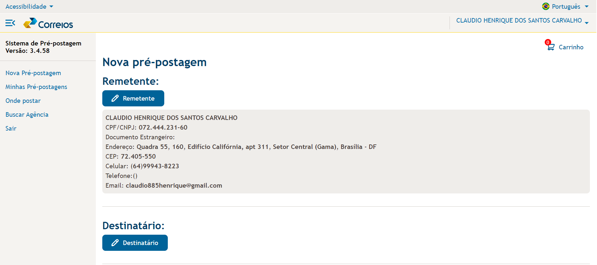
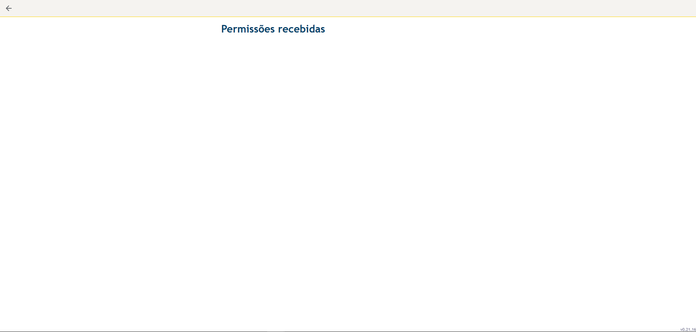
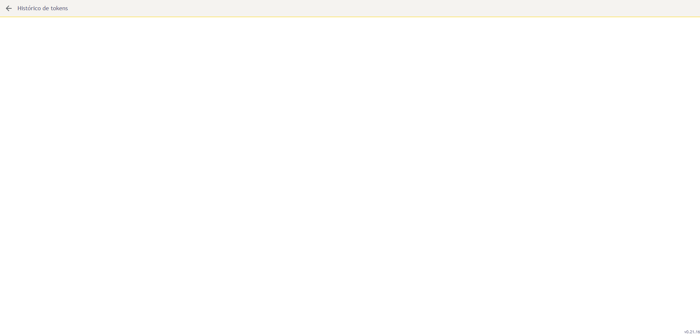

## Introdução

Os princípios gerais e diretrizes de IHC são objetivos e regras que definem um caminho a ser seguido para se obter um design de alto nível e qualidade seguindo esses objetivos que envolveram  determinado ambiente, contexto, características, usuário e realização de tarefas específicas(Mayhew, 1999).

Os princípios e diretrizes mais conhecidos são os de Norman(1988), Tognazzini(2003), Nielsen(1993) e as regras de ouro de Shneiderman(1998). Os profissionais e pesquisadores também ressaltam que os princípios e diretrizes  ão substituem as tarefas de  análise, design e avaliação. Vendo isso tem-se em consideração que os princípios apenas auxiliam a análise de requisitos e o processo de avaliação de IHC, pois há diretrizes e princípios por exemplo que são criados para ambientes de operação específicos como: Windows, MacOS e Linux, também para plataformas diferentes como Desktops e Mobile. 

De acordo com Norman(1988) os princípios e diretrizes devem proporcionar o desenvolvimento de sistemas de fácil apredizagem de uso, auxiliar o usuário a entender melhor a ralação entre as atividades e ações realizadas e as informações no mundo,

## Metodologia

Neste artefato iremos utilizar como base os princípios e diretrizes para o design de IHC, utilizando os conjuntos de diretrizes e princípios mais conhecidos de Norman(1988), Tognazzini(2003), Nielsen e as regras de ouuro de Shneiderman(1998). Será apresentado a definição de cada princípio e o não cumprimento dessa diretriz no site dos correios, mostrando a funcionalidade ou local do site que infringil a devida norma.

### Correspondência com as Expectativas dos Usuários

## Definição

De acordo com Norman(1988), levando em consideração as variáveis pisicológicas e físicas que envolvem o sistema em questão o usuário deve perceber a relação entre suas intenções e ações possíveis; perceber a ralação entre o estado atual e o que é percebido pela visão; entre o estado percebido do sistema e as vontades, intenções e expectativas dos usuários.

## Violação

Na figura 01 abaixo é possível ver no site dos correios logo na página inicial uma violação de um dos princípios de Norman descrito acima, tendo em foco o chat bot nomeado de "Carol" localizado no canto inferior direito da tela, abrindo uma aba ao clicar e mostrando uma breve descrição sobre o chat e dando opções para o usuário, mas na parte inferior dessa aba há uma caixa de texto com a descrição "Faça uma pergunta", que obviamente induz o usuário a digitar algo que precise e gere uma expectativa no mesmo de que o chat irá retorná-lo opções relacionadas com aquilo, o que não acontece pois o chat bot apenas responde as opção genéricas já pré definidas e retorna uma mesnsagem informando que não encontrou nada relacionado, mas essa mensagem é retornada para todo tipo de pergunta enviada através da caixa de texto até mesmo temas já mostrados nas opções disponíveis, mostrando a ineficiência e não correspondencia de algo que é apresentado no site.

Figura 1 - Assistente Virtual

Fonte: [Site dos Correios](https://www.correios.com.br/)

### Conteúdo Relevante e Expressão adequada

## Definição

Segundo Gride(1975) a interação polidade leva em conta quatro máximas, que são : Quantidade, qualidade, relação e modo ou clareza.

* A máxima da qualidade diz respeito ao conteúdo da informação, ou seja, se mesma possui uma fonte confiável não sendo um texto baseado em achismo e especulação;
  
* A máxima da quantidade é baseada na quantificação da informação, ou seja, se teremos um pequeno texto bem explicativo e de fácil entendimento ou um texto enorme para nos passar uma informação que não necessita de tanta explicação, Nielsen(1994c) defende o desenvlvimento dos projetos tendo uma forma estética e minimalista;
  
* A máxima da relação mostra que tudo o que for levantado no texto deve ter relação com o objetivo dos interlocutores;
  
* A máxima do modo ou clareza define que as informações do sistema devem ser objetivas e diretas evitando a prolixidade e ambiguidade.

Nielsen(1994b) mostra também sobre a máxima de quantidade que o projeto deve ser estético e minimalista, fazendo com que os textos e diálogos não contenham informações desnecessárias ou irrelevantes.

## Violação

Na Figura 02, é evidente que, ao acessar a página "receber encomendas", um usuário que procura utilizar a funcionalidade de localizar sua encomenda ou encontrar uma agência do correio para receber seu pacote se depara com informações sobre os Correios que podem não ser tão relevantes para sua necessidade imediata. Nielsen destaca a importância de uma página polida e simples, priorizando a experiência do usuário que busca uma funcionalidade específica.

Figura 2 - Conteúdo Relevante

<!-- 2ª Opção -->

Fonte: [Site dos Correios](https://www.correios.com.br/)

### Consistência e Padronização

## Definição

Com base nos princípios e diretrizes elencados por Norman(1988), um sistema deve possuir um sistema que apresente suas telas e páginas padronizadas e consistentes

Tognazzini, Nielsen e Shneiderman recomendam padronizar as ações, os resultados das ações, o layout dos
diálogos e as visualizações de informação. Ações relacionadas em situações semelhantes devem funcionar
da mesma forma.

## Violação 

// Simulação preços e prazos e pré postagem
Loja

### Equilíbrio entre Controle e Liberdade do Usuário

## Definição

Norman (1988), Nielsen (1994), Tognazzini (2014), Shneiderman (1998) e Cooper (1999) ressaltam a importância do controle do usuário. Tognazzini (2014) destaca que o usuário deve se sentir no comando para aprender e alcançar maestria, porém alerta para equilibrar isso com o excesso de opções. Norman (1988) sugere o uso de restrições para orientar o usuário na escolha correta. Tognazzini (2014) defende a flexibilidade dos caminhos de interação, priorizando o mais eficiente. A necessidade de uma saída clara e o equilíbrio entre liberdade e assistência variam conforme o perfil do usuário.

## Violação

A violação é observada quando o usuário, após fazer o login, entra na página de Pré-postagem e deseja voltar a página inicial, não consegue voltar, pois não existem setas ou botões que levem de volta para a página inicial do site.

E mesmo clicando na logo dos Correios, como mostra a figura 04, o site somente recarrega e mantém a mesma tela.

Figura 04 - Painel Pré-postagem

Fonte: [Site dos Correios](https://www.correios.com.br/)

### Visibilidade e Reconhecimento

## Definição

De acordo com Norman (1988), os designers têm a responsabilidade de criar sistemas que tornem os itens visíveis para os usuários. Isso implica que a interface deve apresentar claramente as opções disponíveis e relevantes aos interesses do usuário. Além disso, é crucial que, após o usuário realizar uma ação, o sistema forneça feedback sobre o estado atual da aplicação. Em suma, como afirmam Nielsen (1994), Shneiderman (1998) e Tognazzini (2014), o estado do sistema, os objetos, as ações e as opções devem ser mantidos atualizados e facilmente perceptíveis.

## Violação

Abaixo vemos na figura 05 ,06 e 07 que o usuário ao entrar em suas informações de login observa que existem algumas opções como: historico de tokens e permissões recebidas, que viola a diretriz de visibilidade e reconhecimento não mostrando o estado do sistema ao entrar na página. 

É observado também uma opção não muito intuitiva ao usuário para **retornar**, que é apenas uma seta pouco visível no canto superior esquerdo da tela. Outro ponto a destacar também é que o sistema não disponibiliza uma opção para o usuário retornar a página incial do site.

Figura 05 - Painel Meu Correios

Fonte: [Site dos Correios](https://www.correios.com.br/)

Figura 06 - Página de Permissões Recebidas

Fonte: [Site dos Correios](https://www.correios.com.br/)

Figura 07 - Histórico de Tokens

Fonte: [Site dos Correios](https://www.correios.com.br/)

Figura 08 - Página inicial

Fonte: [Site dos Correios](https://www.correios.com.br/)

Também na Figura 08 observamos que quando o usuário realiza o login e retorna a página inicial do site dos Correios, ele não consegue ver o estado do sistema com relação ao login, mas ao clicar novamente na opção de login ele já estará logado. Acontece na parte superior, no canto direito.

## Referências Bibliográficas

> 1. NORMAN, Don. The Psychology Of Everyday Things. Basic Books, New York, illustrated edition, 1988.

> 2. TOGNAZZINI, Bruce. First Principles of Interaction Design (Revised & Expanded), 2014.

> 3. COOPER, Alan. The Inmates Are Running the Asylum: Why High Tech Products Drive Us Crazy and How to Restore the Sanity (2nd Edition). Sams Publishing, 1999.

> 4. REEVES, Byron e NASS, Clifford. The Media Equation: How People Treat Computers, Television, and New Media Like Real People and Places. Cambridge University Press/CSLI, Stanford, Calif, new edition, 1996.

## Bibliografia

> 1. Barbosa, S. D. J.; Silva, B. S. da; Silveira, M. S.; Gasparini, I.; Darin, T.; Barbosa, G. D. J. (2021) Interação Humano-Computador e Experiência do usuário. Autopublicação. ISBN: 978-65-00-19677-1. 

## Histórico de Versões

| Versão | Data | Descrição | Autor(es) | Revisor(es) |
| :----: | :--: | --------- | ----------- | ------ |
| `1.0`  | 20/04/2024 | Criação do documento | [Elias F. Oliveira](https://github.com/EliasOliver21) e [Claudio Henrique](https://github.com/claudiohsc)| |