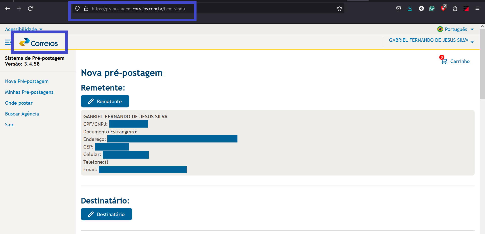

# Metas de Usabilidade

## Introdução

É na fase da análise de requisitos que são estabelecidas as metas de usabilidade, levando em consideração os artefatos produzidos anteriormente (Perfil do Usuário, Análise de Tarefas e Princípios Gerais do Projeto), metas essas que servirão como guia para as 3 próximas partes da fase de design (Barbosa et. al, 2021).

Metas de usabilidade se referem a garantir que um produto seja fácil de aprender, eficaz de se usar e agradável a partir da perspectiva de um usuário (Rogers et. al, 2023). Para ajudar a identificar os principais objetivos de se desenvolver um produto interativo, Rogers et. al, (2023) sugere identificar os fatores em termos de metas de usabilidade e metas de experiência do usuário. Enquanto as metas de usabilidade se concentram em critérios específicos como eficiência e segurança, as metas de experiência do usuário buscam elucidar aspectos subjetivos, como a estética e a satisfação. Essas metas não são facilmente diferenciadas entre si, mas é essencial considerá-las como uma só durante o processo de design.

## Metodologia

Seguindo a estrutura proposta por Rogers et. al, (2023), as nossas metas de usabilidade estão separadas em 7 objetivos: eficácia, eficiência, segurança, utilidade, aprendizagem, memorização e satisfação. Para cada meta nós apresentamos uma breve descrição e tanto uma pergunta, que permite analisar de maneira mais concreta o objetivo da respectiva meta, quanto um exemplo, quando aplicável, no próprio site escolhido.

## Metas Estabelecidas

### 1. Eficácia
Se refere a uma meta mais geral, analisando o quão bom o produto é em fazer aquilo que se propõem

**Pergunta:** O site permite que os usuários realizem as principais tarefas relacionadas aos Correios (descritas no [perfil do usuário](https://interacao-humano-computador.github.io/2024.1-Correios/analise_de_requisitos/perfil_de_usuario/perfil_de_usuario/)) de forma precisa e completa, atingindo seus objetivos sem dificuldades?

**No sistema:** no geral, com base nas respostas do questionário e entrevistas com o usuário, o sistema atende bem as necessidades dos usuários, que cumprem seus objetivos com facilidade, porém, foi ressaltada a necessidade de possuir uma interface mais minimalista e mais intuitiva.

### 2. Eficiência
Trata-se de oferecer meios para os usuários realizarem tarefas de maneira rápida e com o mínimo de esforço, otimizando tempo e recursos

**Pergunta:** O sistema salva informações, do usuário, que são recorrentemente solicitadas?

**No sistema:** atualmente, o site já disponibiliza meios para autocompletar alguns campos recorrentes como, por exemplo, salvar informações de pagamento, visto na figura 01, e o endereço principal do usuário é usado para o preenchimento do campo de remetente ao realizar uma pré-postagem, como visto na figura 02, porém, essa funcionalidade poderia ser estendida para permitir que o usuário escolha entre um de seus endereços já cadastrados e também permitir o cadastramento de destinatários recorrentes.

Figura 01: Tela de pagamento de uma pré-postagem.

Fonte: [Correios](https://www.correios.com.br/),
2024.

Figura 02: Tela do campo do destinatário ao realizar uma pré-postagem.

Fonte: [Correios](https://www.correios.com.br/),
2024.

### 3. Segurança
Se refere a proteger os usuários de condições perigosas e situações indesejáveis. Isso inclui prevenir erros graves ao reduzir o risco de ativação acidental de funções perigosas e fornecer mecanismos de recuperação.

**Pergunta:** Há meios que previnem erros graves pelo uso da confirmação de ações? São proporcionados mecanismos de reversão de ações durante a navegação?

**No sistema:** em diversas partes do sistema estão presentes caixas de diálogos que previnem eventuais ações indesejadas por parte do usuário em ações importantes como, por exemplo, excluir itens do carrinho e definir meios de pagamento, que possuem caixas de diálogo que explicitam o que será feito e pedem a confirmação do usuário. Quanto a reversão de ações no sistema, foi observado durante a navegação que para certas funcionalidades, o sistema nos leva à uma espécie de portal específico, o que dificulta a ação de retornar à página inicial dos Correios, situação visível na figura 03, em que ao clicar na logo dos Correios, ocorre que apenas o recarregamento da página atual, ao invés do esperado, que seria voltar à página inicial.  

Figura 03: Tela do campo do destinatário ao realizar uma pré-postagem.

Fonte: [Correios](https://www.correios.com.br/),
2024.

### 4. Utilidade
Diz respeito a até que ponto o sistema fornece as funcionalidades certas para que os usuários façam o que precisam/querem.

**Pergunta:** O site dos Correios oferece as funcionalidades necessárias para que os usuários realizem suas atividades e tenham acesso à informações úteis e relevantes? 

**No sistema:** com base nos dados coletados durante a construção do [perfil do usuário](https://interacao-humano-computador.github.io/2024.1-Correios/analise_de_requisitos/perfil_de_usuario/perfil_de_usuario/), o sistema já oferece as funcionalidade e todas as informações necessárias, sendo relatado que a disposição e quantidade de funcionalidades e informações podem ser otimizadas.

## Bibliografia
> 1. Barbosa, S. D. J.; Silva, B. S. da; Silveira, M. S.; Gasparini, I.; Darin, T.; Barbosa, G. D. J. (2021) Interação Humano-Computador e Experiência do usuário. Autopublicação. ISBN: 978-65-00-19677-1.
> 2. ROGERS HELEN SHARP, J. P. Y. Interaction Design: Beyond Human-Computer
Interaction. 6. ed. John Wiley Sons, 2023. (Praise for Interaction Design).
ISBN 9781119901099; 111990109X. Disponível em: [Interaction Design: Beyond Human-Computer Interaction, 6th Edition](https://www.wiley.com/en-us/Interaction+Design%3A+Beyond+Human-Computer+Interaction%2C+6th+Edition-p-9781119901099)
> 3. Domínio Público. Metas de usabilidade. Repositório do Grupo Domínio Público da disciplina de Interação Humano Computador da Universidade de Brasília, 2023. Disponível em: https://interacao-humano-computador.github.io/2023.2-Dominio-Publico/analise_de_requisitos/metas_de_usabilidade/. Acesso em: 12 de maio 2024.

## Referências Bibliográficas
> 1. Barbosa, S. D. J.; Silva, B. S. da; Silveira, M. S.; Gasparini, I.; Darin, T.; Barbosa, G. D. J. (2021) Interação Humano-Computador e Experiência do usuário. Autopublicação. ISBN: 978-65-00-19677-1.
> 2. ROGERS HELEN SHARP, J. P. Y. Interaction Design: Beyond Human-Computer
Interaction. 6. ed. John Wiley Sons, 2023. (Praise for Interaction Design).
ISBN 9781119901099; 111990109X. Disponível em: [Interaction Design: Beyond Human-Computer Interaction, 6th Edition](https://www.wiley.com/en-us/Interaction+Design%3A+Beyond+Human-Computer+Interaction%2C+6th+Edition-p-9781119901099)

## Histórico de Versões

| Versão | Data | Descrição | Autor(es) | Revisor(es) |
| :----: | :--: | --------- | ----------- | ------ |
| `1.0`  | 12/05/2024 | Criação do documento | [Gabriel F. J. Silva](GabrielfGH) |  |

[GabrielfGH]: https://github.com/MMcLovin
[GabrielbGH]: https://github.com/https://github.com/Bertolazi
[ClaudioGH]: https://github.com/claudiohsc
[EliasGH]: https://www.github.com/EliasOliver21
[PabloGH]: https://github.com/pabloheika
[RicardoGH]: https://www.github.com/avmricardo

