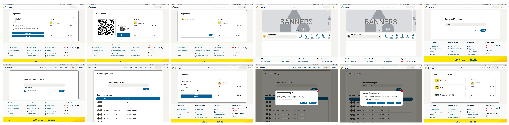

# Relato da Avaliação so Prototip de Alta Fidelidade das Minhas Importações

## Introdução

Este artefato contém o relato dos resultados obtidos na sessão de observação do protótipo de alta fidelidade produzido por [Pablo S. Costa][PabloGH], que tem como foco a funcionalidade de realizar uma simulação de envio de encomendas e ter como resultado preços e prazos de envio. Ele servirá para certificar que as informações principais e de extrema importância para o projeto sejam exploradas e representadas de forma clara e ordenada, auxiliando na compreensão dos dados e informações coletadas nas análises para se obter o melhor uso dessas, assim trazendo melhorias para o projeto.

## Metodologia

Este artefato leva como base alguns tópicos elecandos no livro IHC por Barbosa e Silva(2021, p.303), para estruturar esse relato dos resultados da análise do protótipo de alta fidelidade e também leva em consideração o artefato do planejamento da análise. Os tópicos a serem desenvolvidos neste artefato são:

- Objetivos da avaliação;
- Metodologia da prototipação
- Número e perfil dos avaliadores e participantes
- Tarefas executadas pelos participantes
- Lista de Problemas encontrados.

## Objetivos da avaliação

Os objetivos desse artefato, conforme estabelecido no planejamento da avaliação, são:

1. Analisar apropriação da tecnologia
2. Comparar ideias alternativas de design
3. Identificar problemas na interação e interface

## Metodologia da prototipação

O método de avaliação que será utilizado será o de teste de usabilidade através do protótipo de alta fidelidade, com um questionário para o usuário e um para ser respondido com base nas ações do usuário ao utilizar e avaliar o protótipo. Nas Tabelas 2, 4 e 4, respectivamente, estão as perguntas pré teste, perguntas para identificar as impressões e opiniões que o usuário obteve ao utilizar o protótipo, e também se a utilização do protótipo pelo participante se dá de maneira correta cumprindo com os objetivos propostos.

### Protótipo

Abaixo nas figuras 1 e 2 temos as telas dos protótipos e o protótipo em si.

Figura 1 - Telas do protótipo de alta fidelidade.

Fonte: [Pablo S. Costa][PabloGH], 2024.

[Link para as telas do protótipo de alta fidelidade.](../../../../assets/prototipo/pablo/minhasimportacoes.pdf)

Figura 2 - Protótipo de alta fidelidade.

<iframe style="border: 1px solid rgba(0, 0, 0, 0.1);" width="800" height="450" src="https://www.figma.com/embed?embed_host=share&url=https%3A%2F%2Fwww.figma.com%2Fproto%2FEvmhs4yV6im7tc4zwjNC7S%2FSite-Correios---minhas-importa%25C3%25A7%25C3%25B5es%3Fnode-id%3D6402-3060%26t%3D0moSeqIHY0AysZVh-1%26scaling%3Dcontain%26content-scaling%3Dfixed%26page-id%3D0%253A1" allowfullscreen></iframe>

Fonte: [Pablo S. Costa][PabloGH], 2024.

[Backup do protótipo de alta fidelidade.](../../../../assets/prototipo/pablo/minhasimportacoes.fig)

## Número e perfil dos avaliadores e participantes

Na tabela 4, temos a tarefa a ser avaliada, os participantes e seus papéis e a data do teste de usabilidade.
Na escolha dos participantes o primeiro Diego Medeiros foi escolhido de acordo com a disponibilidade e aptidão em usar o Minhas importações, por ser influenciador digital e ter diversos patrocínios de recebidos internacionais, o que o faz ter um constante uso da plataforma mesmo. A escolha da segunda usuário é por ser uma representante feminina de um grupo majoritariamente masculino, e se encaixar ao perfil de usuário recomendado e ter disponibilidade. O terceiro usuário Matheus foi escolhido por sua grande aptidão tecnológica e bastante reconhecimento da plataforma dos Correios, sendo professor e também empresário de um Clube de beach Tennis. A escolha do último usuário Wirley foi por se encaixar no perfil de usuário e ter se disponibilizado por participar.

Tabela 4 - Cronograma executado da realização das entrevistas do protótipo de alta fidelidade.

| Tarefa | Entrevistador | Entrevistado | Horário | Data | Local | 
| :----- | :-----------: | :----------: | :-----: |:----:| :----:| 
| **Gerenciar Minhas Imprtações** | [Pablo S. Costa][PabloGH] | Diego Medeiros - 34 anos | 16:30 - 16:42 | 01/07/2024  | Estudio do entrevistado |
| **Gerenciar Minhas Imprtações** | [Pablo S. Costa][PabloGH] | Heloisa Lima - 27 anos| 17:00 - 17:11 | 03/07/2024  | Domicilio |
| **Gerenciar Minhas Imprtações** | [Pablo S. Costa][PabloGH] | Matheus Wesley - 29 Anos | 20:30 - 21:00 | 03/07/2024  | Domicilio |
| **Gerenciar Minhas Imprtações** | [Pablo S. Costa][PabloGH] | Wirley Israel - 19 Anos | 22:00 - 22:15 | 03/07/2024  | Domicilio |

Fonte: [Pablo S. Costa][PabloGH], 2024.

## Gravações

Abaixo temos as gravações das entrevistas realizadas que estão no vídeos 1, 2 e 3.

Vídeo 1 - Entrevista do protótipo de alta fidelidade com o usuário Diego Medeiros dos Santos.

<iframe width="560" height="315" src="https://www.youtube.com/embed/twrhpYAhi_E?si=fJWL4j-7dDNgJ22u" title="YouTube video player" frameborder="0" allow="accelerometer; autoplay; clipboard-write; encrypted-media; gyroscope; picture-in-picture; web-share" referrerpolicy="strict-origin-when-cross-origin" allowfullscreen></iframe>

Fonte: [Pablo S. Costa][PabloGH], 2024.

    <a href="https://youtu.be/twrhpYAhi_E?si=fJWL4j-7dDNgJ22u"> Link para o vídeo </a>

Vídeo 2 - Entrevista do protótipo de alta fidelidade com o usuário Heloisa Lima.

<iframe width="560" height="315" src="https://www.youtube.com/embed/b93-PsdzLuo?si=vvnjPhTPVzCGAkZ2" title="YouTube video player" frameborder="0" allow="accelerometer; autoplay; clipboard-write; encrypted-media; gyroscope; picture-in-picture; web-share" referrerpolicy="strict-origin-when-cross-origin" allowfullscreen></iframe>

Fonte: [Pablo S. Costa][PabloGH], 2024.

    <a href="https://youtu.be/b93-PsdzLuo?si=vvnjPhTPVzCGAkZ2"> Link para o vídeo </a>

Vídeo 3 - Entrevista do protótipo de alta fidelidade com o usuário Matheus.

<iframe width="560" height="315" src="https://www.youtube.com/embed/b10SL1mjrms?si=mqld_woXxMuwoYVG" title="YouTube video player" frameborder="0" allow="accelerometer; autoplay; clipboard-write; encrypted-media; gyroscope; picture-in-picture; web-share" referrerpolicy="strict-origin-when-cross-origin" allowfullscreen></iframe>

Fonte: [Pablo S. Costa][PabloGH], 2024.

    <a href="https://youtu.be/b10SL1mjrms?si=mqld_woXxMuwoYVG"> Link para o vídeo </a>

Vídeo 4 - Entrevista do protótipo de alta fidelidade com o usuário Wirley.

<iframe width="560" height="315" src="https://www.youtube.com/embed/AyyX5xo1JfU?si=wz3wZ4lAVD9j6-WE" title="YouTube video player" frameborder="0" allow="accelerometer; autoplay; clipboard-write; encrypted-media; gyroscope; picture-in-picture; web-share" referrerpolicy="strict-origin-when-cross-origin" allowfullscreen></iframe>

Fonte: [Pablo S. Costa][PabloGH], 2024.

    <a href="https://youtu.be/AyyX5xo1JfU?si=wz3wZ4lAVD9j6-WE"> Link para o vídeo </a>

### Respstas

Tabela 2 - Perguntas do questionário pré-teste.

| ID | Pergunta | Diego | Heloisa | Matheus | Wirley  |
| --- | --- | --- | --- | --- | --- |
| **1** | Qual o seu nome completo? | Diego Medeiros dos Santos | Heloísa Lima | Matheus Wesley Santana Lima | Wirley Israel Apolônio de Oliveira |
| **2** | Qual a sua idade? | 34 anos | 27 anos | 29 anos | 19 anos |
| **3** | Qual a sua ocupação? | Influenciador digital | Empresária | Professor de beach Tennis | Empresário |
| **4** | Você descreveria seu grau de experiência e facilidade em utilizar artefatos tecnologicos em "Muito boa", "Boa", "Média", "Ruim", "Muito ruim" | Boa | Muito boa | Muito boa | Boa |

Fonte: [Pablo S. Costa][PabloGH], 2024

Tabela 3 - Perguntas do questionário para o usuário pós-teste.

| ID | Pergunta | Diego | Heloisa | Matheus | Wirley |
| --- | --- | --- | --- | --- | --- |
| **1** | Como você avalia o design apresentado no protótipo?(péssimo, ruim, médio, bom, ótimo) | Bom | Ótimo | Ótimo | Otimo |
| **2** | Você acredita que a disposição dos itens e elementos na tela está bem organizada e de fácil visualização? | Sim. | Está fácil de visualizar e bem organizado | Sim | Sim |
| **3** | Você teve obstáculos ao realizar alguma ação na aplicação ou ao utilizar a funcionalidade proposta? | Não | Não | Não | Não |
| **4** | Foi encontrado alguma falha durante o uso da funcionalidade apresentada? | Não | Não | Não | Não |
| **5** | As tarefas mostradas são plauzíveis e representam bem a realidade? | Sim | Sim | Sim | Sim |
| **5** | Você sugere alguma mudança no design da interface ou nas funcionalidades apresentadas? | Não, Não. | Não está ótimo. | Não | Não |

Fonte: [Pablo S. Costa][PabloGH], 2024

Tabela 4 - Perguntas do questionário pós-teste.

| ID | Pergunta | Diego | Heloisa | Matheus | Wirley |
| --- | --- | --- | --- | --- | --- |
| **1** | O usuário utilizou de forma correta a funcionalidade? | Sim | Sim | Sim | Sim |
| **2** | Foram atingidos os objetivos principais do participante ao testar o protótipo? | Sim | Sim | Sim | Sim |
| **3** | O usuário teve obstáculos para concluir a tarefa proposta? Se sim quais foram? | Não houve obstaculos. | Não houve obstaculos. | Não houve obstaculos. | Não houve obstaculos. |
| **4** | Em quais partes do sistema esses problemas e obstáculos são encontrados? E com qual frequência ocorrem? | Não se aplica. | Não se aplica. | Não se aplica. | Não se aplica. |
| **5** | O usuário requereu auxílio para compreender alguma parte da interface ou para realizar alguma ação? Se sim quantas vezes? | Não precisou. | Não precisou. | Não precisou. | Não precisou. |

Fonte: [Pablo S. Costa][PabloGH], 2024

## Lista de Problemas de usabilidade corrigidos

Abaixo temos a tabela 5 com os problemas de usabilidades encontados ao usar o Minhas Importações e que nesse prototipo ja foram corrijidos antes da avaliação.

Tabela 5 - Lista de Problemas de usabilidade corrigidos.

| **Local onde ocorreu** | **Fatores de Usabilidade Prejudicados** | **Descrição e Justificativa do Problema** | **Correção Realizada no Protótipo** | **Indicação se o Problema Voltou a Ocorrer Depois da Correção** |
| --- | --- | --- | --- | --- |
| Tela inicial | Estética e design minimalista | A página inicial contém muitas informações a deixando poluída e carregada, indo contra as estéticas e design minimalista. | Sim | Não |
| Todo o site | Consistências e padrões | Todo site dos Correios há uma alternância de tecnologias, padrões de design, cores e estruturas de forma inconsistente e despadronizarda. | Sim | Não |
| Login | Prevenção de erros | Na realização de login, existe áreas de logins para serviços providos pelos Correios separados em diversas partes da plataforma. Causando uma confusão no momento em que o usuário realiza sua autenticação já que um mesmo usuário dos Correios tem diversos logins diversas senhas e serviços. | Sim | Não |
| Meus Correios | Estética e design minimalista | Ao acessar a área restrita meus Correios são disponibilizados as informações de conta do usuário prejudicando a estética de design minimalista, visto que esta página tem a finalidade de disponibilizar os serviços dos Correios. | Sim | Não |
| Minhas Importações | Estética e design minimalista | A estruturação e exibição na tela principal e nas posteriores em minhas importações são poluídas visivelmente indo contra a estética de design minimalista. | Sim | Não |
| Todo o site | Ajuda no reconhecimento, diagnóstico e correção de erros. | Durante o acesso há uma inconsistência nos padrões de Acessibilidade causando uma confusão sobre quais as funcionalidades disponíveis em seus diversos serviços, quais as linguagens disponíveis, tutoriais e menus de ajudas disponíveis | Sim | Não |

Fonte: [Pablo S. Costa ][PabloGH], 2024

## Lista de Problemas de usabilidade não corrigidos

Com base nos dados obtidos pelas as entrevistas, não há outros problemas de usabilidade para se reportar após a validação. disto isso com o presente resultado não se faz necessidade de reprojeto.

## Bibliografia

> 1. Barbosa, S. D. J.; Silva, B. S. da; Silveira, M. S.; Gasparini, I.; Darin, T.; Barbosa, G. D. J. (2021) Interação Humano-Computador e Experiência do usuário. Autopublicação. ISBN: 978-65-00-19677-1. 

## Histórico de Versão

| Versão | Data | Descrição | Autor | Revisor
|:-:|:-:|:-:|:-:|:-:|
|`1.0`| 03/07/2024 | Criação do documento| [Pablo S. Costa][PabloGH] | [Ricardo Augusto][RicardoGH] |

[GabrielFGH]: https://github.com/MMcLovin
[GabrielBGH]: https://github.com/https://github.com/Bertolazi
[ClaudioGH]: https://github.com/claudiohsc
[EliasGH]: https://www.github.com/EliasOliver21
[PabloGH]: https://github.com/pabloheika
[RicardoGH]: https://www.github.com/avmricardo
