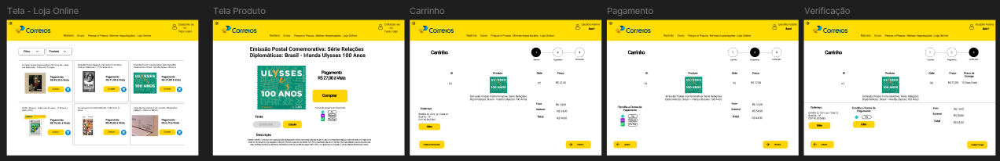

## Introdução

Este documento tem como objetivo validar o protótipo de alta fidelidade feito pelo integrante [Elias F. Oliveira][EliasGH], que tem como foco representar a loja online dos correios e suas repectivas funcionalidades, como: busca, filtragem  e compra de produtos. Esse documento utiliza como base o artefato de planejamento para o relato, mostrando abaixo todos os dados e informações importantes coletadas nas entrevistas realizadas.

## Metodologia

Este artefato leva como base alguns tópicos elecandos no livro IHC por Barbosa e Silva(2021, p.303), para estruturar o relato dos resultados da análise do protótipo de alta fidelidade e também leva em consideração o artefato do planejamento da análise. Os tópicos a serem desenvolvidos pela equipe são:

- Objetivos da avaliação;
- Metodologia da prototipação
- Número e perfil dos avaliadores e participantes
- Tarefas executadas pelos participantes
- Lista de Problemas encontrados.

## Objetivos da avaliação

Os objetivos desse artefato, conforme estabelecido no planejamento da avaliação, são:

1. Analisar apropriação da tecnologia
2. Comparar ideias alternativas de design
3. Identificar problemas na interação e interface

## Metodologia da prototipação

O método de avaliação que será utilizado será o de teste de usabilidade através do protótipo de alta fidelidade, com um questionário para o usuário e um para ser respondido com base nas ações do usuário ao utilizar e avaliar o protótipo. Abaixo temos o script das ações que o usuário deveria realizar utilizando o protótipo, mas podendo realizar ações não previstas no nele:

- Filtrar os itens da Loja;
- Entrar na tela de um produto e verificar sua descrição;
- Realizar a compra de um produto.

## Número e perfil dos avaliadores e participantes

Na tabela 1, temos tanto as tarefas a serem avaliadas quanto os participantes, e seus papeis, das sessões do teste de usabilidade.

Tabela 1 - Número e perfil dos participantes da entrevista.

| Tarefa | Entrevistador | Entrevistado | Idade |Ocupação | Horário | Data | Local | 
| :----- | :-----------: | :----------: | :-----: |:-----: | :-----: |:----:| :----:| 
| **Realizar compras na loja online** | [Elias F. Oliveira][EliasGH] | Renato Medeiros | 28 anos | Graduando em Engenharia Aeroespacial na Unb |13:00 - 13:10 | 02/07/2024 | UnB-FGA| 
| **Realizar compras na loja online** | [Elias F. Oliveira][EliasGH] | Marcos Antônio| 20 anos | Estudante |13:10 - 13:20 | 02/07/2024 | UnB-FGA| 
| **Realizar compras na loja online** | [Elias F. Oliveira][EliasGH] | João Eduardo | 24 anos | Graduando em Engenharia de Software na Unb e Trabalha na área de T.I  | 15:30 - 15:40 | 02/07/2024 | UnB-FGA| 
| **Realizar compras na loja online** | [Elias F. Oliveira][EliasGH] | Daniel | 21 anos | Graduando em Engenharia de Software na Unb e membro do Ai-Lab | 15:40 - 15:50 | 02/07/2024 | UnB-FGA| 

Fonte: [Elias F. Oliveira][EliasGH], 2024.

## Protótipo de Alta Fidelidade

Abaixo na figura 01 é mostrado o protótipo de alta fidelidade e logo abaixo temos o protótipo direto com a ferramenta figma.

Figura 01: Protótipo de Alta Fidelidade

Fonte: [Elias F. Oliveira][EliasGH]

Protótipo de Alta fidelidade

<iframe style="border: 1px solid rgba(0, 0, 0, 0.1);" width="800" height="450" src="https://www.figma.com/embed?embed_host=share&url=https%3A%2F%2Fwww.figma.com%2Fdesign%2Fa0P9XJF8KBQ8ywJWyFeuJb%2FProt%25C3%25B3tipo-de-Alta-FIdelidade-Correios---IHC%3Fnode-id%3D0-1%26t%3DON3TkUTgDYKHROOJ-1" allowfullscreen></iframe>

Fonte: [Elias F. Oliveira][EliasGH]

## Gravações das Avaliações do Protótipo

=== "Gravação 01 - Entrevistado: Renato Medeiros"

   
    
Vídeo 1 - Entrevista do protótipo de alta fidelidade com o usuário Renato Medeiros.

    

        <iframe width="560" height="315" src="https://www.youtube.com/embed/hR0K_-JOL_A" title="YouTube video player" frameborder="0" allow="accelerometer; autoplay; clipboard-write; encrypted-media; gyroscope; picture-in-picture; web-share" referrerpolicy="strict-origin-when-cross-origin" allowfullscreen></iframe>
    

    
Fonte: [Elias F. Oliveira][EliasGH], 2024

    
[Link direto para o vídeo](https://www.youtube.com/watch?v=hR0K_-JOL_A)

    

    
Tabela 2 - Perguntas do questionário para o usuário pós-teste.

    

    | ID | Pergunta | Resposta|
    | :-:| -------- |-------- |
    | **1** | Como você avalia o design apresentado no protótipo?(péssimo, ruim, médio, bom, ótimo) | Ótimo, pelo protótipo ser bem fidedigno a um site de comprar comum. |
    | **2** | Você acredita que a disposição dos itens e elementos na tela está bem organizada e de fácil visualização? | Sim, pois o protótipo apresenta os elementos de maneira a ter uma fácil visualização das opções |
    | **3** | Você teve obstáculos ao realizar alguma ação na aplicação ou ao utilizar a funcionalidade proposta? | Sim, o usuário se despercebeu não visualizando o filtro logo de início. |
    | **4** | Foi encontrado alguma falha durante o uso da funcionalidade apresentada? | Não, tudo conforme o esperado. |
    | **5** | As tarefas mostradas são plauzíveis e representam bem a realidade? | Sim, pois o protótipo apresenta uma estrutura fidedigna aos sites de compra encontrados atualmente. |
    | **5** | Você sugere alguma mudança no design da interface ou nas funcionalidades apresentadas? | O usuário sugeriu a inclusão de uma função pára poder aumentar ou diminuir a fonte dos textos no site.  |

    OBS: O usuário gostou bastante da opção de filtragem implementada no site, pela economia de tempo que ele terá ao buscar algum produto no site.

    

    
Fonte: [Elias F. Oliveira][EliasGH], 2024

=== "Gravação 02 Entrevistado: Marcos Antônio"

    
Vídeo 2 - Entrevista do protótipo de alta fidelidade com o usuário Marcos Antônio.

     

    <iframe width="560" height="315" src="https://www.youtube.com/embed/ejdxy_wD0Us" title="YouTube video player" frameborder="0" allow="accelerometer; autoplay; clipboard-write; encrypted-media; gyroscope; picture-in-picture; web-share" referrerpolicy="strict-origin-when-cross-origin" allowfullscreen></iframe>
    

    
Fonte: [Elias F. Oliveira][EliasGH], 2024

    
    
[Link direto para o vídeo](https://www.youtube.com/watch?v=ejdxy_wD0Us)

    
Tabela 3 - Perguntas do questionário para o usuário pós-teste.

    

    | ID | Pergunta | Resposta|
    | :-:| -------- |-------- |
    | **1** | Como você avalia o design apresentado no protótipo?(péssimo, ruim, médio, bom, ótimo) | Ótimo. |
    | **2** | Você acredita que a disposição dos itens e elementos na tela está bem organizada e de fácil visualização? | Sim. |
    | **3** | Você teve obstáculos ao realizar alguma ação na aplicação ou ao utilizar a funcionalidade proposta? | Não. |
    | **4** | Foi encontrado alguma falha durante o uso da funcionalidade apresentada? | Sim, erro no filtro dos produtos. |
    | **5** | As tarefas mostradas são plauzíveis e representam bem a realidade? | Sim. |
    | **5** | Você sugere alguma mudança no design da interface ou nas funcionalidades apresentadas? | Não, o protótipo está de acordo. |

    

=== "Gravação 03 Entrevistado: João Eduardo"  

    
Vídeo 3 - Entrevista do protótipo de alta fidelidade com o usuário João Eduardo.

    

    

    <iframe width="560" height="315" src="https://www.youtube.com/embed/Rm0RkXn9Ock" title="YouTube video player" frameborder="0" allow="accelerometer; autoplay; clipboard-write; encrypted-media; gyroscope; picture-in-picture; web-share" referrerpolicy="strict-origin-when-cross-origin" allowfullscreen></iframe>
    

    
Fonte: [Elias F. Oliveira][EliasGH], 2024

    
[Link direto para o vídeo](https://www.youtube.com/watch?v=Rm0RkXn9Ock)

    

    
Tabela 4 - Perguntas do questionário para o usuário pós-teste.

    

    | ID | Pergunta | Resposta|
    | :-:| -------- |-------- |
    | **1** | Como você avalia o design apresentado no protótipo?(péssimo, ruim, médio, bom, ótimo) | Ótimo, pois está bem simples e intuitivo. |
    | **2** | Você acredita que a disposição dos itens e elementos na tela está bem organizada e de fácil visualização? | Sim, pois as funcionalidades estão bem visíveis. |
    | **3** | Você teve obstáculos ao realizar alguma ação na aplicação ou ao utilizar a funcionalidade proposta? | Não. |
    | **4** | Foi encontrado alguma falha durante o uso da funcionalidade apresentada? | Sim, problema ao realizar a filtragem. |
    | **5** | As tarefas mostradas são plauzíveis e representam bem a realidade? | Sim, o protótipo está bem fidedigno com a realidade. |
    | **5** | Você sugere alguma mudança no design da interface ou nas funcionalidades apresentadas? | Alterar a localização do filtro para a parte lateral esquerda do site, ao invés da parte superior onde ele se encontrava. |

    

=== "Gravação 04 Entrevistado: Daniel"  

    
Vídeo 4 - Entrevista do protótipo de alta fidelidade com o usuário Daniel.

    

    

    <iframe width="560" height="315" src="https://www.youtube.com/embed/Ocdx-z3g4fc" title="YouTube video player" frameborder="0" allow="accelerometer; autoplay; clipboard-write; encrypted-media; gyroscope; picture-in-picture; web-share" referrerpolicy="strict-origin-when-cross-origin" allowfullscreen></iframe>
    

    
Fonte: [Elias F. Oliveira][EliasGH], 2024

    
[Link direto para o vídeo](https://www.youtube.com/watch?v=Ocdx-z3g4fc)

    
    
Tabela 5 - Perguntas do questionário para o usuário pós-teste.

    | ID | Pergunta | Resposta|
    | :-:| -------- |-------- |
    | **1** | Como você avalia o design apresentado no protótipo?(péssimo, ruim, médio, bom, ótimo) | Ótimo. |
    | **2** | Você acredita que a disposição dos itens e elementos na tela está bem organizada e de fácil visualização? | Sim. |
    | **3** | Você teve obstáculos ao realizar alguma ação na aplicação ou ao utilizar a funcionalidade proposta? | Não. |
    | **4** | Foi encontrado alguma falha durante o uso da funcionalidade apresentada? | Sim, parte não implementada. |
    | **5** | As tarefas mostradas são plauzíveis e representam bem a realidade? | Sim. |
    | **5** | Você sugere alguma mudança no design da interface ou nas funcionalidades apresentadas? | Na tela do produto a imagem do produto estar localizada a esquerda, a descrição um pouco menor à direita e a opção de compra logo abaixo da descrição. Outra sugestão seria alterar a cor de alguns textos na tabela de produtos no carrinho para se obter um contraste entre os títulos dos campos e o conteúdo em cada célula. |

    

## Lista de Problemas de usabilidade corrigidos

Abaixo temos os problemas de usabilidade corrigidos após a fase de avaliação do protótipo de papel elaborado na etapa passada do projeto.

- Local onde ocorreu: Carrinho da loja
- Fatores de usabilidade prejudicados: Estética e design minimalista.
- Descrição e justificativa do problema: O problema relatado na avaliação do protótipo de papel foi ambiguidade na apresentação a opção de cáculo do frete na etapa de pagamento no carrinho sendo que o usuário já estaria logado e suas informações de endereço ja estariam armazenas apenas necessitando calcular o frete na tela do produto caso não esteja logado.
- Indicação se o problema voltou a ocorrer depois da correção: Não, a opção de cálculo de frete foi retirada da tela do carrinho.

## Lista de Problemas de usabilidade não corrigidos

Abaixo temos os problemas de usabilidade não corrigidos após a fase de avaliação do protótipo de papel elaborado na etapa passada do projeto.

- Local onde ocorreu: Todas as telas.
- Fatores de usabilidade prejudicados: Visibilidade e Reconhecimento / Estética e design minimalista 
- Descrição e justificativa do problema: Ao avaliar o protótipo alguns usuários relataram dificuldade para enchergar alguns textos, como descrições dos produtos que são textos menores, também foi relatado problemas com as funcionalidades de filtragem que ainda não estavam implementadas corretamente.
- Prioridade para correção: Alta.
- Sugestões de correção: Adicionar uma funcionalidade que possibilite o usuário aumentar ou diminuir a fonte do site, para a funcionalidade de filtragem foi-se também sugerido alterar o posicionamento e realizar a implementação correta desta.
- Indicações de partes do sistema que podem ser mais bem elaboradas: Melhoramento da filtragem dos produtos e implementação da edição da quantidade de itens no carrinho e a exclusão.

## Resultado e Reprojeto

Abaixo temos a tabela 06 com o cronograma executado do reprojeto:

Tabela 06 - Cronograma do Reprojeto executado.

| Funcionalidade | Autor | Revisor | Data | Status |
| :----- | :-----------: | :----------: |:----------: |:----------: |
| Filtragem dos itens da loja | Elias | Revisor |03/07/2024| Implementado |
| Opção de aumentar e diminuir a fonte do site  | Elias | Revisor |03/07/2024| Implementado|
| Edição da quantidade de itens no carrinho | Elias | Revisor |03/07/2024 | Implementado |
| Exclusão de itens no carrinho | Elias | Revisor |03/07/2024| Implementado |

Fonte: [Elias F. Oliveira][EliasGH], 2024 

## Bibliografia

> 1. Barbosa, S. D. J.; Silva, B. S. da; Silveira, M. S.; Gasparini, I.; Darin, T.; Barbosa, G. D. J. (2021) Interação Humano-Computador e Experiência do usuário. Autopublicação. ISBN: 978-65-00-19677-1. 

## Histórico de Versão

| Versão | Data | Descrição | Autor | Revisor
|:-:|:-:|:-:|:-:|:-:|
|`1.0`| 03/07/2024 | Criação do documento| [Elias F. Oliveira][EliasGH]| |

[GabrielFGH]: https://github.com/MMcLovin
[GabrielBGH]: https://github.com/https://github.com/Bertolazi
[ClaudioGH]: https://github.com/claudiohsc
[EliasGH]: https://www.github.com/EliasOliver21
[PabloGH]: https://github.com/pabloheika
[RicardoGH]: https://www.github.com/avmricardo
