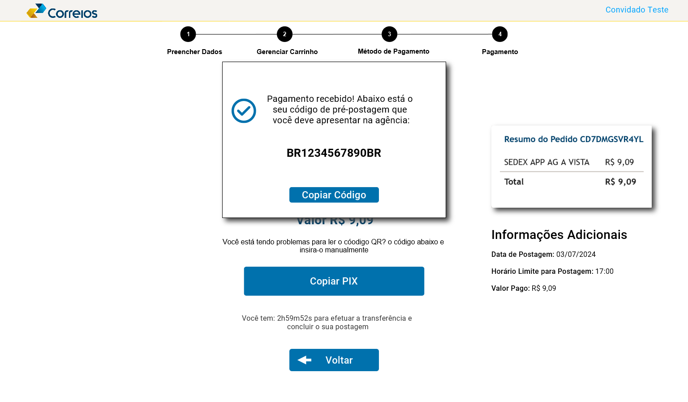

## Introdução

Este documento tem como objetivo validar o protótipo de alta fidelidade feito pelo integrante [Gabriel F. J. Silva][GabrielFGH], que tem como foco representar a loja online dos correios e suas repectivas funcionalidades, como: busca, filtragem  e compra de produtos. Esse documento utiliza como base o artefato de planejamento para o relato, mostrando abaixo todos os dados e informações importantes coletadas nas entrevistas realizadas.

## Metodologia

Este artefato leva como base alguns tópicos elecandos no livro IHC por Barbosa e Silva(2021, p.303), para estruturar o relato dos resultados da análise do protótipo de alta fidelidade e também leva em consideração o artefato do planejamento da análise. Os tópicos a serem desenvolvidos pela equipe são:

- Objetivos da avaliação;
- Metodologia da prototipação
- Número e perfil dos avaliadores e participantes
- Tarefas executadas pelos participantes
- Lista de Problemas encontrados.

## Objetivos da avaliação

Os objetivos desse artefato, conforme estabelecido no planejamento da avaliação, são:

1. Analisar apropriação da tecnologia
2. Comparar ideias alternativas de design
3. Identificar problemas na interação e interface

## Metodologia da prototipação

O método de avaliação que será utilizado será o de teste de usabilidade através do protótipo de alta fidelidade, com um questionário para o usuário e um para ser respondido com base nas ações do usuário ao utilizar e avaliar o protótipo. Abaixo temos o script das ações que o usuário deveria realizar utilizando o protótipo, mas podendo realizar ações não previstas no nele:

- Preencher os dados de uma postagem
- Gerenciar o carrinho de postagens
- Escolher método de pagamento
- Realizar pagamento

## Número e perfil dos avaliadores e participantes

Na Tabela 1, temos tanto as tarefas a serem avaliadas quanto os participantes, e seus papeis, das sessões do teste de usabilidade.

Tabela 1 - Número e perfil dos participantes da entrevista.

| Tarefa | Entrevistador | Entrevistado | Idade | Ocupação | Experiência e facilidade com tecnologia | Data | Local | 
| ---- | :-----------: | ------------ | :---: | :------: | :-----: |:----:| :----:| 
| **Pré-postagem** | [Gabriel F. J. Silva][GabrielFGH] | Caio Mesquita | 23 anos | Estudante | Boa | 03/07/2024 | UnB-FGA| 
| **Pré-postagem** | [Gabriel F. J. Silva][GabrielFGH] | Emivalto Tavares | 24 anos | Estudante | Muito Boa | 03/07/2024 | UnB-FGA| 
| **Pré-postagem** | [Gabriel F. J. Silva][GabrielFGH] | Willdemberg Salles | 21 anos | Estudante  | Muito Boa | 03/07/2024 | UnB-FGA|  

Fonte: [Gabriel F. J. Silva][GabrielFGH], 2024.

## Protótipo de Alta Fidelidade

Para a realização do protótipo foi utiliada a ferramenta [JustInMind](https://www.justinmind.com/), que pode ser conferido por meio desse link [aqui](https://cloud.justinmind.com/usernote/prototype/122c258254c9d39de110b40f46fd981903b873e74149f54ee2b3de94d5d07a5f) .Abaixo na Figura 01, 02, 03 estão as telas que foram desenvolvidas do zero para o protótipo de alta fidelidade, pois representam funções que não estavam implementadas no site dos correios até a data do projeto.

Figura 01: tela desenvolvida para adicionar endereços, do remetente, já cadastrados na conta Meus Correios 

Fonte: [Gabriel F. J. Silva][GabrielFGH]

Figura 02: tela desenvolvida para adicionar destinatários frequentes 

Fonte: [Gabriel F. J. Silva][GabrielFGH]

Figura 03: tela adicionada para o pagamento por pix 

Fonte: [Gabriel F. J. Silva][GabrielFGH]

## Gravações das Avaliações do Protótipo

=== "Gravação 01 - Entrevistado: Caio Mesquita"

    
Vídeo 1 - Entrevista do protótipo de alta fidelidade com o usuário Caio Mesquita.

    

        <iframe width="560" height="315" src="https://www.youtube.com/embed/Fq78gSI_oAU" title="(Entrega 8) Teste de Usabilidade do Protótipo de Alta Fidelidade: Sessão 1" frameborder="0" allow="accelerometer; autoplay; clipboard-write; encrypted-media; gyroscope; picture-in-picture; web-share" referrerpolicy="strict-origin-when-cross-origin" allowfullscreen></iframe>
    

    

        <a href="https://www.youtube.com/watch?v=Fq78gSI_oAU">Link direto para o vídeo</a> 
    

    
Tabela 2 - Perguntas do questionário para o usuário pós-teste.

    

    | ID | Pergunta | Resposta|
    | :-:| -------- |-------- |
    | **1** | Como você avalia o design apresentado no protótipo?(péssimo, ruim, médio, bom, ótimo) | Ótimo |
    | **2** | Você acredita que a disposição dos itens e elementos na tela está bem organizada e de fácil visualização? | Sim |
    | **3** | Você teve obstáculos ao realizar alguma ação na aplicação ou ao utilizar a funcionalidade proposta? | Sim |
    | **4** | Foi encontrado alguma falha durante o uso da funcionalidade apresentada? | Não |
    | **5** | As tarefas mostradas são plauzíveis e representam bem a realidade? | Sim |
    | **6** | Você sugere alguma mudança no design da interface ou nas funcionalidades apresentadas? | Não |

    

    
Fonte: [Gabriel F. J. Silva][GabrielFGH], 2024

=== "Gravação 02 Entrevistado: Emivalto Tavares"

    
Vídeo 2 - Entrevista do protótipo de alta fidelidade com o usuário Emivalto Tavares.

    

        <iframe width="560" height="315" src="https://www.youtube.com/embed/lSWACF1MbSw" title="(Entrega 8) Teste de Usabilidade do Protótipo de Alta Fidelidade: Sessão 2" frameborder="0" allow="accelerometer; autoplay; clipboard-write; encrypted-media; gyroscope; picture-in-picture; web-share" referrerpolicy="strict-origin-when-cross-origin" allowfullscreen></iframe>
    

    

        <a href="https://www.youtube.com/watch?v=lSWACF1MbSw">Link direto para o vídeo</a> 
    

    
Tabela 3 - Perguntas do questionário para o usuário pós-teste.

    

    | ID | Pergunta | Resposta|
    | :-:| -------- |-------- |
    | **1** | Como você avalia o design apresentado no protótipo?(péssimo, ruim, médio, bom, ótimo) | Ótimo |
    | **2** | Você acredita que a disposição dos itens e elementos na tela está bem organizada e de fácil visualização? | Sim |
    | **3** | Você teve obstáculos ao realizar alguma ação na aplicação ou ao utilizar a funcionalidade proposta? | Não |
    | **4** | Foi encontrado alguma falha durante o uso da funcionalidade apresentada? | Não |
    | **5** | As tarefas mostradas são plauzíveis e representam bem a realidade? | Sim |
    | **6** | Você sugere alguma mudança no design da interface ou nas funcionalidades apresentadas? | Não |

    

=== "Gravação 03 Entrevistado: Willdemberg Salles"  

    
Vídeo 3 - Entrevista do protótipo de alta fidelidade com o usuário Willdemberg Salles.

    

        <iframe width="560" height="315" src="https://www.youtube.com/embed/cAXgVQwTwk8" title="(Entrega 8) Teste de Usabilidade do Protótipo de Alta Fidelidade: Sessão 3" frameborder="0" allow="accelerometer; autoplay; clipboard-write; encrypted-media; gyroscope; picture-in-picture; web-share" referrerpolicy="strict-origin-when-cross-origin" allowfullscreen></iframe>
    

    

        <a href="https://www.youtube.com/watch?v=cAXgVQwTwk8">Link direto para o vídeo</a> 
    

    
Tabela 4 - Perguntas do questionário para o usuário pós-teste.

    

    | ID | Pergunta | Resposta|
    | :-:| -------- |-------- |
    | **1** | Como você avalia o design apresentado no protótipo?(péssimo, ruim, médio, bom, ótimo) | Ótimo |
    | **2** | Você acredita que a disposição dos itens e elementos na tela está bem organizada e de fácil visualização? | Sim |
    | **3** | Você teve obstáculos ao realizar alguma ação na aplicação ou ao utilizar a funcionalidade proposta? | Não |
    | **4** | Foi encontrado alguma falha durante o uso da funcionalidade apresentada? | Não |
    | **5** | As tarefas mostradas são plauzíveis e representam bem a realidade? | Sim |
    | **6** | Você sugere alguma mudança no design da interface ou nas funcionalidades apresentadas? | Não |

    

## Lista de Problemas encontrados

Abaixo temos os problemas de usabilidade corrigidos após a fase de avaliação do protótipo de papel elaborado na etapa passada do projeto.

### Problema 1

- Local onde ocorreu: [tela inicial](../../../../assets/prototipos-AF/Gabrielf/Home@1x.png)
- Fatores de usabilidade prejudicados: Eficiência
- Descrição e justificativa do problema: ao procurar por onde começar para realizar a tarefa de pré-postagem, todos os participantes começaram pelo primeiro menu horizontal, onde há a opção "enviar", ao invés da sessão de acesso rápido, em que há um ícone para pré-postagem
- sugestões de solução: creio que ambos os locais de acesso são válidos, uma vez que eu mesmo enquanto analisava a interface do site nunca havia acessado a funcionalidade por aquele menu

### Problema 2

- Local onde ocorreu: telas de [preenchimento dos dados da postagem](../../../../assets/prototipos-AF/Gabrielf/remetente%20preechido@1x.png)
- Fatores de usabilidade prejudicados: Aprendizado
- Descrição e justificativa do problema: todos os participantes não perceberam que ao clicar em um tipo de embalagem, certos campos do tamanho das dimensões não eram necessários e com isso, inseriram dados neles
- sugestões de solução: bloquear o campo de preenchimento conforme o tipo de embalagem escolhido

### Problema 3

- Local onde ocorreu: [tela de pagamento por pix](../../../../assets/prototipos-AF/Gabrielf/pix@1x.png)
- Fatores de usabilidade prejudicados: Aprendizagem
- Descrição e justificativa do problema: ao clicar em copiar a chave pix, surge uma tela confirmando o recebimento do pagamento e disponibilizando o código para postagem da encomenda junto a um botão para copiá-lo, porém, todos os participantes não perceberam isso e acharam que ainda se tratava do código pix  
- sugestões de solução: após o recebimento do pix, mostrar um tela de pop up com a confirmação do recebimento e disponibilizar o código para postagem fora deste pop up.

## Resultado e Reprojeto

Abaixo temos a Tabela 5 com o cronograma executado do reprojeto:

Tabela 5 - Cronograma do Reprojeto executado.

| Funcionalidade | Autor | Revisor | Data | Status |
| -------------- | :---: | :-----: |:---: | :----: |
| Filtragem dos itens da loja | Elias | Revisor |03/07/2024| Implementado |

[Gabriel F. J. Silva][GabrielFGH] 

## Bibliografia

> 1. Barbosa, S. D. J.; Silva, B. S. da; Silveira, M. S.; Gasparini, I.; Darin, T.; Barbosa, G. D. J. (2021) Interação Humano-Computador e Experiência do usuário. Autopublicação. ISBN: 978-65-00-19677-1. Acesso em: 03 de Julho de 2024
>
> 2. Justinmind. Disponível em: . Acesso em: 03 de Julho de 2024

## Histórico de Versão

| Versão | Data | Descrição | Autor | Revisor
|:-:|:-:|:-:|:-:|:-:|
|`1.0`| 03/07/2024 | Criação do documento| [Gabriel F. J. Silva][GabrielFGH]| [Pablo S. Costa][PabloGH] |

[GabrielFGH]: https://github.com/MMcLovin
[GabrielBGH]: https://github.com/https://github.com/Bertolazi
[ClaudioGH]: https://github.com/claudiohsc
[EliasGH]: https://www.github.com/EliasOliver21
[PabloGH]: https://github.com/pabloheika
[RicardoGH]: https://www.github.com/avmricardo
