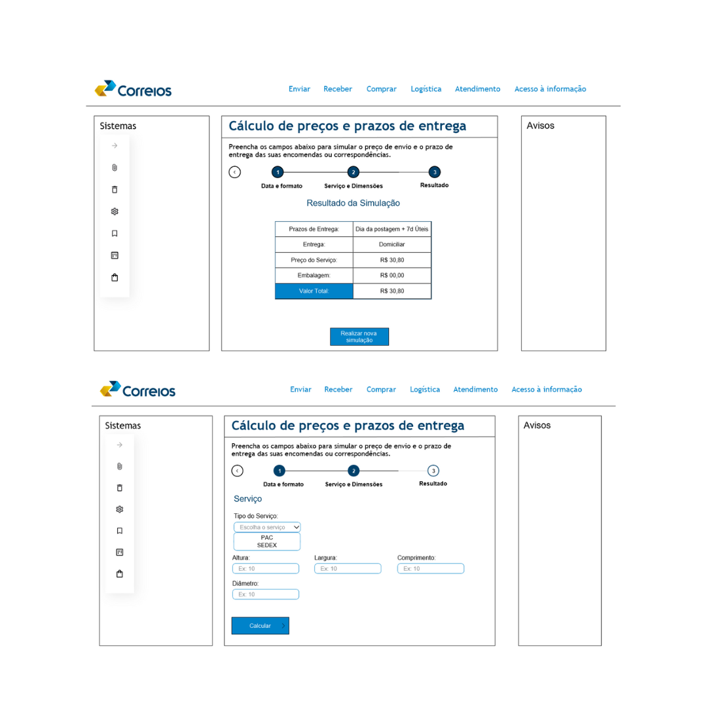

# Calcular Preços e Prazos

## Introdução

Este artefato contém o relato dos resultados obtidos na sessão de observação do protótipo de alta fidelidade produzido por [Claudio Henrique][ClaudioGH], que tem como foco a funcionalidade de realizar uma simulação de envio de encomendas e ter como resultado preços e prazos de envio. Ele servirá para certificar que as informações principais e de extrema importância para o projeto sejam exploradas e representadas de forma clara e ordenada, auxiliando na compreensão dos dados e informações coletadas nas análises para se obter o melhor uso dessas, assim trazendo melhorias para o projeto.

## Metodologia

Este artefato leva como base alguns tópicos elecandos no livro IHC por Barbosa e Silva(2021, p.303), para estruturar esse relato dos resultados da análise do protótipo de alta fidelidade e também leva em consideração o artefato do planejamento da análise. Os tópicos a serem desenvolvidos neste artefato são:

- Objetivos da avaliação;
- Metodologia da prototipação
- Número e perfil dos avaliadores e participantes
- Tarefas executadas pelos participantes
- Lista de Problemas encontrados.

## Objetivos da avaliação

Os objetivos desse artefato, conforme estabelecido no planejamento da avaliação, são:

1. Analisar apropriação da tecnologia
2. Comparar ideias alternativas de design
3. Identificar problemas na interação e interface

## Metodologia da prototipação

O método de avaliação que será utilizado será o de teste de usabilidade através do protótipo de alta fidelidade, com um questionário para o usuário e um para ser respondido com base nas ações do usuário ao utilizar e avaliar o protótipo. Nas Tabelas 3 e 4, respectivamente, estão as perguntas para identificar as impressões e opiniões que o usuário obteve ao utilizar o protótipo e também se a utilização do protótipo pelo participante se dá de maneira correta cumprindo com os objetivos propostos.

Tabela 1 - Perguntas do questionário para o usuário pós-teste.

| ID | Pergunta | 
| :-:| -------- |
| **1** | Como você avalia o design apresentado no protótipo?(péssimo, ruim, médio, bom, ótimo) |
| **2** | Você acredita que a disposição dos itens e elementos na tela está bem organizada e de fácil visualização? | 
| **3** | Você teve obstáculos ao realizar alguma ação na aplicação ou ao utilizar a funcionalidade proposta? | 
| **4** | Foi encontrado alguma falha durante o uso da funcionalidade apresentada? |
| **5** | As tarefas mostradas são plauzíveis e representam bem a realidade? |
| **5** | Você sugere alguma mudança no design da interface ou nas funcionalidades apresentadas? |

Fonte: [Elias F. Oliveira][EliasGH], 2024

Tabela 2 - Perguntas do questionário pós-teste.

| ID | Pergunta | Objetivo Relacionado |
| :-:| -------- | ------------------ |
| **1** | O usuário utilizou de forma correta a funcionalidade? | Analisar apropriação da tecnologia | 
| **2** | Foram atingidos os objetivos principais do participante ao testar o protótipo? |Analisar apropriação da tecnologia |
| **3** | O usuário teve obstáculos para concluir a tarefa proposta? Se sim quais foram? |Identificar problemas na interação e interface|
| **4** | Em quais partes do sistema esses problemas e obstáculos são encontrados? E com qual frequência ocorrem? |Identificar problemas na interação e interface  |
| **5** | O usuário requereu auxílio para compreender alguma parte da interface ou para realizar alguma ação? Se sim quantas vezes? | Identificar problemas na interação e interface|

Fonte: [Elias F. Oliveira][EliasGH], 2024

## Número e perfil dos avaliadores e participantes

Na tabela 3, temos a tarefa a ser avaliada, os participantes e seus papéis e a data do teste de usabilidade.

Tabela 3 - Cronograma executado das entrevistas e perfil dos entrevistados.

| Tarefa | Entrevistador | Entrevistado | Idade |Ocupação | Horário | Data | Local | 
| :----- | :-----------: | :----------: | :-----: |:-----: | :-----: |:----:| :----:| 
| **Calcular preços e prazos de entrega** | [Claudio Henrique][ClaudioGH] | Renato Medeiros | 28 anos | Graduando em Engenharia Aeroespacial na UnB |13:20 - 13:30 | 02/07/2024 | UnB-FGA| 
| **Calcular preços e prazos de entrega** | [Claudio Henrique][ClaudioGH] | Marcos Antônio| 20 anos | Graduando em Engenharia de Software na UnB |13:40 - 13:50 | 02/07/2024 | UnB-FGA| 
| **Calcular preços e prazos de entrega** | [Claudio Henrique][ClaudioGH] | Henrique Quenino | 22 anos | Graduando em Engenharia de Software na UnB | 13:50 - 13:55 | 02/07/2024 | UnB-FGA| 
| **Calcular preços e prazos de entrega** | [Claudio Henrique][ClaudioGH] | Isabelly Sophia | 18 anos | Graduanda em Direito | 22:20 - 22:30 | 02/07/2024 | Presencial | 

Fonte: [Claudio Henrique][ClaudioGH], 2024.

## Protótipo de Alta Fidelidade

Abaixo nas figuras 1 e 2 é mostrado o protótipo de alta fidelidade e logo abaixo temos o link direto para acessar na ferramenta [Justinmind](https://www.justinmind.com).

Figura 1 - Página inicial do site e da funcionalidade.

Fonte: [Claudio Henrique][ClaudioGH], 2024.

Figura 2 - Páginas de cadastro e resultado da simulação.

Fonte: [Claudio Henrique][ClaudioGH], 2024.

[Link para acessar o protótipo](https://cloud.justinmind.com/usernote/prototype/522588bc089c1346304eb0283cc2411a0df6aaa214200768bd4134cd86219f9c)

## Gravações das Avaliações do Protótipo

=== "Gravação 01 - Entrevistado: Renato Medeiros"

    
Vídeo 1 - Entrevista do protótipo de alta fidelidade com o usuário Renato Medeiros.

    

    <iframe width="560" height="315" src="https://www.youtube.com/embed/8mlgxoaWHns?si=WmSpsrCRcPsrolG7" title="YouTube video player" frameborder="0" allow="accelerometer; autoplay; clipboard-write; encrypted-media; gyroscope; picture-in-picture; web-share" referrerpolicy="strict-origin-when-cross-origin" allowfullscreen></iframe>

    [Link direto para o vídeo](https://www.youtube.com/watch?v=8mlgxoaWHns)

    

    
Fonte: [Claudio Henrique][ClaudioGH], 2024.

    

    
Tabela 4 - Respostas do usuário

    | ID | Pergunta | Resposta|
    | :-:| -------- |-------- |
    | **1** | Como você avalia o design apresentado no protótipo?(péssimo, ruim, médio, bom, ótimo) | Ótimo, pela abordagem de design diferente em relação ao site. |
    | **2** | Você acredita que a disposição dos itens e elementos na tela está bem organizada e de fácil visualização? | Sim, estão bem organizados. |
    | **3** | Você teve obstáculos ao realizar alguma ação na aplicação ou ao utilizar a funcionalidade proposta? | Não, utilizei sem problemas. |
    | **4** | Foi encontrado alguma falha durante o uso da funcionalidade apresentada? | Não. Somente a fonte que poderia aumentar em alguns pontos. |
    | **5** | As tarefas mostradas são plauzíveis e representam bem a realidade? | Sim, representam o que seria a simulação. |
    | **5** | Você sugere alguma mudança no design da interface ou nas funcionalidades apresentadas? | Não, funcionalidade está bem representada.  |

    

    
Fonte: [Claudio Henrique][ClaudioGH], 2024.

=== "Gravação 02 - Entrevistado: Henrique Quenino"

    
Vídeo 2 - Entrevista do protótipo de alta fidelidade com o usuário Henrique Quenino.

    

    <iframe width="560" height="315" src="https://www.youtube.com/embed/yQMmVa78Ksk?si=jh3N5EJphITk0wO9" title="YouTube video player" frameborder="0" allow="accelerometer; autoplay; clipboard-write; encrypted-media; gyroscope; picture-in-picture; web-share" referrerpolicy="strict-origin-when-cross-origin" allowfullscreen></iframe>

    [Link direto para o vídeo](https://www.youtube.com/watch?v=yQMmVa78Ksk)

    

    
Fonte: [Claudio Henrique][ClaudioGH], 2024.

    

    
Tabela 5 - Respostas do usuário

    | ID | Pergunta | Resposta|
    | :-:| -------- |-------- |
    | **1** | Como você avalia o design apresentado no protótipo?(péssimo, ruim, médio, bom, ótimo) | Médio, a imagem inicial estava fora da resolução correta para a tela. |
    | **2** | Você acredita que a disposição dos itens e elementos na tela está bem organizada e de fácil visualização? | Sim, estão bem dispostos. |
    | **3** | Você teve obstáculos ao realizar alguma ação na aplicação ou ao utilizar a funcionalidade proposta? | Sim, na parte da data poderia inserir por meio de um calendário. |
    | **4** | Foi encontrado alguma falha durante o uso da funcionalidade apresentada? | Não, mas gostaria de simular vários tipos de embalagem ao mesmo tempo e mais de uma. |
    | **5** | As tarefas mostradas são plauzíveis e representam bem a realidade? | Sim, representa a realidade. |
    | **5** | Você sugere alguma mudança no design da interface ou nas funcionalidades apresentadas? | Mudança na forma de inserir a data, resolução da página inicial, especificação dos valores máximos e mínimos das medidas do objeto.  |

    

    
Fonte: [Claudio Henrique][ClaudioGH], 2024.

=== "Gravação 03 - Entrevistado: Marcos Antônio"

    
Vídeo 3 - Entrevista do protótipo de alta fidelidade com o usuário Marcos Antônio.

    

    <iframe width="560" height="315" src="https://www.youtube.com/embed/jp6LJB2UJ-M?si=JmRTECnNMcMQkUAO" title="YouTube video player" frameborder="0" allow="accelerometer; autoplay; clipboard-write; encrypted-media; gyroscope; picture-in-picture; web-share" referrerpolicy="strict-origin-when-cross-origin" allowfullscreen></iframe>

    [Link direto para o vídeo](https://www.youtube.com/watch?v=jp6LJB2UJ-M)

    

    
Fonte: [Claudio Henrique][ClaudioGH], 2024.

    

    
Tabela 6 - Respostas do usuário

    | ID | Pergunta | Resposta|
    | :-:| -------- |-------- |
    | **1** | Como você avalia o design apresentado no protótipo?(péssimo, ruim, médio, bom, ótimo) | ótimo. |
    | **2** | Você acredita que a disposição dos itens e elementos na tela está bem organizada e de fácil visualização? | Sim, estão bem organizados. |
    | **3** | Você teve obstáculos ao realizar alguma ação na aplicação ou ao utilizar a funcionalidade proposta? | Não. |
    | **4** | Foi encontrado alguma falha durante o uso da funcionalidade apresentada? | Não, funcionou bem. |
    | **5** | As tarefas mostradas são plauzíveis e representam bem a realidade? | Sim, representam. |
    | **5** | Você sugere alguma mudança no design da interface ou nas funcionalidades apresentadas? | Não, achou bem organizado e prático.  |

    

    
Fonte: [Claudio Henrique][ClaudioGH], 2024.

=== "Gravação 04 - Entrevistada: Isabelly Sophia"

    
Vídeo 4 - Entrevista do protótipo de alta fidelidade com o usuário Isabelly Sophia.

    

    <iframe width="560" height="315" src="https://www.youtube.com/embed/WZpKRBjGiMA?si=WnCDOeuZWMfHteuT" title="YouTube video player" frameborder="0" allow="accelerometer; autoplay; clipboard-write; encrypted-media; gyroscope; picture-in-picture; web-share" referrerpolicy="strict-origin-when-cross-origin" allowfullscreen></iframe>

    [Link direto para o vídeo](https://www.youtube.com/watch?v=WZpKRBjGiMA)

    

    
Fonte: [Claudio Henrique][ClaudioGH], 2024.

    

    
Tabela 7 - Respostas do usuário

    | ID | Pergunta | Resposta|
    | :-:| -------- |-------- |
    | **1** | Como você avalia o design apresentado no protótipo?(péssimo, ruim, médio, bom, ótimo) | Ótimo. |
    | **2** | Você acredita que a disposição dos itens e elementos na tela está bem organizada e de fácil visualização? | Com certeza, estão bem organizados. |
    | **3** | Você teve obstáculos ao realizar alguma ação na aplicação ou ao utilizar a funcionalidade proposta? | Não. |
    | **4** | Foi encontrado alguma falha durante o uso da funcionalidade apresentada? | Não. |
    | **5** | As tarefas mostradas são plauzíveis e representam bem a realidade? | Sim, representam. |
    | **5** | Você sugere alguma mudança no design da interface ou nas funcionalidades apresentadas? | Não, para a funcionalidade está ok.  |

    

## Lista de Problemas de usabilidade corrigidos

Abaixo está a lista dos problemas corrigidos durante o ciclo de avaliação e reprojeto realizados no nível anterior pelo grupo.

- Local onde ocorreu: Preenchimento de informações sobre o objeto;
- Fatores de usabilidade prejudicados: Eficiência;
- Descrição e justificativa do problema: Escolha dos vários tipos de serviço sem relação com o tipo do objeto deixavam o usuário confuso;
- Correção realizada no protótipo de alta fidelidade: Escolha do formato do objeto antes do tipo de serviço;
- Indicação se o problema voltou a ocorrer depois da correção: Não, o usuário escolhe o formato e tem as opções certas de serviço de entrega;

## Lista de Problemas de usabilidade não corrigidos

Abaixo temos os problemas de usabilidade não corrigidos após a fase de avaliação do protótipo de alta fidelidade elaborado nessa etapa do projeto.

- Local onde ocorreu: Página inicial da funcionalidade e preenchimento de informações;
- Fatores de usabilidade prejudicados: Eficiência;
- Descrição e justificativa do problema: Fonte das letras pequenas, a data da postagem ser totalmente direto pelo teclado e falta de informações sobre medidas do objeto;
- Prioridade para correção: Tamanho da fonte e informações do objeto;
- Sugestões de correção: Aumentar tamanho da fonte, preencher data da postagem por meio de um calendário e adicionar informações de máximos e mínimos das medidas permitidas para envio de encomendas;
- Indicações de partes do sistema que podem ser melhoradas: Preechimento da data da postagem e informações úteis sobre as medidas do objeto a ser enviado.

## Resultado e Reprojeto

Abaixo temos a tabela 06 com o cronograma executado do reprojeto:

Tabela 8 - Cronograma do Reprojeto executado.

| Funcionalidade | Autor | Revisor | Data | Status |
| :----- | :-----------: | :----------: |:----------: |:----------: |
| Filtragem dos itens da loja | Elias | Revisor |03/07/2024| Implementado |
| Opção de aumentar e diminuir a fonte do site  | Elias | Revisor |03/07/2024| Implementado|
| Edição da quantidade de itens no carrinho | Elias | Revisor |03/07/2024 | Implementado |
| Exclusão de itens no carrinho | Elias | Revisor |03/07/2024| Implementado |

[Elias F. Oliveira][EliasGH] 

## Bibliografia

> 1. Barbosa, S. D. J.; Silva, B. S. da; Silveira, M. S.; Gasparini, I.; Darin, T.; Barbosa, G. D. J. (2021) Interação Humano-Computador e Experiência do usuário. Autopublicação. ISBN: 978-65-00-19677-1. 

## Histórico de Versão

| Versão | Data | Descrição | Autor | Revisor
|:-:|:-:|:-:|:-:|:-:|
|`1.0`| 02/07/2024 | Criação do documento| [Claudio Henrique][ClaudioGH]|[Ricardo Augusto][RicardoGH]|

[GabrielFGH]: https://github.com/MMcLovin
[GabrielBGH]: https://github.com/https://github.com/Bertolazi
[ClaudioGH]: https://github.com/claudiohsc
[EliasGH]: https://www.github.com/EliasOliver21
[PabloGH]: https://github.com/pabloheika
[RicardoGH]: https://www.github.com/avmricardo
