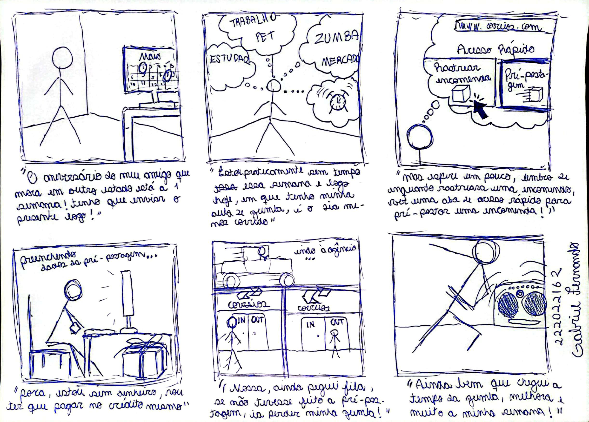
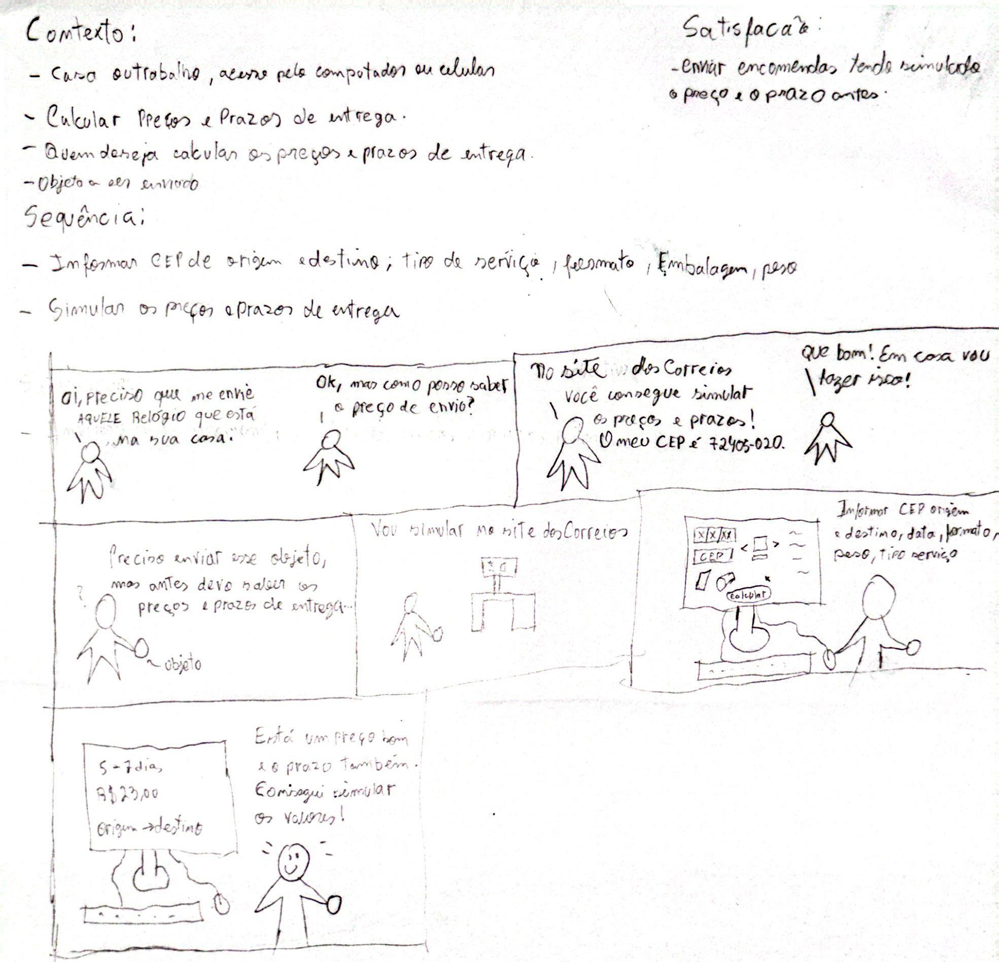
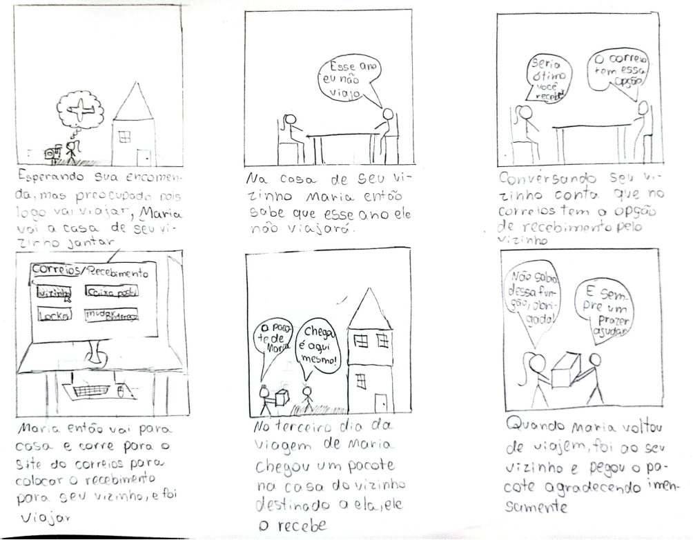
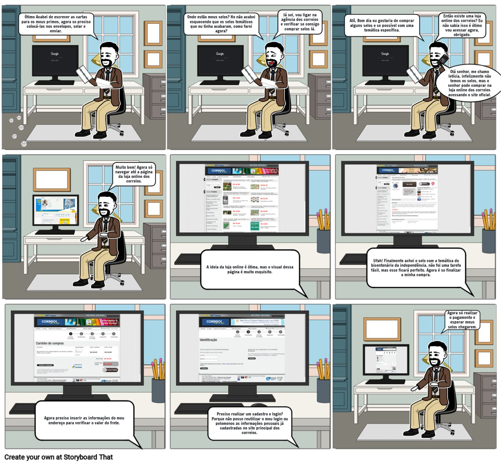
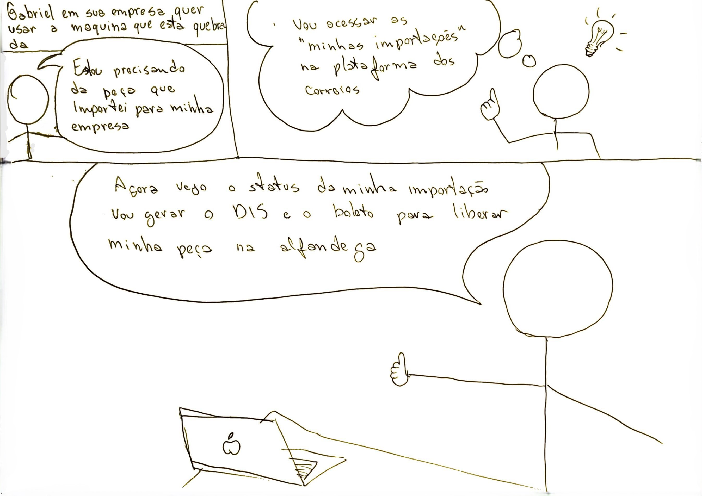

# Storyboards

## Introdução 

Um storyboard é uma ferramenta crucial para o design e desenvolvimento de interfaces e experiências de usuário. Ele consiste em uma série de quadros que ilustram a sequência de ações e interações que um usuário realizará ao navegar por um sistema ou aplicativo. Ao visualizar essas interações de forma sequencial, a equipe pode refinar o design, garantir uma experiência intuitiva e eficiente, e alinhar a visão do projeto com as expectativas dos usuários finais e stakeholders.

Os storyboards elaborados pelo grupo possuem os seguintes elementos:

- Contexto;
- Sequência;
- Satisfação final do usuário.

## Storyboards

### Pré postagem

Abaixo está a figura 1 representado o storyboard de pré postagem, assim como seu contexto, sequência de atividades e satisfação final do usuário.

Figura 1 - Storyboard da pré postagem.

Fonte: [Gabriel F. J. Silva][GabrielFGH], 2024.

[Clique aqui para abrir a figura acima.](../assets/storyboards/storyboard_gabrielf.jpg)

### Cálculo de preços e prazos de entrega

Abaixo está a figura 2 representado o storyboard de cálculo de preços e prazos, assim como seu contexto, sequência de atividades e satisfação final do usuário.

Figura 2 - Storyboard do cálculo de preços e prazos de entrega.

Fonte: [Claudio][ClaudioGH], 2024.

[Clique aqui para abrir a figura acima.](../assets/storyboards/storyboard_claudio.jpg)

### Receber encomendas

Abaixo está a figura 3 representado o storyboard de receber encomendas, assim como seu contexto, sequência de atividades e satisfação final do usuário.

Figura 3 - Storyboard de receber encomendas.

Fonte: [Gabriel B. Bertolazi][GabrielBGH], 2024.

[Clique aqui para abrir a figura acima.](../assets/storyboards/storyboard_gabrielb.jpeg)

### Rastreamento de encomendas

Abaixo está a figura 4 representado o storyboard de rastreamento de encomendas, assim como seu contexto, sequência de atividades e satisfação final do usuário.

Figura 4 - Storyboard de rastreamento de encomendas.

[Clique aqui para abrir a figura acima.](../assets/storyboards/storyboard_ricardo.jpg)

Fonte: [Ricardo Augusto][RicardoGH], 2024.

### Loja online

Abaixo está a figura 5 representado o storyboard da loja online, assim como seu contexto, sequência de atividades e satisfação final do usuário.

Figura 5 - Storyboard da loja online.

Fonte: [Elias][EliasGH], 2024.

[Clique aqui para abrir a figura acima.](../assets/storyboards/storyboard_elias.jpg)

### Minhas importações

Abaixo está a figura 6 representado o storyboard de minhas importações, assim como seu contexto, sequência de atividades e satisfação final do usuário.

Figura 6 - Storyboard de minhas importações.

Fonte: [Pablo S. Costa][PabloGH], 2024.

[Clique aqui para abrir a figura acima.](../assets/storyboards/storyboard_pablo.jpeg)

## Bibliografia

> 1. Barbosa, S. D. J.; Silva, B. S. da; Silveira, M. S.; Gasparini, I.; Darin, T.; Barbosa, G. D. J. (2021) Interação Humano-Computador e Experiência do usuário. Autopublicação. ISBN: 978-65-00-19677-1.
>
> 2. 2023.2-Dominio-Publico. Disponível em: <https://interacao-humano-computador.github.io/2023.2-Dominio-Publico/>Acesso em 22 de maio de 2024.
>

## Histórico de Versões

| Versão | Data | Descrição | Autor(es) | Revisor(es) |
| :----: | :--: | --------- | ----------- | ------ |
| `1.0`  | 20/05/2024 | Criação do documento | [Ricardo Augusto][RicardoGH] e [Pablo S. Costa][PabloGH]  | [Claudio Henrique](ClaudioGH)  |
| `1.1`  | 01/06/2024 | Revisão pós apresentação | [Pablo S. Costa][PabloGH]  | [Ricardo Augusto][RicardoGH] |

[ClaudioGH]: https://github.com/claudiohsc
[EliasGH]: https://github.com/EliasOliver21
[GabrielBGH]: https://github.com/Bertolazi
[GabrielFGH]: https://github.com/MMcLovin
[PabloGH]: https://github.com/pabloheika
[RicardoGH]: https://www.github.com/avmricardo
