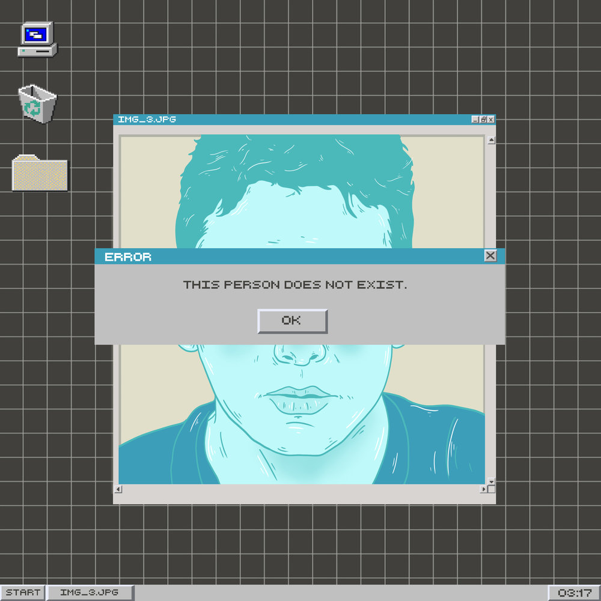
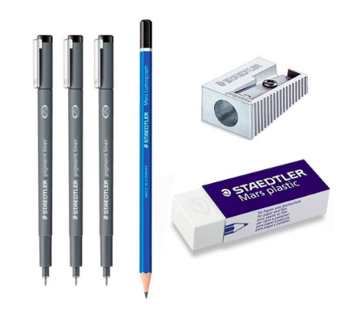

# Ferramentas do projeto

## Introdução

Ferramentas são instrumentos ou dispositivos utilizados para realizar tarefas específicas, facilitando o trabalho humano. Desde os primórdios da civilização, elas têm sido essenciais para o desenvolvimento e progresso da humanidade, permitindo-nos executar trabalhos de forma mais eficiente, economizando tempo e esforço. Existem ferramentas manuais, como martelos e chaves de fenda, e ferramentas elétricas, como furadeiras e serras, cada uma projetada para uma função particular. Além disso, o termo "ferramenta" também se estende a programas e aplicativos que auxiliam em tarefas digitais e intelectuais¹.

## Sobre nossas ferramentas

A equipe empregará programas computacionais que darão suporte às tarefas de planejamento, coordenação, comunicação e registro do projeto de análise dos Correios. A seleção desses programas foi baseada nas exigências e gostos do grupo, contudo, estão sujeitos a mudanças durante a execução do projeto caso se identifique a necessidade de ajustes ou a chance de aprimoramento. A Tabela 1 apresenta as ferramentas escolhidas pela equipe e o papel de cada uma no desenvolvimento do projeto.

## Ferramentas Utilizadas

Tabela 1: Tabela de ferramentas.

| Logo | Ferramenta | Finalidade |
| :--: | ---------- | ---------- |
|  | Notebook | Desevolvimento do projeto|
|  | Smartphone | Comunicação entre a equipe |
|  | Git | Controle de versionamento de código |
|  | GitHub | Repositório git online para organizar e armazenar toda a produção da equipe |
|  | Microsoft Teams | Realizar videos chamadas com gravações de reuniões e apresentações. |
|  | Mkdocs for material | Geração da documentação do gitpages em paginas estáticas. |
|  | Visual Studio Code | Criação e edição dos arquivos de documentação. |
|  | Telegram | Comunicação via chat com a equipe |
|  | YouTube | Publicação dos vídeos produzidos em reuniões e apresentações. |
|  | This person does not exist | Geração de imagens para as personas do projeto. |
|  | Google Forms | Produção e distribuição de questionarios e formularios online. |
|  | Google Planilhas | Produção de tabelas compartilhada para realização do heatmap. |
|  | Canva | Produção de arte para storyboard. |
|  | Draw.io | Produção de diagramas UML. |
|  | Figma | Produção do protótipo de alta fidelidade. |
|  | Justinmind | Produção do protótipo de alta fidelidade |
|  | Storyboard That | Confecção do storyboard |
|  | Materiais de escrever (lápis, lapiseira, caneta, borracha) | Confecção do protótipo de papel |
|  | Papel | Confecção do protótipo de papel |

Fonte: [Pablo S. Costa](https://github.com/pabloheika), 2024.

## Bibliografia

> 1. GitHub. Disponível em: [https://docs.github.com/pt](). Acesso em: 08 de abr. de 2024.
>
> 2. Microsoft Teams. Disponível em: [https://www.microsoft.com/pt-br/microsoft-teams/group-chat-software](). Acesso em: 08 de abr. de 2024.
>
> 3. Mkdocs for material. Disponível em: [https://squidfunk.github.io/mkdocs-material/](). Acesso em: 08 de abr. de 2024.
>
> 4. Visual Studio Code. Disponível em: [https://code.visualstudio.com/](). Acesso em: 08 de abr. de 2024.
>
> 5. Telegram. Disponível em: [https://telegram.org/](). Acesso em: 08 de abr. de 2024.
>
> 6. YouTube. Disponível em: [https://about.youtube/](). Acesso em: 08 de abr. de 2024.
>
> 7. This person does not exist. Disponível em: [https://thispersondoesnotexist.com/](). Acesso em: 08 de abr. de 2024.
>
> 8. Google Forms. Disponível em: [https://www.google.com/intl/pt-BR/forms/about/](). Acesso em: 08 de abr. de 2024.
>
> 9. Google Planilhas. Disponível em: [https://www.google.com/sheets/about/](). Acesso em: 08 de abr. de 2024.
>
> 10. Canva. Disponível em: [https://www.canva.com/](). Acesso em: 08 de abr. de 2024.
> 
> 11. Draw.io. Disponível em: [https://app.diagrams.net/](). Acesso em: 08 de abr. de 2024.
>
> 12. Figma. Disponível em: [https://www.figma.com/about/](). Acesso em: 08 de abr. de 2024.
>
> 13. Git. Disponível em: <https://git-scm.com/>. Acesso em: 08 de jul. de 2024.
>
> 14. Justinmind. Disponível em: <https://www.justinmind.com/>. Acesso em: 08 de jul. de 2024.
>
> 15. Storyboard That. Disponível em: <https://www.storyboardthat.com/pt>. Acesso em: 08 de jul. de 2024.

## Histórico de Versões

| Versão | Data | Descrição | Autor(es) | Revisor(es) |
| :------: | :--------: | -------------------- | ----------------------------------------------- | ----------- |
| `1.0`  | 08/04/2024 | Criação do documento | [Pablo S. Costa](https://github.com/pabloheika) | [Ricardo Augusto](https://www.github.com/avmricardo) |  
| `1.1` | 08/07/2024 | Adicionando ferramentas | [Ricardo Augsuto](https://www.github.com/avmricardo) | [Cláudio Henrique][ClaudioGH] |

[ClaudioGH]: https://github.com/claudiohsc
[EliasGH]: https://github.com/EliasOliver21
[GabrielBGH]: https://github.com/Bertolazi
[GabrielFGH]: https://github.com/MMcLovin
[PabloGH]: https://github.com/pabloheika
[RicardoGH]: https://www.github.com/avmricardo

