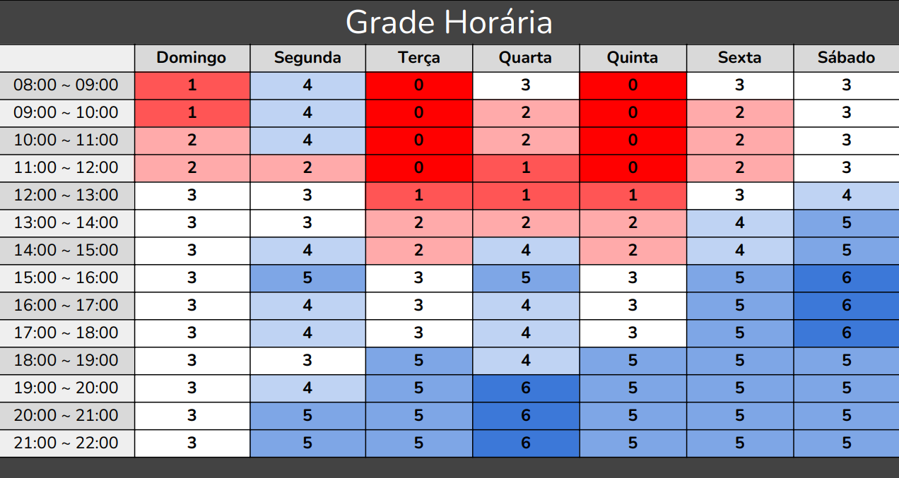

# Heatmap

## Sobre o heatmap
Um heatmap(mapa de calor) é um método gráfico para exibir informações, onde diferentes cores representam níveis variados de atividade ou valor. Imagine um mapa de calor como uma ferramenta que destaca as zonas de maior acesso em um website, as áreas mais impactadas por uma enfermidade ou as temperaturas médias em uma nação. Ele é útil para revelar padrões, tendências ou discrepâncias nos dados, o que auxilia na análise e decisão.

Em nosso contexto, empregamos o mapa de calor para mapear a disponibilidade de tempo dos membros do time, considerando seus compromissos pessoais, profissionais e educacionais. Essa visão nos capacita a planejar encontros de maneira mais eficaz e considerada, prevenindo choques de horários e excesso de demandas. Dessa forma, asseguramos a participação plena e engajada de todos no projeto, permitindo que contribuam com suas perspectivas e competências.

## Resultados

Para determinar rapidamente a disponibilidade dos membros da equipe, criamos uma planilha online compartilhada. Nela, cada pessoa registra sua disponibilidade durante a semana, marcando os períodos em que está livre ou ocupado. Com base nessas informações, elaboramos um mapa de calor correspondente.

Tabela 1: Heatmap.

Fonte: [Pablo S. Costa](https://github.com/pabloheika), 2024.

Com base nas informações da tabela acima, definimos que os encontros serão idealmente realizados às quartas-feiras às 19h e aos sábados às 15h. Estes momentos são os mais apropriados para a maior parte dos integrantes do grupo, levando em conta suas disponibilidades e obrigações. Ademais, esses intervalos nos oferecem a oportunidade adequada para debater os temas importantes para o nosso projeto.

## Bibliografia

> - All About Heatmaps. Disponível em: [https://towardsdatascience.com/all-about-heatmaps-bb7d97f099d7](https://towardsdatascience.com/all-about-heatmaps-bb7d97f099d7). Acesso em: 30 de mar. de 2024.
>

## Histórico de Versões

| Versão | Data | Descrição | Autor(es) | Revisor(es) |
| :----: | :--: | --------- | ----------- | ------ |
| `1.0`  | 30/03/2024 | Criação do documento | [Pablo S. Costa](https://github.com/pabloheika)  | [Pessoa](https://github.com/) |
