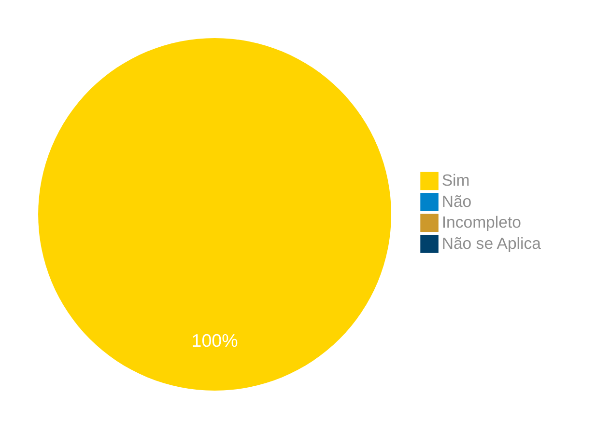

# Verificação do Artefato Planejamento do Relato dos Resultados das Análises de Tarefas

## Introdução

Neste artefato, está descrito os resultados da verificação do artefato de [Planejamento do Relato dos Resultados das Análises de Tarefas](https://interacao-humano-computador.github.io/2024.1-Correios/design_avaliacao/nivel_1/analise_de_tarefas/planejamento_relato_resultados_analise_de_tarefas/) feito pelo [Grupo 03](https://interacao-humano-computador.github.io/2024.1-Correios/) da disciplina de Interação Humano Computador referente ao site [Correios](https://www.correios.com.br/). Lembrando que o foco não é apontar quem errou e sim os problemas presentes no artefato produzido, e por fim garantir os critérios de qualidade estabelecidos.

## Metodologia

Este artefato foi produzido por [Ricardo][RicardoGH] e verificado por [Cláudio][ClaudioGH], seguindo a divisão planejada pelo grupo na [reunião 7](https://interacao-humano-computador.github.io/2024.1-Correios/atas/ata7/). Para a verificação do artefato, foi utilizada a versão `1.0` datada do dia 22/05/2024. Adotamos a metodologia de inspeção por [checklist](#checklist-de-verificacao) neste processo. Podemos ver pela Tabela 1 de exemplo, que para cada item do checklist teremos: descrição do item em verificação, resposta à avaliação (pode ser "Sim", "Não", "Incompleto" ou "Não se Aplica"), o número da referência bibliográfica e um link para um print da referência que o fundamenta o item. Ao final, na seção de [Problemas Encontrados](#problemas-encontrados), são comentados os itens negativos.

Tabela 1 - Perguntas elaboradas de acordo com as referências bibliográficas.

| ID | Descrição | Avaliação | Referência | Print |
|:--:| --------- | :-------: | :--------: | :---: |
| **1** | O planejamento aborda o tópico dos objetivos da avaliação? |  | <a href="#ref1">1</a> | [página 279](../../../../../assets/prints_verificacao/ricardo/planejrelato1.png) |
| **2** | O planejamento descreve qual será o método de avaliação que será realizado? |  | <a href="#ref1">1</a> | [página 279](../../../../../assets/prints_verificacao/ricardo/planejrelato1.png) |
| **3** | O artefato define a quantidade e o perfil dos entrevistadores e dos entrevistados que participarão das avaliações? |  | <a href="#ref1">1</a> | [página 279](../../../../../assets/prints_verificacao/ricardo/planejrelato1.png) |
| **4** | O planejamento prevê um sumário dos dados coletados e suas interpretações? |  | <a href="#ref1">1</a> | [página 279](../../../../../assets/prints_verificacao/ricardo/planejrelato1.png) |
| **5** | O planejamento descreve que existirá uma lista de problemas encontrados? |  | <a href="#ref1">1</a> | [página 279](../../../../../assets/prints_verificacao/ricardo/planejrelato1.png) |
| **6** | O grupo fez um planejamento para o reprojeto? |  | <a href="#ref1">1</a> | [página 279](../../../../../assets/prints_verificacao/ricardo/planejrelato1.png) |

Fonte: [Ricardo Augusto](https://github.com/avmricardo), 2024.

## Apresentação dos Dados

Aqui será apresentado os resultados do checklist e logo após as observações dos itens com resultado negativo.

### Checklist de verificação

Tabela 2 - Checklist preenchido na verificação

| ID | Descrição | Avaliação | Referência | Print |
|:--:| --------- | :-------: | :--------: | :---: |
| **1** | O planejamento aborda o tópico dos objetivos da avaliação? |Sim  | <a href="#ref1">1</a> | [página 279](../../../../../assets/prints_verificacao/ricardo/planejrelato1.png) |
| **2** | O planejamento descreve qual será o método de avaliação que será realizado? |Sim  | <a href="#ref1">1</a> | [página 279](../../../../../assets/prints_verificacao/ricardo/planejrelato1.png) |
| **3** | O artefato define a quantidade e o perfil dos entrevistadores e dos entrevistados que participarão das avaliações? | Sim | <a href="#ref1">1</a> | [página 279](../../../../../assets/prints_verificacao/ricardo/planejrelato1.png) |
| **4** | O planejamento prevê um sumário dos dados coletados e suas interpretações? |  Sim | <a href="#ref1">1</a> | [página 279](../../../../../assets/prints_verificacao/ricardo/planejrelato1.png) |
| **5** | O planejamento descreve que existirá uma lista de problemas encontrados? | Sim | <a href="#ref1">1</a> | [página 279](../../../../../assets/prints_verificacao/ricardo/planejrelato1.png) |
| **6** | O grupo fez um planejamento para o reprojeto? | Sim | <a href="#ref1">1</a> | [página 279](../../../../../assets/prints_verificacao/ricardo/planejrelato1.png) |

Fonte: [Claudio Henrique](https://github.com/claudiohsc), 2024.

## Problemas Encontrados

Não foram encontrados problemas nesse artefato, visto que os itens foram marcados com "sim", e estão seguindo corretamente a bibliografia.

### Gravação da verificação

<!-- para o iframe do vídeo, bote width = 560 e height = 315 -->

<iframe width="560" height="315" src="https://www.youtube.com/embed/HE-_qiLmeOo?si=9rmCojrTzSjTU3-U" title="YouTube video player" frameborder="0" allow="accelerometer; autoplay; clipboard-write; encrypted-media; gyroscope; picture-in-picture; web-share" referrerpolicy="strict-origin-when-cross-origin" allowfullscreen></iframe>

    <a href="https://www.youtube.com/watch?v=HE-_qiLmeOo"> Link para o vídeo </a>

### Sumário dos resultados

<!-- Conte as quantidade de ocorrencias e coloque no Grafico a quantidade em cada tipo de avaliação (se não ouver incidencia de um tipo como "não se aplica", apague a linha do mesmo)-->
A seguir, apresentamos a Figura 1 com o gráfico de pizza do sumário dos resultados.

Figura 1 - Gráfico de pizza do sumário dos resultados.

Fonte: [Claudio Henrique][ClaudioGH], 2024.

## Bibliografia

> 1. Barbosa, S. D. J.; Silva, B. S. da; Silveira, M. S.; Gasparini, I.; Darin, T.; Barbosa, G. D. J. (2021) Interação Humano-Computador e Experiência do usuário. Autopublicação. ISBN: 978-65-00-19677-1.

## Referências Biliográficas

> 1<a id="ref1">.</a> Barbosa, S. D. J.; Silva, B. S. da; Silveira, M. S.; Gasparini, I.; Darin, T.; Barbosa, G. D. J. (2021) Interação Humano-Computador e Experiência do usuário. Autopublicação. ISBN: 978-65-00-19677-1.

## Histórico de Versões

| Versão | Data | Descrição | Autor(es) | Revisor(es) |
| :----: | :--: | --------- | ----------- | ------ |
| `1.0`  | 25/06/2024 | Criação do documento |[Ricardo Augusto](https://github.com/avmricardo) |  |

[ClaudioGH]: https://github.com/claudiohsc
[EliasGH]: https://github.com/EliasOliver21
[GabrielBGH]: https://github.com/Bertolazi
[GabrielFGH]: https://github.com/MMcLovin
[PabloGH]: https://github.com/pabloheika
[RicardoGH]: https://www.github.com/avmricardo