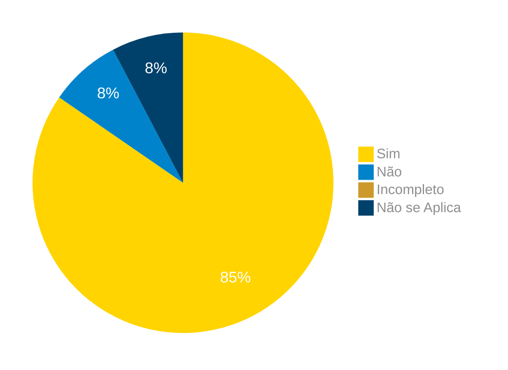

# Verificação do Artefato Realizar Compras Online

## Introdução

Neste artefato, está descrito os resultados da verificação do artefato de Relato da análise de tarefas para [Realizar Compras Online](https://interacao-humano-computador.github.io/2024.1-Correios/design_avaliacao/nivel_1/analise_de_tarefas/relato-resultados/loja-online/) feito pelo [Grupo 03](https://interacao-humano-computador.github.io/2024.1-Correios/) da disciplina de Interação Humano Computador referente ao site [Correios](https://www.correios.com.br/). Lembrando que o foco não é apontar quem errou e sim os problemas presentes no artefato produzido, e por fim garantir os critérios de qualidade estabelecidos.

## Metodologia

Este artefato foi produzido por [Gabriel F. J. Silva][GabrielFGH] e verificado por [][], seguindo a divisão planejada pelo grupo na [reunião 7](https://interacao-humano-computador.github.io/2024.1-Correios/atas/ata7/). Para a verificação do artefato, foi utilizada a versão `1.0` datada do dia 03/06/2024. Adotamos a metodologia de inspeção por [checklist](#checklist-de-verificacao) neste processo. Podemos ver pela Tabela 1 de exemplo, que para cada item do checklist teremos: descrição do item em verificação, resposta à avaliação (pode ser "Sim", "Não", "Incompleto" ou "Não se Aplica"), o número da referência bibliográfica e um link para um print da referência que o fundamenta o item. Ao final, na seção de [Problemas Encontrados](#problemas-encontrados), são comentados os itens negativos.

Tabela 1 - Perguntas elaboradas de acordo com as referências bibliográficas para os relatos do resultado.

| ID | Descrição | Avaliação | Referência| Print |
|:--:| --------- | :-------: | :-------: | :---: | 
| **1** | Estão descritos os objetivos da avaliação? |  | <a href="#ref1">1</a> | [pg 279](../../../../../../assets/prints_verificacao/gabrielf/Relato%20dos%20resultados%20ref%20-%20tópicos.jpeg) |
| **2** | Possui uma explicação sobre o método de avaliação usado? |  | <a href="#ref1">1</a> | [pg 279](../../../../../../assets/prints_verificacao/gabrielf/Relato%20dos%20resultados%20ref%20-%20tópicos.jpeg) |
| **3** | Apresenta o número e perfil dos avaliadores e participantes da avaliação? |  | <a href="#ref1">1</a> | [pg 279](../../../../../../assets/prints_verificacao/gabrielf/Relato%20dos%20resultados%20ref%20-%20tópicos.jpeg) |
| **4** | Possui um sumário dos dados coletados? |  | <a href="#ref1">1</a> | [pg 279](../../../../../../assets/prints_verificacao/gabrielf/Relato%20dos%20resultados%20ref%20-%20tópicos.jpeg) |
| **5** | Faz uma interpretação e análise dos dados? |  | <a href="#ref1">1</a> | [pg 279](../../../../../../assets/prints_verificacao/gabrielf/Relato%20dos%20resultados%20ref%20-%20tópicos.jpeg) |
| **6** | Apresenta uma lista dos problemas encontrados? |  | <a href="#ref1">1</a> | [pg 279](../../../../../../assets/prints_verificacao/gabrielf/Relato%20dos%20resultados%20ref%20-%20tópicos.jpeg) |
| **7** | Possui planejamento para um reprojeto do sistema? |  | <a href="#ref1">1</a> | [pg 279](../../../../../../assets/prints_verificacao/gabrielf/Relato%20dos%20resultados%20ref%20-%20tópicos.jpeg) |
| **8** | A coleta de dados ocorreu de acordo com o planejamento e método de avaliação escolhido? |  | <a href="#ref1">1</a> | [pg 277](../../../../../../assets/prints_verificacao/gabrielf/Relato%20dos%20resultados%20ref%20-%20coleta%20dos%20dados.jpeg) |
| **10** | Caso a coleta de dados tenha sido feita em um laboratório (ambiente controlado), o ambiente de teste foi apresentado ao participante? |  | <a href="#ref1">1</a> | [pg 277](../../../../../../assets/prints_verificacao/gabrielf/Relato%20dos%20resultados%20ref%20-%20coleta%20dos%20dados.jpeg) e  [pg 301](../../../../../../assets/prints_verificacao/gabrielf/Relato%20dos%20resultados%20ref%20-%20ambiente%20controlado%20~%20lab.jpeg) |
| **11** | O avaliador explicou para o participante os objetivos do estudo, procedimentos da avaliação e cuidados éticos tomados? |  | <a href="#ref1">1</a> | [pg 277](../../../../../../assets/prints_verificacao/gabrielf/Relato%20dos%20resultados%20ref%20-%20coleta%20dos%20dados.jpeg) |
| **12** | Enquanto o participante realizava as tarefas previstas, ele foi interrompido ou questionado? |  | <a href="#ref1">1</a> | [pg 277](../../../../../../assets/prints_verificacao/gabrielf/Relato%20dos%20resultados%20ref%20-%20coleta%20dos%20dados.jpeg) |
| **13** | Caso o participante demonstre não conseguir completar a tarefa, o avaliador passa para uma próxima etapa a fim de evitar emoções desagradáveis? |  | <a href="#ref1">1</a> | [pg 278](../../../../../../assets/prints_verificacao/gabrielf/Relato%20dos%20resultados%20ref%20-%20coleta%20dos%20dados%202.jpeg) |

Fonte: [Gabriel F. J. Silva](https://github.com/MMcLovin), 2024.

## Apresentação dos Dados

Aqui será apresentado os resultados do checklist e logo após as observações dos itens com resultado negativo.

### Checklist de verificação

Tabela 2 - Checklist preenchido na verificação

| ID | Descrição | Avaliação | Referência| Print |
|:--:| --------- | :-------: | :-------: | :---: | 
| **1** | Estão descritos os objetivos da avaliação? | Sim | <a href="#ref1">1</a> | [pg 279](../../../../../../assets/prints_verificacao/gabrielf/Relato%20dos%20resultados%20ref%20-%20tópicos.jpeg) |
| **2** | Possui uma explicação sobre o método de avaliação usado? | Sim | <a href="#ref1">1</a> | [pg 279](../../../../../../assets/prints_verificacao/gabrielf/Relato%20dos%20resultados%20ref%20-%20tópicos.jpeg) |
| **3** | Apresenta o número e perfil dos avaliadores e participantes da avaliação? | Sim | <a href="#ref1">1</a> | [pg 279](../../../../../../assets/prints_verificacao/gabrielf/Relato%20dos%20resultados%20ref%20-%20tópicos.jpeg) |
| **4** | Possui um sumário dos dados coletados? | Sim | <a href="#ref1">1</a> | [pg 279](../../../../../../assets/prints_verificacao/gabrielf/Relato%20dos%20resultados%20ref%20-%20tópicos.jpeg) |
| **5** | Faz uma interpretação e análise dos dados? | Sim | <a href="#ref1">1</a> | [pg 279](../../../../../../assets/prints_verificacao/gabrielf/Relato%20dos%20resultados%20ref%20-%20tópicos.jpeg) |
| **6** | Apresenta uma lista dos problemas encontrados? | Sim | <a href="#ref1">1</a> | [pg 279](../../../../../../assets/prints_verificacao/gabrielf/Relato%20dos%20resultados%20ref%20-%20tópicos.jpeg) |
| **7** | Possui planejamento para um reprojeto do sistema? | Sim | <a href="#ref1">1</a> | [pg 279](../../../../../../assets/prints_verificacao/gabrielf/Relato%20dos%20resultados%20ref%20-%20tópicos.jpeg) |
| **8** | A coleta de dados ocorreu de acordo com o planejamento e método de avaliação escolhido? | Sim | <a href="#ref1">1</a> | [pg 277](../../../../../../assets/prints_verificacao/gabrielf/Relato%20dos%20resultados%20ref%20-%20coleta%20dos%20dados.jpeg) |
| **10** | Caso a coleta de dados tenha sido feita em um laboratório (ambiente controlado), o ambiente de teste foi apresentado ao participante? | Sim | <a href="#ref1">1</a> | [pg 277](../../../../../../assets/prints_verificacao/gabrielf/Relato%20dos%20resultados%20ref%20-%20coleta%20dos%20dados.jpeg) e  [pg 301](../../../../../../assets/prints_verificacao/gabrielf/Relato%20dos%20resultados%20ref%20-%20ambiente%20controlado%20~%20lab.jpeg) |
| **11** | O avaliador explicou para o participante os objetivos do estudo, procedimentos da avaliação e cuidados éticos tomados? | Sim | <a href="#ref1">1</a> | [pg 277](../../../../../../assets/prints_verificacao/gabrielf/Relato%20dos%20resultados%20ref%20-%20coleta%20dos%20dados.jpeg) |
| **12** | Enquanto o participante realizava as tarefas previstas, ele foi interrompido ou questionado? | Não | <a href="#ref1">1</a> | [pg 277](../../../../../../assets/prints_verificacao/gabrielf/Relato%20dos%20resultados%20ref%20-%20coleta%20dos%20dados.jpeg) |
| **13** | Caso o participante demonstre não conseguir completar a tarefa, o avaliador passa para uma próxima etapa a fim de evitar emoções desagradáveis? | Não se aplica | <a href="#ref1">1</a> | [pg 278](../../../../../../assets/prints_verificacao/gabrielf/Relato%20dos%20resultados%20ref%20-%20coleta%20dos%20dados%202.jpeg) |

Fonte: [Gabriel B. Bertolazi][GabrielBGH], 2024.

### Gravação da verificação

<!-- para o iframe do vídeo, bote width = 560 e height = 315 -->

    <iframe width="560" height="315" src="https://www.youtube.com/embed" title="Apresentação 7 Interação Humano Computador 2024.1 - Grupo 3" frameborder="0" allow="accelerometer; autoplay; clipboard-write; encrypted-media; gyroscope; picture-in-picture; web-share" referrerpolicy="strict-origin-when-cross-origin" allowfullscreen></iframe>

    <a href="link"> Link para o vídeo </a>

## Problemas Encontrados

<!--- Aqui será apresentado todos os problemas identificados durante o processo de verificação do artefato de link do artefato. --->

- ID 12: Enquanto o participante realizava as tarefas previstas, ele foi interrompido ou questionado?
    - Avaliação: Não.
    - Comentário: O usuário não foi interrompido.

## Sumário dos resultados

<!-- Conte as quantidade de ocorrencias e coloque no Grafico a quantidade em cada tipo de avaliação (se não ouver incidencia de um tipo como "não se aplica", apague a linha do mesmo)-->
A seguir, apresentamos a Figura 1 com o gráfico de pizza do sumário dos resultados.

Figura 1 - Gráfico de pizza do sumário dos resultados.

Fonte: [][], 2024.

## Bibliografia

> 1. Barbosa, S. D. J.; Silva, B. S. da; Silveira, M. S.; Gasparini, I.; Darin, T.; Barbosa, G. D. J. (2021) Interação Humano-Computador e Experiência do usuário. Autopublicação. ISBN: 978-65-00-19677-1. 

## Histórico de Versões

| Versão | Data | Descrição | Autor(es) | Revisor(es) |
| :----: | :--: | --------- | ----------- | ------ |
| `1.0`  | 25/06/2024 | Criação do documento | [Gabriel F. J. Silva][GabrielFGH] | [][] |
| `1.1`  | 26/06/2024 | Aplicação do Checklist | [][] | [][] |

[ClaudioGH]: https://github.com/claudiohsc
[EliasGH]: https://github.com/EliasOliver21
[GabrielBGH]: https://github.com/Bertolazi
[GabrielFGH]: https://github.com/MMcLovin
[PabloGH]: https://github.com/pabloheika
[RicardoGH]: https://www.github.com/avmricardo

