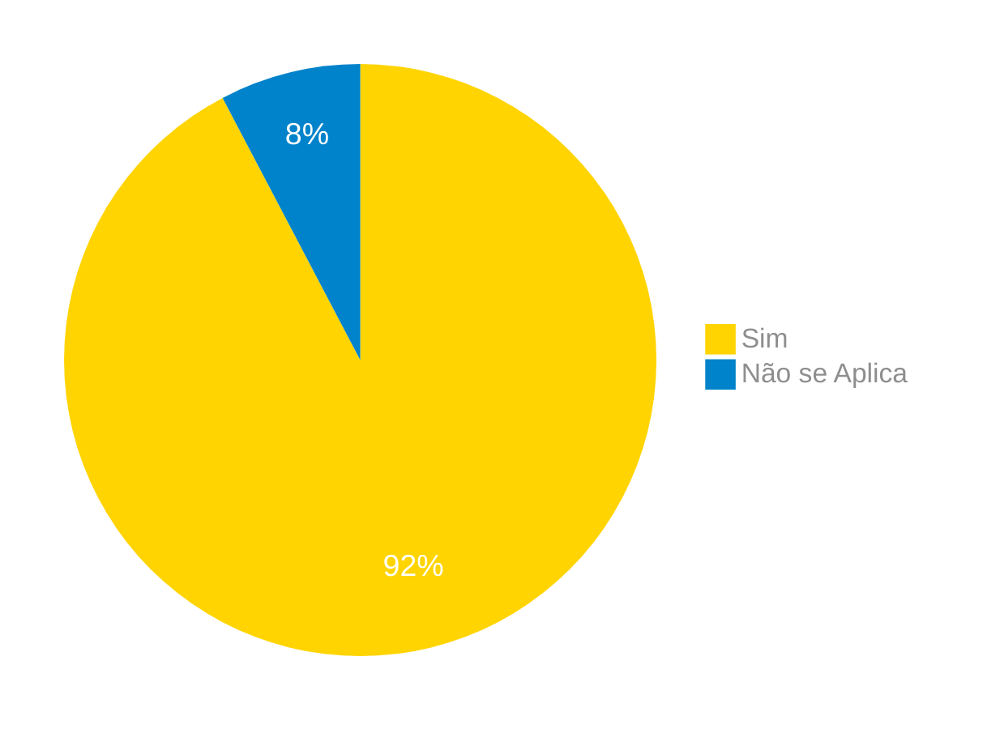
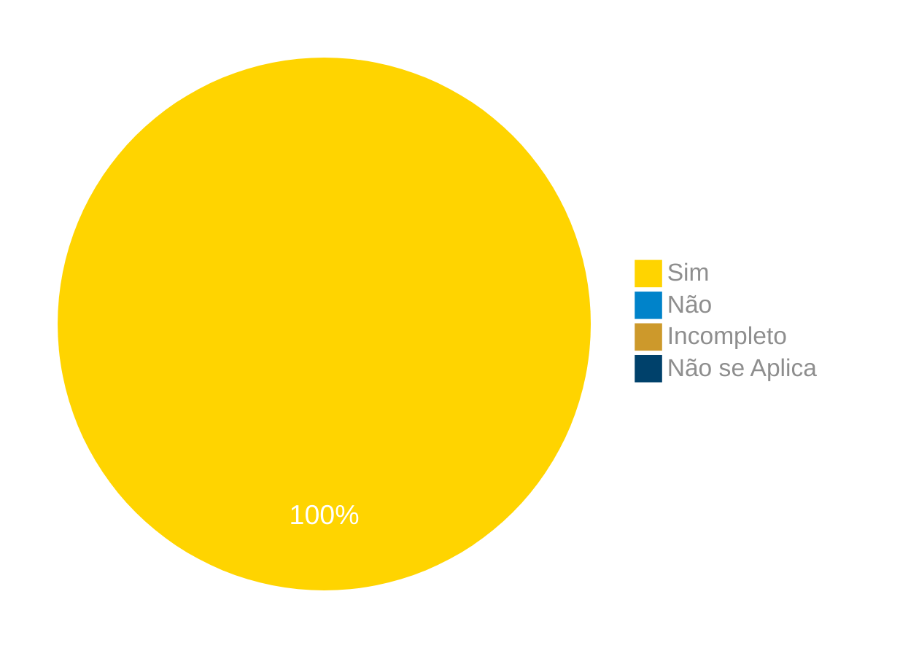
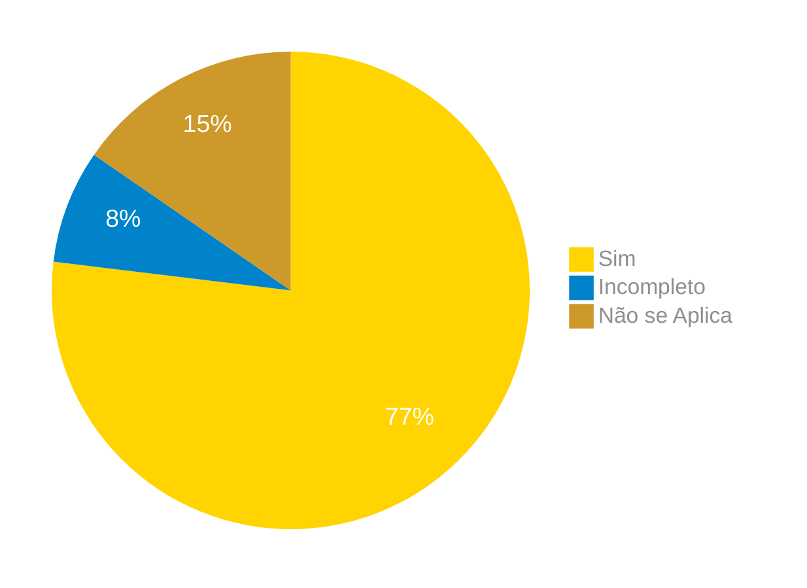
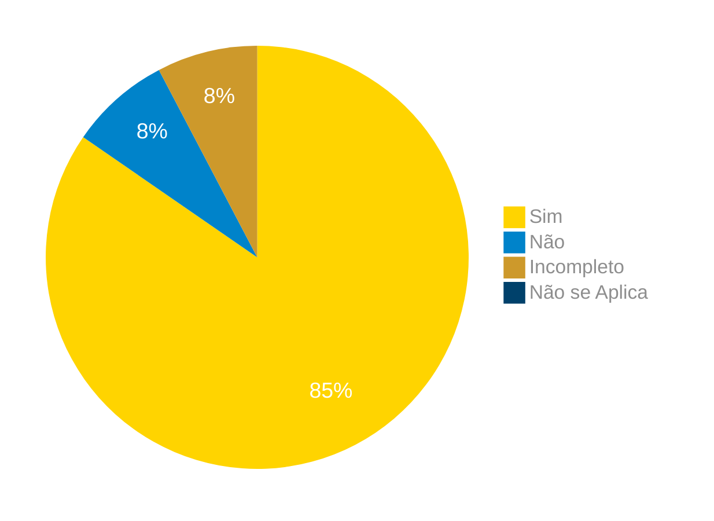
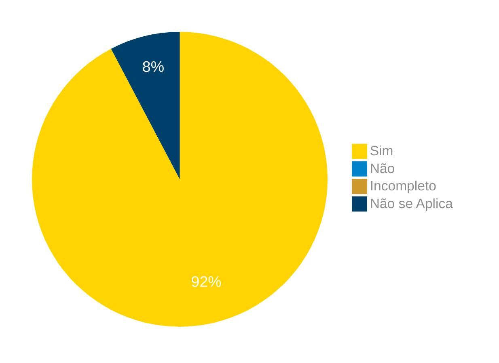

# Verificação do Relato dos Resultados dos Storyboards

## Introdução

Neste artefato, está descrito os resultados da verificação dos artefatos de Relato dos Resultados dos Storyboards que são os [Calculo de Preços e prazos](../../../../../design_avaliacao/nivel_1/analise_dos_storyboards/Relatos_StoryBoards/), [Pré-postagem](../../../../../design_avaliacao/nivel_1/analise_dos_storyboards/Relatos_StoryBoards/), [Loja Online dos Correios](../../../../../design_avaliacao/nivel_1/analise_dos_storyboards/Relatos_StoryBoards/), [Receber encomendas](../../../../../design_avaliacao/nivel_1/analise_dos_storyboards/Relatos_StoryBoards/), [Minhas importações](../../../../../design_avaliacao/nivel_1/analise_dos_storyboards/Relatos_StoryBoards/) e [Rastrear encomendas](../../../../../design_avaliacao/nivel_1/analise_dos_storyboards/Relatos_StoryBoards/) feito pelo [Grupo 03](https://interacao-humano-computador.github.io/2024.1-Correios/) da disciplina de Interação Humano Computador referente ao site [Correios](https://www.correios.com.br/). Lembrando que o foco não é apontar quem errou e sim os problemas presentes no artefato produzido, e por fim garantir os critérios de qualidade estabelecidos.

## Metodologia

Este artefato foi produzido por [Pablo S. Costa][PabloGH] e verificado por [Cláudio Henrique][ClaudioGH], [Elias F. Oliveira][EliasGH], [Gabriel B. Bertolazi][GabrielBGH], [Gabriel F. J. Silva][GabrielFGH], [Pablo S. Costa][PabloGH] e [Ricardo Augusto][RicardoGH], seguindo a divisão planejada pelo grupo na [reunião 7](https://interacao-humano-computador.github.io/2024.1-Correios/atas/ata7/). Para a verificação do artefato, foi utilizada as versões `1.0` datada dos dias 1, 2 e 3 de junlho de 2024. Adotamos a metodologia de inspeção por [checklist](#checklist-de-verificacao) neste processo. Podemos ver pela Tabela 1 de exemplo, que para cada item do checklist teremos: descrição do item em verificação, resposta à avaliação (pode ser "Sim", "Não", "Incompleto" ou "Não se Aplica"), o número da referência bibliográfica e um link para um print da referência que o fundamenta o item. Ao final, na seção de [Problemas Encontrados](#problemas-encontrados), são comentados os itens negativos.

<font size="2"><p style="text-align: center">Tabela 1 - Perguntas elaboradas de acordo com as referências bibliográficas.</p></font>

<center>

| ID | Descrição | Avaliação | Referência | Print |
| --- | --- | --- | --- | --- |
| **1** | Foi buscado recorrência nos resultados para distinguir características representativas do grupo? |   | [1.](#ref1) 11.7.5 Consolidação e Relato dos Resultado | [página 279](../../../../../assets/prints_verificacao/pablo/relato_dos_storyboards/1.jpeg) |
| **2** | Na consolidação dos resultados foram endereçados novamente as questões que motivaram os estudos buscando respondê-las ou justificar de alguma forma uma resposta não encontrada? |   | [1.](#ref1) 11.7.5 Consolidação e Relato dos Resultado | [página 279](../../../../../assets/prints_verificacao/pablo/relato_dos_storyboards/2.jpeg) |
| **3** | Foram levadas em considerações fatores que prejudicam a qualidade e o uso dos dados? |   | [1.](#ref1) 11.7.5 Consolidação e Relato dos Resultado | [página 279](../../../../../assets/prints_verificacao/pablo/relato_dos_storyboards/3.jpeg) |
| **4** | Quando não encontrado problemas durante a avaliação não foram afirmados categoricamente que o storyboard tenha alta qualidade, mas sim que neste planejamento de avaliação não foram revelados problemas? |   | [1.](#ref1) 11.7.5 Consolidação e Relato dos Resultado | [página 279](../../../../../assets/prints_verificacao/pablo/relato_dos_storyboards/4.jpeg) |
| **5** | Há objetivos e escopo da avaliação? |   | [1.](#ref1) 11.7.5 Consolidação e Relato dos Resultado | [página 279](../../../../../assets/prints_verificacao/pablo/relato_dos_storyboards/5.jpeg) |
| **6** | Há forma como a avaliação foi realizada? (Método de avaliação empregado) |   | [1.](#ref1) 11.7.5 Consolidação e Relato dos Resultado | [página 279](../../../../../assets/prints_verificacao/pablo/relato_dos_storyboards/6.jpeg) |
| **7** | É informada a quantidade de participantes? |   | [1.](#ref1) 11.7.5 Consolidação e Relato dos Resultado | [página 279](../../../../../assets/prints_verificacao/pablo/relato_dos_storyboards/7,%208%20e%209.jpeg) |
| **8** | É informado o perfil do usuário dos participantes? |   | [1.](#ref1) 11.7.5 Consolidação e Relato dos Resultado | [página 279](../../../../../assets/prints_verificacao/pablo/relato_dos_storyboards/7,%208%20e%209.jpeg) |
| **9** | São informadas as funções dos participantes? (Avaliadores e entrevistados) |   | [1.](#ref1) 11.7.5 Consolidação e Relato dos Resultado | [página 279](../../../../../assets/prints_verificacao/pablo/relato_dos_storyboards/7,%208%20e%209.jpeg) |
| **10** | Há um sumário dos dados coletados, incluindo tabelas e gráficos? |   | [1.](#ref1) 11.7.5 Consolidação e Relato dos Resultado | [página 279](../../../../../assets/prints_verificacao/pablo/relato_dos_storyboards/10.jpeg) |
| **11** | Há o relato da interpretação e análise dos dados? |   | [1.](#ref1) 11.7.5 Consolidação e Relato dos Resultado | [página 279](../../../../../assets/prints_verificacao/pablo/relato_dos_storyboards/11.jpeg) |
| **12** | Há uma lista dos problemas encontrados? |   | [1.](#ref1) 11.7.5 Consolidação e Relato dos Resultado | [página 279](../../../../../assets/prints_verificacao/pablo/relato_dos_storyboards/12.jpeg) |
| **13** | Existe um planejamento para o reprojeto do storyboard? |   | [1.](#ref1) 11.7.5 Consolidação e Relato dos Resultado | [página 279](../../../../../assets/prints_verificacao/pablo/relato_dos_storyboards/13.jpeg) |

</center>

<font size="2"><p style="text-align: center">Fonte: [Pablo S. Costa][PabloGH], 2024.</p></font>

## Apresentação dos Dados

Abaixo temos as tabelas de 2 a 7 com as listas verificadas para cada storyboard com suas gravações e as figuras de 1 a 6 com os graficos de pizza com o sumario de cada resultado.

## Storyboard - Calculo de Preços e prazos

### Checklists verificação

<font size="2"><p style="text-align: center">Tabela 2 - Checklist preenchido na verificação</p></font>

<center>

| ID | Descrição | Avaliação | Referência | Print |
| --- | --- | --- | --- | --- |
| **1** | Foi buscado recorrência nos resultados para distinguir características representativas do grupo? | Sim.   | [1.](#ref1) 11.7.5 Consolidação e Relato dos Resultado | [página 279](../../../../../assets/prints_verificacao/pablo/relato_dos_storyboards/1.jpeg) |
| **2** | Na consolidação dos resultados foram endereçados novamente as questões que motivaram os estudos buscando respondê-las ou justificar de alguma forma uma resposta não encontrada? |   | [1.](#ref1) 11.7.5 Consolidação e Relato dos Resultado | [página 279](../../../../../assets/prints_verificacao/pablo/relato_dos_storyboards/2.jpeg) |
| **3** | Foram levadas em considerações fatores que prejudicam a qualidade e o uso dos dados? | Sim.   | [1.](#ref1) 11.7.5 Consolidação e Relato dos Resultado | [página 279](../../../../../assets/prints_verificacao/pablo/relato_dos_storyboards/3.jpeg) |
| **4** | Quando não encontrado problemas durante a avaliação não foram afirmados categoricamente que o storyboard tenha alta qualidade, mas sim que neste planejamento de avaliação não foram revelados problemas? |   | [1.](#ref1) 11.7.5 Consolidação e Relato dos Resultado | [página 279](../../../../../assets/prints_verificacao/pablo/relato_dos_storyboards/4.jpeg) |
| **5** | Há objetivos e escopo da avaliação? |  Sim.  | [1.](#ref1) 11.7.5 Consolidação e Relato dos Resultado | [página 279](../../../../../assets/prints_verificacao/pablo/relato_dos_storyboards/5.jpeg) |
| **6** | Há forma como a avaliação foi realizada? (Método de avaliação empregado) |  Sim.  | [1.](#ref1) 11.7.5 Consolidação e Relato dos Resultado | [página 279](../../../../../assets/prints_verificacao/pablo/relato_dos_storyboards/6.jpeg) |
| **7** | É informada a quantidade de participantes? |  Sim.  | [1.](#ref1) 11.7.5 Consolidação e Relato dos Resultado | [página 279](../../../../../assets/prints_verificacao/pablo/relato_dos_storyboards/7,%208%20e%209.jpeg) |
| **8** | É informado o perfil do usuário dos participantes? | Sim.   | [1.](#ref1) 11.7.5 Consolidação e Relato dos Resultado | [página 279](../../../../../assets/prints_verificacao/pablo/relato_dos_storyboards/7,%208%20e%209.jpeg) |
| **9** | São informadas as funções dos participantes? (Avaliadores e entrevistados) | Sim.   | [1.](#ref1) 11.7.5 Consolidação e Relato dos Resultado | [página 279](../../../../../assets/prints_verificacao/pablo/relato_dos_storyboards/7,%208%20e%209.jpeg) |
| **10** | Há um sumário dos dados coletados, incluindo tabelas e gráficos? |  Sim.  | [1.](#ref1) 11.7.5 Consolidação e Relato dos Resultado | [página 279](../../../../../assets/prints_verificacao/pablo/relato_dos_storyboards/10.jpeg) |
| **11** | Há o relato da interpretação e análise dos dados? | Sim.   | [1.](#ref1) 11.7.5 Consolidação e Relato dos Resultado | [página 279](../../../../../assets/prints_verificacao/pablo/relato_dos_storyboards/11.jpeg) |
| **12** | Há uma lista dos problemas encontrados? |  Sim.  | [1.](#ref1) 11.7.5 Consolidação e Relato dos Resultado | [página 279](../../../../../assets/prints_verificacao/pablo/relato_dos_storyboards/12.jpeg) |
| **13** | Existe um planejamento para o reprojeto do storyboard? | Sim.   | [1.](#ref1) 11.7.5 Consolidação e Relato dos Resultado | [página 279](../../../../../assets/prints_verificacao/pablo/relato_dos_storyboards/13.jpeg) |

</center>

<font size="2"><p style="text-align: center">Fonte: [][], 2024.</p></font>

### Gravação da verificação

<!-- para o iframe do vídeo, bote width = 560 e height = 315 -->

<div style="text-align: center;">
    <iframe width="560" height="315" src="https://www.youtube.com/embed" title="Apresentação 7 Interação Humano Computador 2024.1 - Grupo 3" frameborder="0" allow="accelerometer; autoplay; clipboard-write; encrypted-media; gyroscope; picture-in-picture; web-share" referrerpolicy="strict-origin-when-cross-origin" allowfullscreen></iframe>
</div>

<p style="text-align: center">
    <a href="link"> Link para o vídeo </a>
</p>

### Problemas Encontrados

<!--- Aqui será apresentado todos os problemas identificados durante o processo de verificação do artefato de link do artefato. --->

- ID xx: Descrição
    - Avaliação:
    - Comentário:

### Sumário dos resultados

<!-- Conte as quantidade de ocorrencias e coloque no Grafico a quantidade em cada tipo de avaliação (se não ouver incidencia de um tipo como "não se aplica", apague a linha do mesmo)-->
A seguir, apresentamos a Figura 1 com o gráfico de pizza do sumário dos resultados.

<font size="2"><p style="text-align: center">Figura 1 - Gráfico de pizza do sumário dos resultados.</p></font>

<center>

``` mermaid
%%{
  init: {
    'theme': 'base',
    'themeVariables': {
        'primaryColor': '#FFD400',
        'secondaryColor': '#0083CA',
        'tertiaryColor': '#CD992B',
        'pie4': '#00416B',
        'primaryTextColor': '#8e8e8e',
        'pieStrokeWidth': '0px',
        'pieOuterStrokeWidth': '0px',
        'pieOpacity': '1',
        'pieSectionTextColor': '#fff',
        'pieSectionTextSize': '19px'
    }
  }
}%%
pie
    "Sim" : 0
    "Não" : 0
    "Incompleto" : 0
    "Não se Aplica" : 0
```

</center>

<font size="2"><p style="text-align: center">Fonte: [][], 2024.</p></font>

## Storyboard - Pré-postagem

### Checklists verificação

<font size="2"><p style="text-align: center">Tabela 3 - Checklist preenchido na verificação</p></font>

<center>

| ID | Descrição | Avaliação | Referência | Print |
| --- | --- | --- | --- | --- |
| **1** | Foi buscado recorrência nos resultados para distinguir características representativas do grupo? | Não se aplica | [1.](#ref1) 11.7.5 Consolidação e Relato dos Resultado | [página 279](../../../../../assets/prints_verificacao/pablo/relato_dos_storyboards/1.jpeg) |
| **2** | Na consolidação dos resultados foram endereçados novamente as questões que motivaram os estudos buscando respondê-las ou justificar de alguma forma uma resposta não encontrada? | Sim | [1.](#ref1) 11.7.5 Consolidação e Relato dos Resultado | [página 279](../../../../../assets/prints_verificacao/pablo/relato_dos_storyboards/2.jpeg) |
| **3** | Foram levadas em considerações fatores que prejudicam a qualidade e o uso dos dados? | Sim | [1.](#ref1) 11.7.5 Consolidação e Relato dos Resultado | [página 279](../../../../../assets/prints_verificacao/pablo/relato_dos_storyboards/3.jpeg) |
| **4** | Quando não encontrado problemas durante a avaliação não foram afirmados categoricamente que o storyboard tenha alta qualidade, mas sim que neste planejamento de avaliação não foram revelados problemas? | Sim | [1.](#ref1) 11.7.5 Consolidação e Relato dos Resultado | [página 279](../../../../../assets/prints_verificacao/pablo/relato_dos_storyboards/4.jpeg) |
| **5** | Há objetivos e escopo da avaliação? | Sim | [1.](#ref1) 11.7.5 Consolidação e Relato dos Resultado | [página 279](../../../../../assets/prints_verificacao/pablo/relato_dos_storyboards/5.jpeg) |
| **6** | Há forma como a avaliação foi realizada? (Método de avaliação empregado) | Sim | [1.](#ref1) 11.7.5 Consolidação e Relato dos Resultado | [página 279](../../../../../assets/prints_verificacao/pablo/relato_dos_storyboards/6.jpeg) |
| **7** | É informada a quantidade de participantes? | Sim | [1.](#ref1) 11.7.5 Consolidação e Relato dos Resultado | [página 279](../../../../../assets/prints_verificacao/pablo/relato_dos_storyboards/7,%208%20e%209.jpeg) |
| **8** | É informado o perfil do usuário dos participantes? | Sim | [1.](#ref1) 11.7.5 Consolidação e Relato dos Resultado | [página 279](../../../../../assets/prints_verificacao/pablo/relato_dos_storyboards/7,%208%20e%209.jpeg) |
| **9** | São informadas as funções dos participantes? (Avaliadores e entrevistados) | Sim | [1.](#ref1) 11.7.5 Consolidação e Relato dos Resultado | [página 279](../../../../../assets/prints_verificacao/pablo/relato_dos_storyboards/7,%208%20e%209.jpeg) |
| **10** | Há um sumário dos dados coletados, incluindo tabelas e gráficos? | Sim | [1.](#ref1) 11.7.5 Consolidação e Relato dos Resultado | [página 279](../../../../../assets/prints_verificacao/pablo/relato_dos_storyboards/10.jpeg) |
| **11** | Há o relato da interpretação e análise dos dados? | Sim | [1.](#ref1) 11.7.5 Consolidação e Relato dos Resultado | [página 279](../../../../../assets/prints_verificacao/pablo/relato_dos_storyboards/11.jpeg) |
| **12** | Há uma lista dos problemas encontrados? | Sim | [1.](#ref1) 11.7.5 Consolidação e Relato dos Resultado | [página 279](../../../../../assets/prints_verificacao/pablo/relato_dos_storyboards/12.jpeg) |
| **13** | Existe um planejamento para o reprojeto do storyboard? | Sim | [1.](#ref1) 11.7.5 Consolidação e Relato dos Resultado | [página 279](../../../../../assets/prints_verificacao/pablo/relato_dos_storyboards/13.jpeg) |

</center>

<font size="2"><p style="text-align: center">Fonte: [Pablo S. Costa][PabloGH], 2024.</p></font>

### Gravação da verificação

<!-- para o iframe do vídeo, bote width = 560 e height = 315 -->

<div style="text-align: center;">
    <iframe width="560" height="315" src="https://www.youtube.com/embed/NfQ6m9xqQs8?si=DNrUedd3y8-KyaWc" title="YouTube video player" frameborder="0" allow="accelerometer; autoplay; clipboard-write; encrypted-media; gyroscope; picture-in-picture; web-share" referrerpolicy="strict-origin-when-cross-origin" allowfullscreen></iframe>
</div>

<p style="text-align: center">
    <a href="https://youtu.be/NfQ6m9xqQs8"> Link para o vídeo </a>
</p>

### Problemas Encontrados

<!--- Aqui será apresentado todos os problemas identificados durante o processo de verificação do artefato de link do artefato. --->

*   ID 1: Foi buscado recorrência nos resultados para distinguir características representativas do grupo?
    *   Avaliação: Não se aplica
    *   Comentário: Por se tratar de um trabalho acadêmico não foi exigido seguir um número determinado de entrevistados, por isso este ponto não se aplica a esta avaliação.

### Sumário dos resultados

<!-- Conte as quantidade de ocorrencias e coloque no Grafico a quantidade em cada tipo de avaliação (se não ouver incidencia de um tipo como "não se aplica", apague a linha do mesmo)-->
A seguir, apresentamos a Figura 2 com o gráfico de pizza do sumário dos resultados.

<font size="2"><p style="text-align: center">Figura 2 - Gráfico de pizza do sumário dos resultados.</p></font>

<center>



</center>

<font size="2"><p style="text-align: center">Fonte: [Pablo S. Costa][PabloGH], 2024.</p></font>

## Storyboard - Loja Online dos Correios

### Checklists verificação

<font size="2"><p style="text-align: center">Tabela 4 - Checklist preenchido na verificação</p></font>

<center>

| ID | Descrição | Avaliação | Referência | Print |
| --- | --- | --- | --- | --- |
| **1** | Foi buscado recorrência nos resultados para distinguir características representativas do grupo? | Sim | [1.](#ref1) 11.7.5 Consolidação e Relato dos Resultado | [página 279](../../../../../assets/prints_verificacao/pablo/relato_dos_storyboards/1.jpeg) |
| **2** | Na consolidação dos resultados foram endereçados novamente as questões que motivaram os estudos buscando respondê-las ou justificar de alguma forma uma resposta não encontrada? | Sim | [1.](#ref1) 11.7.5 Consolidação e Relato dos Resultado | [página 279](../../../../../assets/prints_verificacao/pablo/relato_dos_storyboards/2.jpeg) |
| **3** | Foram levadas em considerações fatores que prejudicam a qualidade e o uso dos dados? | Sim | [1.](#ref1) 11.7.5 Consolidação e Relato dos Resultado | [página 279](../../../../../assets/prints_verificacao/pablo/relato_dos_storyboards/3.jpeg) |
| **4** | Quando não encontrado problemas durante a avaliação não foram afirmados categoricamente que o storyboard tenha alta qualidade, mas sim que neste planejamento de avaliação não foram revelados problemas? | Sim | [1.](#ref1) 11.7.5 Consolidação e Relato dos Resultado | [página 279](../../../../../assets/prints_verificacao/pablo/relato_dos_storyboards/4.jpeg) |
| **5** | Há objetivos e escopo da avaliação? | Sim | [1.](#ref1) 11.7.5 Consolidação e Relato dos Resultado | [página 279](../../../../../assets/prints_verificacao/pablo/relato_dos_storyboards/5.jpeg) |
| **6** | Há forma como a avaliação foi realizada? (Método de avaliação empregado) | Sim | [1.](#ref1) 11.7.5 Consolidação e Relato dos Resultado | [página 279](../../../../../assets/prints_verificacao/pablo/relato_dos_storyboards/6.jpeg) |
| **7** | É informada a quantidade de participantes? | Sim | [1.](#ref1) 11.7.5 Consolidação e Relato dos Resultado | [página 279](../../../../../assets/prints_verificacao/pablo/relato_dos_storyboards/7,%208%20e%209.jpeg) |
| **8** | É informado o perfil do usuário dos participantes? | Sim  | [1.](#ref1) 11.7.5 Consolidação e Relato dos Resultado | [página 279](../../../../../assets/prints_verificacao/pablo/relato_dos_storyboards/7,%208%20e%209.jpeg) |
| **9** | São informadas as funções dos participantes? (Avaliadores e entrevistados) |  Sim | [1.](#ref1) 11.7.5 Consolidação e Relato dos Resultado | [página 279](../../../../../assets/prints_verificacao/pablo/relato_dos_storyboards/7,%208%20e%209.jpeg) |
| **10** | Há um sumário dos dados coletados, incluindo tabelas e gráficos? | Sim  | [1.](#ref1) 11.7.5 Consolidação e Relato dos Resultado | [página 279](../../../../../assets/prints_verificacao/pablo/relato_dos_storyboards/10.jpeg) |
| **11** | Há o relato da interpretação e análise dos dados? | Sim | [1.](#ref1) 11.7.5 Consolidação e Relato dos Resultado | [página 279](../../../../../assets/prints_verificacao/pablo/relato_dos_storyboards/11.jpeg) |
| **12** | Há uma lista dos problemas encontrados? | Sim  | [1.](#ref1) 11.7.5 Consolidação e Relato dos Resultado | [página 279](../../../../../assets/prints_verificacao/pablo/relato_dos_storyboards/12.jpeg) |
| **13** | Existe um planejamento para o reprojeto do storyboard? | Sim   | [1.](#ref1) 11.7.5 Consolidação e Relato dos Resultado | [página 279](../../../../../assets/prints_verificacao/pablo/relato_dos_storyboards/13.jpeg) |

</center>

<font size="2"><p style="text-align: center">Fonte: [][], 2024.</p></font>

### Gravação da verificação

<!-- para o iframe do vídeo, bote width = 560 e height = 315 -->
<center>

<iframe width="560" height="315" src="https://www.youtube.com/embed/GajoJFYArFQ?si=yi9OWqTauNhjILBR" title="YouTube video player" frameborder="0" allow="accelerometer; autoplay; clipboard-write; encrypted-media; gyroscope; picture-in-picture; web-share" referrerpolicy="strict-origin-when-cross-origin" allowfullscreen></iframe>


### Problemas Encontrados

<!--- Aqui será apresentado todos os problemas identificados durante o processo de verificação do artefato de link do artefato. --->

Não foram identifocados erros.

### Sumário dos resultados

<!-- Conte as quantidade de ocorrencias e coloque no Grafico a quantidade em cada tipo de avaliação (se não ouver incidencia de um tipo como "não se aplica", apague a linha do mesmo)-->
A seguir, apresentamos a Figura 3 com o gráfico de pizza do sumário dos resultados.

<font size="2"><p style="text-align: center">Figura 3 - Gráfico de pizza do sumário dos resultados.</p></font>

<center>



</center>

<font size="2"><p style="text-align: center">Fonte: [][], 2024.</p></font>

## Storyboard - Receber encomendas

O artefato de relato dos resultados do storyboard verificado pode ser encontrado [aqui](https://interacao-humano-computador.github.io/2024.1-Correios/design_avaliacao/nivel_1/analise_dos_storyboards/Relatos_StoryBoards/Relato_pre_postagem/).

### Checklists verificação

<font size="2"><p style="text-align: center">Tabela 5 - Checklist preenchido na verificação</p></font>

<center>

| ID | Descrição | Avaliação | Referência | Print |
| --- | --- | --- | --- | --- |
| **1** | Foi buscado recorrência nos resultados para distinguir características representativas do grupo? | não se aplica  | [1.](#ref1) 11.7.5 Consolidação e Relato dos Resultado | [página 279](../../../../../assets/prints_verificacao/pablo/relato_dos_storyboards/1.jpeg) |
| **2** | Na consolidação dos resultados foram endereçados novamente as questões que motivaram os estudos buscando respondê-las ou justificar de alguma forma uma resposta não encontrada? | não | [1.](#ref1) 11.7.5 Consolidação e Relato dos Resultado | [página 279](../../../../../assets/prints_verificacao/pablo/relato_dos_storyboards/2.jpeg) |
| **3** | Foram levadas em considerações fatores que prejudicam a qualidade e o uso dos dados? | sim | [1.](#ref1) 11.7.5 Consolidação e Relato dos Resultado | [página 279](../../../../../assets/prints_verificacao/pablo/relato_dos_storyboards/3.jpeg) |
| **4** | Quando não encontrado problemas durante a avaliação não foram afirmados categoricamente que o storyboard tenha alta qualidade, mas sim que neste planejamento de avaliação não foram revelados problemas? | não se aplica | [1.](#ref1) 11.7.5 Consolidação e Relato dos Resultado | [página 279](../../../../../assets/prints_verificacao/pablo/relato_dos_storyboards/4.jpeg) |
| **5** | Há objetivos e escopo da avaliação? | incompleto | [1.](#ref1) 11.7.5 Consolidação e Relato dos Resultado | [página 279](../../../../../assets/prints_verificacao/pablo/relato_dos_storyboards/5.jpeg) |
| **6** | Há forma como a avaliação foi realizada? (Método de avaliação empregado) | sim | [1.](#ref1) 11.7.5 Consolidação e Relato dos Resultado | [página 279](../../../../../assets/prints_verificacao/pablo/relato_dos_storyboards/6.jpeg) |
| **7** | É informada a quantidade de participantes? | sim | [1.](#ref1) 11.7.5 Consolidação e Relato dos Resultado | [página 279](../../../../../assets/prints_verificacao/pablo/relato_dos_storyboards/7,%208%20e%209.jpeg) |
| **8** | É informado o perfil do usuário dos participantes? | sim | [1.](#ref1) 11.7.5 Consolidação e Relato dos Resultado | [página 279](../../../../../assets/prints_verificacao/pablo/relato_dos_storyboards/7,%208%20e%209.jpeg) |
| **9** | São informadas as funções dos participantes? (Avaliadores e entrevistados) | sim | [1.](#ref1) 11.7.5 Consolidação e Relato dos Resultado | [página 279](../../../../../assets/prints_verificacao/pablo/relato_dos_storyboards/7,%208%20e%209.jpeg) |
| **10** | Há um sumário dos dados coletados, incluindo tabelas e gráficos? | sim | [1.](#ref1) 11.7.5 Consolidação e Relato dos Resultado | [página 279](../../../../../assets/prints_verificacao/pablo/relato_dos_storyboards/10.jpeg) |
| **11** | Há o relato da interpretação e análise dos dados? | sim | [1.](#ref1) 11.7.5 Consolidação e Relato dos Resultado | [página 279](../../../../../assets/prints_verificacao/pablo/relato_dos_storyboards/11.jpeg) |
| **12** | Há uma lista dos problemas encontrados? | sim | [1.](#ref1) 11.7.5 Consolidação e Relato dos Resultado | [página 279](../../../../../assets/prints_verificacao/pablo/relato_dos_storyboards/12.jpeg) |
| **13** | Existe um planejamento para o reprojeto do storyboard? | sim | [1.](#ref1) 11.7.5 Consolidação e Relato dos Resultado | [página 279](../../../../../assets/prints_verificacao/pablo/relato_dos_storyboards/13.jpeg) |

</center>

<font size="2"><p style="text-align: center">Fonte: [Gabriel F. J. Silva][GabrielFGH], 2024.</p></font>

### Gravação da verificação

<!-- para o iframe do vídeo, bote width = 560 e height = 315 -->

<div style="text-align: center;">
    <iframe width="560" height="315" src="https://www.youtube.com/embed/sCPvSt16e9Y" title="(Entrega 6.2) Verificação: Storyboard - Receber Encomendas" frameborder="0" allow="accelerometer; autoplay; clipboard-write; encrypted-media; gyroscope; picture-in-picture; web-share" referrerpolicy="strict-origin-when-cross-origin" allowfullscreen></iframe>
</div>

<p style="text-align: center">
    <a href="https://www.youtube.com/watch?v=sCPvSt16e9Y"> Link para o vídeo </a>
</p>

### Problemas Encontrados

<!--- Aqui será apresentado todos os problemas identificados durante o processo de verificação do artefato de link do artefato. --->

- ID 05: Há objetivos e escopo da avaliação?
    - Avaliação: incompleto
    - Comentário: há objetivos definidos, porém, estes diferem dos estabelecidos no [planejamento da avaliação](https://interacao-humano-computador.github.io/2024.1-Correios/design_avaliacao/nivel_1/analise_de_tarefas/planejamento-analise-tarefas/#d-definir).

### Sumário dos resultados

<!-- Conte as quantidade de ocorrencias e coloque no Grafico a quantidade em cada tipo de avaliação (se não ouver incidencia de um tipo como "não se aplica", apague a linha do mesmo)-->
A seguir, apresentamos a Figura 4 com o gráfico de pizza do sumário dos resultados.

<font size="2"><p style="text-align: center">Figura 4 - Gráfico de pizza do sumário dos resultados.</p></font>

<center>



</center>

<font size="2"><p style="text-align: center">Fonte: [Gabriel F. J. Silva][GabrielFGH], 2024.</p></font>

## Storyboard - Minhas importações

### Checklists verificação

<font size="2"><p style="text-align: center">Tabela 6 - Checklist preenchido na verificação</p></font>

<center>

| ID | Descrição | Avaliação | Referência | Print |
| --- | --- | --- | --- | --- |
| **1** | Foi buscado recorrência nos resultados para distinguir características representativas do grupo? | Incompleto  | [1.](#ref1) 11.7.5 Consolidação e Relato dos Resultado | [página 279](../../../../../assets/prints_verificacao/pablo/relato_dos_storyboards/1.jpeg) |
| **2** | Na consolidação dos resultados foram endereçados novamente as questões que motivaram os estudos buscando respondê-las ou justificar de alguma forma uma resposta não encontrada? |  Sim  | [1.](#ref1) 11.7.5 Consolidação e Relato dos Resultado | [página 279](../../../../../assets/prints_verificacao/pablo/relato_dos_storyboards/2.jpeg) |
| **3** | Foram levadas em considerações fatores que prejudicam a qualidade e o uso dos dados? | Não  | [1.](#ref1) 11.7.5 Consolidação e Relato dos Resultado | [página 279](../../../../../assets/prints_verificacao/pablo/relato_dos_storyboards/3.jpeg) |
| **4** | Quando não encontrado problemas durante a avaliação não foram afirmados categoricamente que o storyboard tenha alta qualidade, mas sim que neste planejamento de avaliação não foram revelados problemas? |   Sim | [1.](#ref1) 11.7.5 Consolidação e Relato dos Resultado | [página 279](../../../../../assets/prints_verificacao/pablo/relato_dos_storyboards/4.jpeg) |
| **5** | Há objetivos e escopo da avaliação? |   Sim | [1.](#ref1) 11.7.5 Consolidação e Relato dos Resultado | [página 279](../../../../../assets/prints_verificacao/pablo/relato_dos_storyboards/5.jpeg) |
| **6** | Há forma como a avaliação foi realizada? (Método de avaliação empregado) |  Sim  | [1.](#ref1) 11.7.5 Consolidação e Relato dos Resultado | [página 279](../../../../../assets/prints_verificacao/pablo/relato_dos_storyboards/6.jpeg) |
| **7** | É informada a quantidade de participantes? |  Sim  | [1.](#ref1) 11.7.5 Consolidação e Relato dos Resultado | [página 279](../../../../../assets/prints_verificacao/pablo/relato_dos_storyboards/7,%208%20e%209.jpeg) |
| **8** | É informado o perfil do usuário dos participantes? |   Sim | [1.](#ref1) 11.7.5 Consolidação e Relato dos Resultado | [página 279](../../../../../assets/prints_verificacao/pablo/relato_dos_storyboards/7,%208%20e%209.jpeg) |
| **9** | São informadas as funções dos participantes? (Avaliadores e entrevistados) |   Sim | [1.](#ref1) 11.7.5 Consolidação e Relato dos Resultado | [página 279](../../../../../assets/prints_verificacao/pablo/relato_dos_storyboards/7,%208%20e%209.jpeg) |
| **10** | Há um sumário dos dados coletados, incluindo tabelas e gráficos? |   Sim | [1.](#ref1) 11.7.5 Consolidação e Relato dos Resultado | [página 279](../../../../../assets/prints_verificacao/pablo/relato_dos_storyboards/10.jpeg) |
| **11** | Há o relato da interpretação e análise dos dados? |   Sim | [1.](#ref1) 11.7.5 Consolidação e Relato dos Resultado | [página 279](../../../../../assets/prints_verificacao/pablo/relato_dos_storyboards/11.jpeg) |
| **12** | Há uma lista dos problemas encontrados? |   Sim | [1.](#ref1) 11.7.5 Consolidação e Relato dos Resultado | [página 279](../../../../../assets/prints_verificacao/pablo/relato_dos_storyboards/12.jpeg) |
| **13** | Existe um planejamento para o reprojeto do storyboard? |  Sim | [1.](#ref1) 11.7.5 Consolidação e Relato dos Resultado | [página 279](../../../../../assets/prints_verificacao/pablo/relato_dos_storyboards/13.jpeg) |

</center>

<font size="2"><p style="text-align: center">Fonte: [Ricardo Augusto][RicardoGH], 2024.</p></font>

### Gravação da verificação

<!-- para o iframe do vídeo, bote width = 560 e height = 315 -->

<div style="text-align: center;">
    <iframe width="560" height="315" src="https://www.youtube.com/embed" title="Apresentação 7 Interação Humano Computador 2024.1 - Grupo 3" frameborder="0" allow="accelerometer; autoplay; clipboard-write; encrypted-media; gyroscope; picture-in-picture; web-share" referrerpolicy="strict-origin-when-cross-origin" allowfullscreen></iframe>
</div>

<p style="text-align: center">
    <a href="link"> Link para o vídeo </a>
</p>

### Problemas Encontrados

<!--- Aqui será apresentado todos os problemas identificados durante o processo de verificação do artefato de link do artefato. --->

- ID 01: Foi buscado recorrência nos resultados para distinguir características representativas do grupo?
    - Avaliação: Incompleto
    - Comentário: Não é citado esse tópico

- ID 03: Foram levadas em considerações fatores que prejudicam a qualidade e o uso dos dados?
    - Avaliação: Não
    - Comentário: Não foram levadas em considerações fatores que prejudicam a qualidade e o uso dos dados

### Sumário dos resultados

<!-- Conte as quantidade de ocorrencias e coloque no Grafico a quantidade em cada tipo de avaliação (se não ouver incidencia de um tipo como "não se aplica", apague a linha do mesmo)-->
A seguir, apresentamos a Figura 5 com o gráfico de pizza do sumário dos resultados.

<font size="2"><p style="text-align: center">Figura 5 - Gráfico de pizza do sumário dos resultados.</p></font>

<center>



</center>

<font size="2"><p style="text-align: center">Fonte: [Ricardo Augusto][RicardoGH], 2024.</p></font>

## Storyboard - Rastrear encomendas

### Checklists verificação

<font size="2"><p style="text-align: center">Tabela 7 - Checklist preenchido na verificação</p></font>

<center>

| ID | Descrição | Avaliação | Referência | Print |
| --- | --- | --- | --- | --- |
| **1** | Foi buscado recorrência nos resultados para distinguir características representativas do grupo? | Sim  | [1.](#ref1) 11.7.5 Consolidação e Relato dos Resultado | [página 279](../../../../../assets/prints_verificacao/pablo/relato_dos_storyboards/1.jpeg) |
| **2** | Na consolidação dos resultados foram endereçados novamente as questões que motivaram os estudos buscando respondê-las ou justificar de alguma forma uma resposta não encontrada? | Sim  | [1.](#ref1) 11.7.5 Consolidação e Relato dos Resultado | [página 279](../../../../../assets/prints_verificacao/pablo/relato_dos_storyboards/2.jpeg) |
| **3** | Foram levadas em considerações fatores que prejudicam a qualidade e o uso dos dados? |  Sim | [1.](#ref1) 11.7.5 Consolidação e Relato dos Resultado | [página 279](../../../../../assets/prints_verificacao/pablo/relato_dos_storyboards/3.jpeg) |
| **4** | Quando não encontrado problemas durante a avaliação não foram afirmados categoricamente que o storyboard tenha alta qualidade, mas sim que neste planejamento de avaliação não foram revelados problemas? | Sim  | [1.](#ref1) 11.7.5 Consolidação e Relato dos Resultado | [página 279](../../../../../assets/prints_verificacao/pablo/relato_dos_storyboards/4.jpeg) |
| **5** | Há objetivos e escopo da avaliação? | Sim  | [1.](#ref1) 11.7.5 Consolidação e Relato dos Resultado | [página 279](../../../../../assets/prints_verificacao/pablo/relato_dos_storyboards/5.jpeg) |
| **6** | Há forma como a avaliação foi realizada? (Método de avaliação empregado) |  Sim | [1.](#ref1) 11.7.5 Consolidação e Relato dos Resultado | [página 279](../../../../../assets/prints_verificacao/pablo/relato_dos_storyboards/6.jpeg) |
| **7** | É informada a quantidade de participantes? |  Sim | [1.](#ref1) 11.7.5 Consolidação e Relato dos Resultado | [página 279](../../../../../assets/prints_verificacao/pablo/relato_dos_storyboards/7,%208%20e%209.jpeg) |
| **8** | É informado o perfil do usuário dos participantes? | Sim  | [1.](#ref1) 11.7.5 Consolidação e Relato dos Resultado | [página 279](../../../../../assets/prints_verificacao/pablo/relato_dos_storyboards/7,%208%20e%209.jpeg) |
| **9** | São informadas as funções dos participantes? (Avaliadores e entrevistados) | Sim  | [1.](#ref1) 11.7.5 Consolidação e Relato dos Resultado | [página 279](../../../../../assets/prints_verificacao/pablo/relato_dos_storyboards/7,%208%20e%209.jpeg) |
| **10** | Há um sumário dos dados coletados, incluindo tabelas e gráficos? |  Sim | [1.](#ref1) 11.7.5 Consolidação e Relato dos Resultado | [página 279](../../../../../assets/prints_verificacao/pablo/relato_dos_storyboards/10.jpeg) |
| **11** | Há o relato da interpretação e análise dos dados? |Sim   | [1.](#ref1) 11.7.5 Consolidação e Relato dos Resultado | [página 279](../../../../../assets/prints_verificacao/pablo/relato_dos_storyboards/11.jpeg) |
| **12** | Há uma lista dos problemas encontrados? |  Sim | [1.](#ref1) 11.7.5 Consolidação e Relato dos Resultado | [página 279](../../../../../assets/prints_verificacao/pablo/relato_dos_storyboards/12.jpeg) |
| **13** | Existe um planejamento para o reprojeto do storyboard? |   Não se aplica| [1.](#ref1) 11.7.5 Consolidação e Relato dos Resultado | [página 279](../../../../../assets/prints_verificacao/pablo/relato_dos_storyboards/13.jpeg) |

</center>

<font size="2"><p style="text-align: center">Fonte: [Claudio Henrique][ClaudioGH], 2024.</p></font>

### Gravação da verificação

<!-- para o iframe do vídeo, bote width = 560 e height = 315 -->

<div style="text-align: center;">
    <iframe width="560" height="315" src="https://www.youtube.com/embed/4YQCzxUr0XA?si=zo16oyn7amyMZ-km" title="YouTube video player" frameborder="0" allow="accelerometer; autoplay; clipboard-write; encrypted-media; gyroscope; picture-in-picture; web-share" referrerpolicy="strict-origin-when-cross-origin" allowfullscreen></iframe>
</div>

<p style="text-align: center">
    <a href="https://www.youtube.com/watch?v=4YQCzxUr0XA"> Link para o vídeo </a>
</p>

### Problemas Encontrados

Não foram encontrados problemas nesse artefato, pois seguiu muito bem o planejamento do relato e a bibliografia apresentada.

### Sumário dos resultados

<!-- Conte as quantidade de ocorrencias e coloque no Grafico a quantidade em cada tipo de avaliação (se não ouver incidencia de um tipo como "não se aplica", apague a linha do mesmo)-->
A seguir, apresentamos a Figura 6 com o gráfico de pizza do sumário dos resultados.

<font size="2"><p style="text-align: center">Figura 6 - Gráfico de pizza do sumário dos resultados.</p></font>

<center>



</center>

<font size="2"><p style="text-align: center">Fonte: [Claudio Henrique][ClaudioGH], 2024.</p></font>

## Sumário total dos resultados

<!-- Conte as quantidade de ocorrencias e coloque no Grafico a quantidade em cada tipo de avaliação (se não ouver incidencia de um tipo como "não se aplica", apague a linha do mesmo)-->
A seguir, apresentamos a Figura 7 com o gráfico de pizza do sumário total dos resultados.

<font size="2"><p style="text-align: center">Figura 7 - Gráfico de pizza do sumário total dos resultados.</p></font>

<center>


</center>

<font size="2"><p style="text-align: center">Fonte: [][], 2024.</p></font>

## Bibliografia

> 1. <a id="ref1"> </a>Barbosa, S. D. J.; Silva, B. S. da; Silveira, M. S.; Gasparini, I.; Darin, T.; Barbosa, G. D. J. (2021) Interação Humano-Computador e Experiência do usuário. Autopublicação. ISBN: 978-65-00-19677-1. 

## Histórico de Versões

| Versão | Data | Descrição | Autor(es) | Revisor(es) |
| :----: | :--: | --------- | ----------- | ------ |
| `1.0`  | 25/06/2024 | Criação do documento | [Pablo S. Costa][PabloGH] | [][] |

[ClaudioGH]: https://github.com/claudiohsc
[EliasGH]: https://github.com/EliasOliver21
[GabrielBGH]: https://github.com/Bertolazi
[GabrielFGH]: https://github.com/MMcLovin
[PabloGH]: https://github.com/pabloheika
[RicardoGH]: https://www.github.com/avmricardo