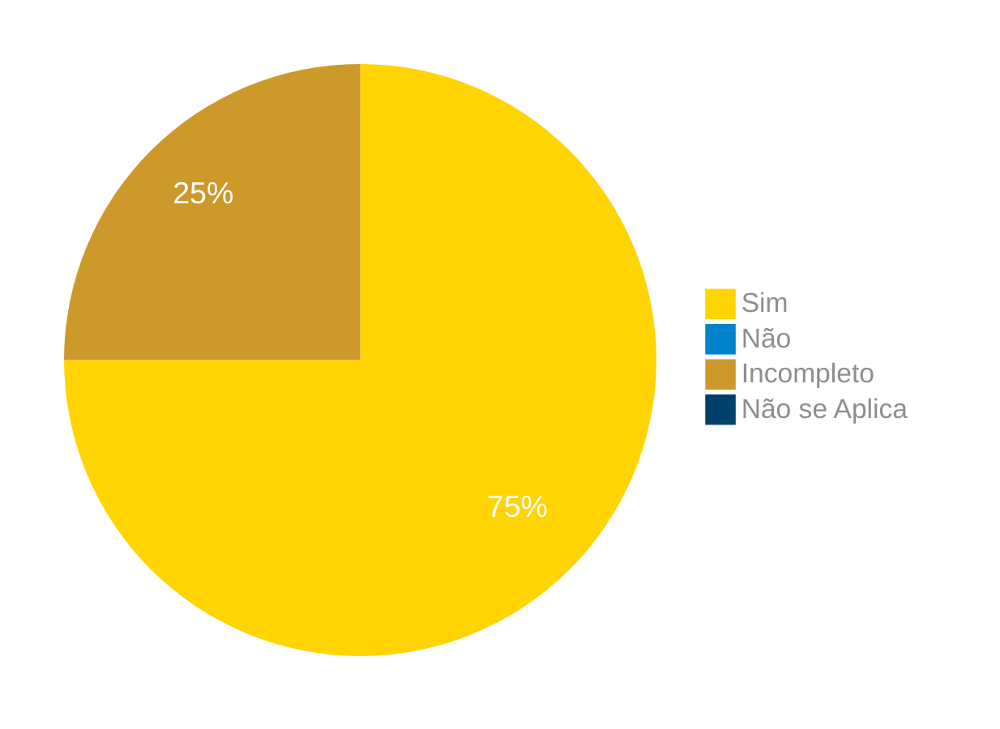

# Verificação do Artefato Storyboards

## Introdução

Neste artefato, está descrito os resultados da verificação do artefato de [Storyboards](https://interacao-humano-computador.github.io/2024.1-Correios/design_avaliacao/storyboards/) feito pelo [Grupo 03](https://interacao-humano-computador.github.io/2024.1-Correios/) da disciplina de Interação Humano Computador referente ao site [Correios](https://www.correios.com.br/). Lembrando que o foco não é apontar quem errou e sim os problemas presentes no artefato produzido, e por fim garantir os critérios de qualidade estabelecidos.

## Metodologia

Este artefato foi produzido por [Ricardo][RicardoGH] e cada integrante do grupo fez a verificação de um storyboard diferente, seguindo a divisão planejada pelo grupo na [reunião 7](https://interacao-humano-computador.github.io/2024.1-Correios/atas/ata7/). Para a verificação do artefato, foi utilizada a versão `1.1` datada do dia 01/06/2024. Adotamos a metodologia de inspeção por [checklist](#checklist-de-verificacao) neste processo. Podemos ver pela Tabela 1 de exemplo, que para cada item do checklist teremos: descrição do item em verificação, resposta à avaliação (pode ser "Sim", "Não", "Incompleto" ou "Não se Aplica"), o número da referência bibliográfica e um link para um print da referência que o fundamenta o item. Ao final, na seção de [Problemas Encontrados](#problemas-encontrados), são comentados os itens negativos.

<font size="2"><p style="text-align: center">Tabela 1 - Perguntas elaboradas de acordo com as referências bibliográficas.</p></font>

<center>

| ID | Descrição | Avaliação | Referência| Print |
|:--:| --------- | :-------: | :-------: | :-:|
| **1** | O storyboard está relacionado a um cenário elaborado pelo grupo? | | <a href="#ref1">1</a> |  [página 263](../../../../../assets/prints_verificacao/ricardo/storyboard1.png)
| **2** | O cenário (propósito) está sendo bem descrito no storyboard? |  | <a href="#ref2">2</a> | [Tópico : Quais são as principais características de um storyboard?](../../../../../assets/prints_verificacao/ricardo/storyboard2.png) |
| **3** | As atividades (etapas dos personagens) são representadas com clareza no storyboard? |  | <a href="#ref2">2</a> | [Tópico : Quais são as principais características de um storyboard?](../../../../../assets/prints_verificacao/ricardo/storyboard2.png) |
| **4** | Os visuias (imagens, formas, vídeos) representam diferentes etapas do storyboard? |  | <a href="#ref2">2</a> | [Tópico : Quais são as principais características de um storyboard?](../../../../../assets/prints_verificacao/ricardo/storyboard2.png) |

</center>

<font size="2"><p style="text-align: center">Fonte: [Ricardo Augusto](https://github.com/avmricardo), 2024.</p></font>

## Apresentação dos Dados

Aqui será apresentado os resultados do checklist e logo após as observações dos itens com resultado negativo.

### Pré postagem

#### Checklist de verificação

<font size="2"><p style="text-align: center">Tabela 2 - Checklist preenchido na verificação</p></font>

<center>

| ID | Descrição | Avaliação | Referência| Print |
|:--:| --------- | :-------: | :-------: | :-:|
| **1** | O storyboard está relacionado a um cenário elaborado pelo grupo? | | <a href="#ref1">1</a> |  [página 263](../../../../../assets/prints_verificacao/ricardo/storyboard1.png)
| **2** | O cenário (propósito) está sendo bem descrito no storyboard? |  | <a href="#ref2">2</a> | [Tópico : Quais são as principais características de um storyboard?](../../../../../assets/prints_verificacao/ricardo/storyboard2.png) |
| **3** | As atividades (etapas dos personagens) são representadas com clareza no storyboard? |  | <a href="#ref2">2</a> | [Tópico : Quais são as principais características de um storyboard?](../../../../../assets/prints_verificacao/ricardo/storyboard2.png) |
| **4** | Os visuias (imagens, formas, vídeos) representam diferentes etapas do storyboard? |  | <a href="#ref2">2</a> | [Tópico : Quais são as principais características de um storyboard?](../../../../../assets/prints_verificacao/ricardo/storyboard2.png) |

</center>

<font size="2"><p style="text-align: center">Fonte: [](https://github.com/), 2024.</p></font>


#### Problemas Encontrados

Aqui será apresentado todos os problemas identificados durante o processo de verificação do artefato de link do artefato.

- ID xx: Descrição
    - Avaliação:
    - Comentário:

### Cálculo de preços e prazos de entrega

#### Checklist de verificação

<font size="2"><p style="text-align: center">Tabela 3 - Checklist preenchido na verificação</p></font>

<center>

| ID | Descrição | Avaliação | Referência| Print |
|:--:| --------- | :-------: | :-------: | :-:|
| **1** | O storyboard está relacionado a um cenário elaborado pelo grupo? | | <a href="#ref1">1</a> |  [página 263](../../../../../assets/prints_verificacao/ricardo/storyboard1.png)
| **2** | O cenário (propósito) está sendo bem descrito no storyboard? |  | <a href="#ref2">2</a> | [Tópico : Quais são as principais características de um storyboard?](../../../../../assets/prints_verificacao/ricardo/storyboard2.png) |
| **3** | As atividades (etapas dos personagens) são representadas com clareza no storyboard? |  | <a href="#ref2">2</a> | [Tópico : Quais são as principais características de um storyboard?](../../../../../assets/prints_verificacao/ricardo/storyboard2.png) |
| **4** | Os visuias (imagens, formas, vídeos) representam diferentes etapas do storyboard? |  | <a href="#ref2">2</a> | [Tópico : Quais são as principais características de um storyboard?](../../../../../assets/prints_verificacao/ricardo/storyboard2.png) |

</center>

<font size="2"><p style="text-align: center">Fonte: [](https://github.com/), 2024.</p></font>


#### Problemas Encontrados

Aqui será apresentado todos os problemas identificados durante o processo de verificação do artefato de link do artefato.

- ID xx: Descrição
    - Avaliação:
    - Comentário:

### Receber encomendas

#### Checklist de verificação

<font size="2"><p style="text-align: center">Tabela 4 - Checklist preenchido na verificação</p></font>

<center>

| ID | Descrição | Avaliação | Referência | Print |
| --- | --- | --- | --- | --- |
| **1** | O storyboard está relacionado a um cenário elaborado pelo grupo? | incompleto | [1](#ref1) | [página 263](../../../../../assets/prints_verificacao/ricardo/storyboard1.png) |
| **2** | O cenário (propósito) está sendo bem descrito no storyboard? | sim | [2](#ref2) | [Tópico : Quais são as principais características de um storyboard?](../../../../../assets/prints_verificacao/ricardo/storyboard2.png) |
| **3** | As atividades (etapas dos personagens) são representadas com clareza no storyboard? | sim | [2](#ref2) | [Tópico : Quais são as principais características de um storyboard?](../../../../../assets/prints_verificacao/ricardo/storyboard2.png) |
| **4** | Os visuias (imagens, formas, vídeos) representam diferentes etapas do storyboard? | sim | [2](#ref2) | [Tópico : Quais são as principais características de um storyboard?](../../../../../assets/prints_verificacao/ricardo/storyboard2.png) |

</center>

<font size="2"><p style="text-align: center">Fonte: [Gabriel F. J. Silva](https://github.com/MMcLovin), 2024.</p></font>

#### Gravação da Verificação

<div style="text-align: center;">
    <iframe width="560" height="315" src="https://www.youtube.com/embed/sCPvSt16e9Y" title="(Entrega 6.2) Verificação: Storyboard - Receber Encomendas" frameborder="0" allow="accelerometer; autoplay; clipboard-write; encrypted-media; gyroscope; picture-in-picture; web-share" referrerpolicy="strict-origin-when-cross-origin" allowfullscreen></iframe>
</div>

<p style="text-align: center">
    <a href="https://www.youtube.com/watch?v=sCPvSt16e9Y"> Link para o vídeo </a>
</p>

#### Problemas Encontrados

Aqui será apresentado todos os problemas identificados durante o processo de verificação do artefato de Cenário para [Recebimento de Encomendas](https://interacao-humano-computador.github.io/2024.1-Correios/analise_de_requisitos/cenarios/#recebimento-de-encomendas).

- ID 01: O contexto descreve o estado inicial: suas pré-condições, o local (físico) e o tempo?
    - Avaliação: incompleto
    - Comentário: Ele está relacionado, porém, o cenário realizado não é exatamente igual e nem há uma ligação por meio de hiperlink

### Sumário dos resultados

<!-- Conte as quantidade de ocorrencias e coloque no Grafico a quantidade em cada tipo de avaliação (se não ouver incidencia de um tipo como "não se aplica", apague a linha do mesmo)-->
A seguir, apresentamos a Figura 2 com o gráfico de pizza do sumário dos resultados.

<font size="2"><p style="text-align: center">Figura 2 - Gráfico de pizza do sumário dos resultados.</p></font>

<div style="text-align: center;">

    ``` mermaid
    %%{
    init: {
        'theme': 'base',
        'themeVariables': {
            'primaryColor': '#FFD400',
            'secondaryColor': '#0083CA',
            'tertiaryColor': '#CD992B',
            'pie4': '#00416B',
            'primaryTextColor': '#8e8e8e',
            'pieStrokeWidth': '0px',
            'pieOuterStrokeWidth': '0px',
            'pieOpacity': '1',
            'pieSectionTextColor': '#fff',
            'pieSectionTextSize': '19px'
        }
    }
    }%%
    pie
        "Sim" : 3
        "Incompleto" : 1
    ```
</div>

<font size="2"><p style="text-align: center">Fonte: [Gabriel F. J. Silva](https://github.com/MMcLovin), 2024.</p></font>

### Rastreamento de encomendas

#### Checklist de verificação

<font size="2"><p style="text-align: center">Tabela 5 - Checklist preenchido na verificação</p></font>

<center>

| ID | Descrição | Avaliação | Referência| Print |
|:--:| --------- | :-------: | :-------: | :-:|
| **1** | O storyboard está relacionado a um cenário elaborado pelo grupo? | Sim| <a href="#ref1">1</a> |  [página 263](../../../../../assets/prints_verificacao/ricardo/storyboard1.png)
| **2** | O cenário (propósito) está sendo bem descrito no storyboard? |Sim  | <a href="#ref2">2</a> | [Tópico : Quais são as principais características de um storyboard?](../../../../../assets/prints_verificacao/ricardo/storyboard2.png) |
| **3** | As atividades (etapas dos personagens) são representadas com clareza no storyboard? | Sim | <a href="#ref2">2</a> | [Tópico : Quais são as principais características de um storyboard?](../../../../../assets/prints_verificacao/ricardo/storyboard2.png) |
| **4** | Os visuais (imagens, formas, vídeos) representam diferentes etapas do storyboard? |Incompleto  | <a href="#ref2">2</a> | [Tópico : Quais são as principais características de um storyboard?](../../../../../assets/prints_verificacao/ricardo/storyboard2.png) |

</center>

<font size="2"><p style="text-align: center">Fonte: [Claudio Henrique](https://github.com/claudiohsc), 2024.</p></font>


#### Problemas Encontrados

Aqui será apresentado todos os problemas identificados durante o processo de verificação do artefato de link do artefato.

- ID 04: Os visuais (imagens, formas, vídeos) representam diferentes etapas do storyboard?
    - Avaliação: Incompleto
    - Comentário: Faltou nos quadros uma melhor representação, no final, da parte de rastreio do site e quais telas o usuário iria presenciar.

### Gravação da verificação

<!-- para o iframe do vídeo, bote width = 560 e height = 315 -->

<div style="text-align: center;">
    <iframe width="560" height="315" src="https://www.youtube.com/embed/v54ijhrZgW4?si=KEKaIcCs19s7vQIx" title="YouTube video player" frameborder="0" allow="accelerometer; autoplay; clipboard-write; encrypted-media; gyroscope; picture-in-picture; web-share" referrerpolicy="strict-origin-when-cross-origin" allowfullscreen></iframe>
</div>

<p style="text-align: center">
    <a href="https://www.youtube.com/watch?v=v54ijhrZgW4"> Link para o vídeo </a>
</p>

### Sumário dos resultados

<!-- Conte as quantidade de ocorrencias e coloque no Grafico a quantidade em cada tipo de avaliação (se não ouver incidencia de um tipo como "não se aplica", apague a linha do mesmo)-->
A seguir, apresentamos a Figura 4 com o gráfico de pizza do sumário dos resultados.

<font size="2"><p style="text-align: center">Figura 4 - Gráfico de pizza do sumário dos resultados.</p></font>

<center>



</center>

<font size="2"><p style="text-align: center">Fonte: [Claudio Henrique][ClaudioGH], 2024.</p></font>

### Loja online

#### Checklist de verificação

<font size="2"><p style="text-align: center">Tabela 6 - Checklist preenchido na verificação</p></font>

<center>

| ID | Descrição | Avaliação | Referência| Print |
|:--:| --------- | :-------: | :-------: | :-:|
| **1** | O storyboard está relacionado a um cenário elaborado pelo grupo? | Sim | <a href="#ref1">1</a> |  [página 263](../../../../../assets/prints_verificacao/ricardo/storyboard1.png)
| **2** | O cenário (propósito) está sendo bem descrito no storyboard? | Sim | <a href="#ref2">2</a> | [Tópico : Quais são as principais características de um storyboard?](../../../../../assets/prints_verificacao/ricardo/storyboard2.png) |
| **3** | As atividades (etapas dos personagens) são representadas com clareza no storyboard? | Sim | <a href="#ref2">2</a> | [Tópico : Quais são as principais características de um storyboard?](../../../../../assets/prints_verificacao/ricardo/storyboard2.png) |
| **4** | Os visuias (imagens, formas, vídeos) representam diferentes etapas do storyboard? | Sim | <a href="#ref2">2</a> | [Tópico : Quais são as principais características de um storyboard?](../../../../../assets/prints_verificacao/ricardo/storyboard2.png) |

</center>

<font size="2"><p style="text-align: center">Fonte: [](https://github.com/), 2024.</p></font>


#### Problemas Encontrados

Aqui será apresentado todos os problemas identificados durante o processo de verificação do artefato de link do artefato.

Não foram identificadas falhas.

### Minhas importações

#### Checklist de verificação

<font size="2"><p style="text-align: center">Tabela 7 - Checklist preenchido na verificação</p></font>

<center>

| ID | Descrição | Avaliação | Referência| Print |
|:--:| --------- | :-------: | :-------: | :-:|
| **1** | O storyboard está relacionado a um cenário elaborado pelo grupo? | Não | <a href="#ref1">1</a> |  [página 263](../../../../../assets/prints_verificacao/ricardo/storyboard1.png)
| **2** | O cenário (propósito) está sendo bem descrito no storyboard? | Não | <a href="#ref2">2</a> | [Tópico : Quais são as principais características de um storyboard?](../../../../../assets/prints_verificacao/ricardo/storyboard2.png) |
| **3** | As atividades (etapas dos personagens) são representadas com clareza no storyboard? | Sim | <a href="#ref2">2</a> | [Tópico : Quais são as principais características de um storyboard?](../../../../../assets/prints_verificacao/ricardo/storyboard2.png) |
| **4** | Os visuias (imagens, formas, vídeos) representam diferentes etapas do storyboard? | Incompleto | <a href="#ref2">2</a> | [Tópico : Quais são as principais características de um storyboard?](../../../../../assets/prints_verificacao/ricardo/storyboard2.png) |

</center>

<font size="2"><p style="text-align: center">Fonte: [Ricardo Augusto](https://github.com/avmricardo), 2024.</p></font>


#### Problemas Encontrados

Aqui será apresentado todos os problemas identificados durante o processo de verificação do artefato de link do artefato.

- ID 01: O storyboard está relacionado a um cenário elaborado pelo grupo?
    - Avaliação: Não
    - Comentário: Não foi comentado o uso de cenários para a fabricação do storyboard;
- ID 02: O cenário (propósito) está sendo bem descrito no storyboard?
    - Avaliação: Não
    - Comentário: A razão para a criação do storyboard não é especificada;
- ID 04: Os visuias (imagens, formas, vídeos) representam diferentes etapas do storyboard?
    - Avaliação: Incompleto
    - Comentário: O storyboard não possui muitas etapas diferentes, apenas o personagem acessando o recurso de minhas importações.

## Bibliografia

> 1. ROGERS, Y.; SHARP, H.; PREECE, J. Design de interação: Além da interação humano-computador. Bookman Editora, 2013.

> 2. O que é Storyboard? Como fazer? Veja modelos e exemplos. Disponível em: <https://miro.com/pt/storyboard/o-que-e-storyboard/>. Acesso em: 11 jun. 2024.

## Referências Biliográficas

> 1<a id="ref1">.</a> ROGERS, Y.; SHARP, H.; PREECE, J. Design de interação: Além da interação humano-computador. Bookman Editora, 2013.

> 2<a id="ref2">.</a> O que é Storyboard? Como fazer? Veja modelos e exemplos. Disponível em: <https://miro.com/pt/storyboard/o-que-e-storyboard/>. Acesso em: 11 jun. 2024.

## Histórico de Versões

| Versão | Data | Descrição | Autor(es) | Revisor(es) |
| :----: | :--: | --------- | ----------- | ------ |
| `1.0`  | 25/06/2024 | Criação do documento |[Ricardo Augusto](https://github.com/avmricardo) | []() |

[ClaudioGH]: https://github.com/claudiohsc
[EliasGH]: https://github.com/EliasOliver21
[GabrielBGH]: https://github.com/Bertolazi
[GabrielFGH]: https://github.com/MMcLovin
[PabloGH]: https://github.com/pabloheika
[RicardoGH]: https://www.github.com/avmricardo