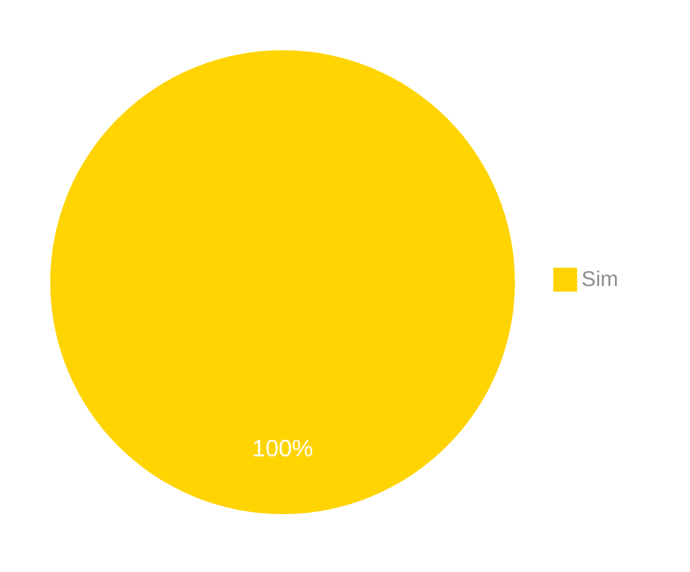

# Verificação do Artefato Gerenciar Minhas importações.

## Introdução

Neste artefato, está descrito os resultados da verificação do artefato de Relato da análise de tarefas para [Gerenciar Minhas Importações.](https://interacao-humano-computador.github.io/2024.1-Correios/design_avaliacao/nivel_2/relato-resultados/gerenciar-importacoes/) feito pelo [Grupo 03](https://interacao-humano-computador.github.io/2024.1-Correios/) da disciplina de Interação Humano Computador referente ao site [Correios](https://www.correios.com.br/). Lembrando que o foco não é apontar quem errou e sim os problemas presentes no artefato produzido, e por fim garantir os critérios de qualidade estabelecidos.

## Metodologia

Este artefato foi produzido por [Gabriel B. Bertolazi][GabrielFGH] e verificado por [Ricardo][RicardoGH], seguindo a divisão planejada pelo grupo na [reunião 7](https://interacao-humano-computador.github.io/2024.1-Correios/atas/ata7/). Para a verificação do artefato, foi utilizada a versão `1.0` datada do dia 22/05/2024. Adotamos a metodologia de inspeção por [checklist](#checklist-de-verificacao) neste processo. Podemos ver pela Tabela 1 de exemplo, que para cada item do checklist teremos: descrição do item em verificação, resposta à avaliação (pode ser "Sim", "Não", "Incompleto" ou "Não se Aplica"), o número da referência bibliográfica e um link para um print da referência que o fundamenta o item. Ao final, na seção de [Problemas Encontrados](#problemas-encontrados), são comentados os itens negativos.

Tabela 1 - Perguntas elaboradas de acordo com as referências bibliográficas para os relatos do resultado.

| ID | Descrição | Avaliação | Referência| Print |
|:--:| --------- | :-------: | :-------: | :---: |
| **1** | Nos relatos, tem-se os objetivos das avaliações? |  | <a href="#ref1">1</a>  | [pg 318](../../../../../../assets/prints_verificacao/gabrielb/Pag-319.png) |
| **2** | Possui uma breve descrição do método de prototipação de papel? |  | <a href="#ref1">1</a>  | [pg 319](../../../../../../assets/prints_verificacao/gabrielb/Pag-319.png)  | 
| **3** | O número e o perfil dos avaliadores e dos participantes presentes na avaliação? |  | <a href="#ref1">1</a>  | [pg 319](../../../../../../assets/prints_verificacao/gabrielb/Pag-319.png) |
| **4** | Possui as tarefas realizadas pelos participantes durante o método de avaliação em questão? |  | <a href="#ref1">1</a>  | [pg 319](../../../../../../assets/prints_verificacao/gabrielb/Pag-319.png) |
| **5** | Tem-se duas listas de usabilidade? Uma com os problemas corrigidos e uma com os problemas ainda não corrigidos? | | <a href="#ref1">1</a> | [pg 319](../../../../../../assets/prints_verificacao/gabrielb/Pag-319.png) |
| **6** | Essas listas possuem o local onde ocorreu a avaliação? |  | <a href="#ref1">1</a>  | [pg 319](../../../../../../assets/prints_verificacao/gabrielb/Pag-319.png) |
| **7** | Essas listas possuem quais fatores de usabilidade foram prejudicados? |  | <a href="#ref1">1</a>  | [pg 319](../../../../../../assets/prints_verificacao/gabrielb/Pag-319.png) |
| **8** | Essas listas possuem a descrição e a justificativa dos problemas? |  | <a href="#ref1">1</a>  | [pg 319](../../../../../../assets/prints_verificacao/gabrielb/Pag-319.png) |
| **9** | A lista com os problemas de usabilidade já resolvidos possui a correção que foi realizada no protótipo de papel? |  | <a href="#ref1">1</a>  | [pg 319](../../../../../../assets/prints_verificacao/gabrielb/Pag-319.png) |
| **10** | A lista com os problemas de usabilidade já corrigidos indica se o problema voltou a ocorrer após a correção? |  | <a href="#ref1">1</a>  | [pg 319](../../../../../../assets/prints_verificacao/gabrielb/Pag-319.png) |
| **11** | A lista com com os problemas de usabilidade ainda não corrigidos possui uma prioridade para correção? |  | <a href="#ref1">1</a>  | [pg 319](../../../../../../assets/prints_verificacao/gabrielb/Pag-319.png) |
| **12** | A lista com com os problemas de usabilidade ainda não corrigidos possui as sugestões para correção? |  | <a href="#ref1">1</a>  | [pg 319](../../../../../../assets/prints_verificacao/gabrielb/Pag-319.png) |
| **13** | A lista com com os problemas de usabilidade ainda não corrigidos possui indicações de partes do sistema que podem ser mais bem elaboradas? |  | <a href="#ref1">1</a>  | [pg 319](../../../../../../assets/prints_verificacao/gabrielb/Pag-319.png) |

Fonte: [Gabriel B. Bertolazi](https://github.com/Bertolazi), 2024.

## Apresentação dos Dados

Aqui será apresentado os resultados do checklist e logo após as observações dos itens com resultado negativo.

### Checklist de verificação

Tabela 2 - Perguntas elaboradas de acordo com as referências bibliográficas para os relatos do resultado.

| ID | Descrição | Avaliação | Referência| Print |
|:--:| --------- | :-------: | :-------: | :---: |
| **1** | Nos relatos, tem-se os objetivos das avaliações? | Sim | <a href="#ref1">1</a>  | [pg 318](../../../../../../assets/prints_verificacao/gabrielb/Pag-319.png) |
| **2** | Possui uma breve descrição do método de prototipação de papel? | Sim | <a href="#ref1">1</a>  | [pg 319](../../../../../../assets/prints_verificacao/gabrielb/Pag-319.png)  | 
| **3** | O número e o perfil dos avaliadores e dos participantes presentes na avaliação? | Sim | <a href="#ref1">1</a>  | [pg 319](../../../../../../assets/prints_verificacao/gabrielb/Pag-319.png) |
| **4** | Possui as tarefas realizadas pelos participantes durante o método de avaliação em questão? | Sim | <a href="#ref1">1</a>  | [pg 319](../../../../../../assets/prints_verificacao/gabrielb/Pag-319.png) |
| **5** | Tem-se duas listas de usabilidade? Uma com os problemas corrigidos e uma com os problemas ainda não corrigidos? | Sim| <a href="#ref1">1</a> | [pg 319](../../../../../../assets/prints_verificacao/gabrielb/Pag-319.png) |
| **6** | Essas listas possuem o local onde ocorreu a avaliação? | Sim | <a href="#ref1">1</a>  | [pg 319](../../../../../../assets/prints_verificacao/gabrielb/Pag-319.png) |
| **7** | Essas listas possuem quais fatores de usabilidade foram prejudicados? | Sim | <a href="#ref1">1</a>  | [pg 319](../../../../../../assets/prints_verificacao/gabrielb/Pag-319.png) |
| **8** | Essas listas possuem a descrição e a justificativa dos problemas? | Sim | <a href="#ref1">1</a>  | [pg 319](../../../../../../assets/prints_verificacao/gabrielb/Pag-319.png) |
| **9** | A lista com os problemas de usabilidade já resolvidos possui a correção que foi realizada no protótipo de papel? | Sim | <a href="#ref1">1</a>  | [pg 319](../../../../../../assets/prints_verificacao/gabrielb/Pag-319.png) |
| **10** | A lista com os problemas de usabilidade já corrigidos indica se o problema voltou a ocorrer após a correção? | Sim | <a href="#ref1">1</a>  | [pg 319](../../../../../../assets/prints_verificacao/gabrielb/Pag-319.png) |
| **11** | A lista com com os problemas de usabilidade ainda não corrigidos possui uma prioridade para correção? | Sim | <a href="#ref1">1</a>  | [pg 319](../../../../../../assets/prints_verificacao/gabrielb/Pag-319.png) |
| **12** | A lista com com os problemas de usabilidade ainda não corrigidos possui as sugestões para correção? | Sim | <a href="#ref1">1</a>  | [pg 319](../../../../../../assets/prints_verificacao/gabrielb/Pag-319.png) |
| **13** | A lista com com os problemas de usabilidade ainda não corrigidos possui indicações de partes do sistema que podem ser mais bem elaboradas? | Sim | <a href="#ref1">1</a>  | [pg 319](../../../../../../assets/prints_verificacao/gabrielb/Pag-319.png) |

Fonte: [Ricardo][RicardoGH], 2024.

### Gravação da verificação

<!-- para o iframe do vídeo, bote width = 560 e height = 315 -->

<iframe width="560" height="315" src="https://www.youtube.com/embed/X4Ytb4KLQzs?si=5CANSPiDOZ0Sj8LT" title="YouTube video player" frameborder="0" allow="accelerometer; autoplay; clipboard-write; encrypted-media; gyroscope; picture-in-picture; web-share" referrerpolicy="strict-origin-when-cross-origin" allowfullscreen></iframe>

    <a href="https://youtu.be/X4Ytb4KLQzs"> Link para o vídeo </a>

## Problemas Encontrados

<!--- Aqui será apresentado todos os problemas identificados durante o processo de verificação do artefato de link do artefato. --->

Não tiveram problemas

## Sumário dos resultados

<!-- Conte as quantidade de ocorrencias e coloque no Grafico a quantidade em cada tipo de avaliação (se não ouver incidencia de um tipo como "não se aplica", apague a linha do mesmo)-->
A seguir, apresentamos a Figura 1 com o gráfico de pizza do sumário dos resultados.

Figura 1 - Gráfico de pizza do sumário dos resultados.

Fonte: [Ricardo Augusto][RicardoGH], 2024.

## Bibliografia

> 1. Barbosa, S. D. J.; Silva, B. S. da; Silveira, M. S.; Gasparini, I.; Darin, T.; Barbosa, G. D. J. (2021) Interação Humano-Computador e Experiência do usuário. Autopublicação. ISBN: 978-65-00-19677-1. 

## Histórico de Versões

| Versão | Data | Descrição | Autor(es) | Revisor(es) |
| :----: | :--: | --------- | ----------- | ------ |
| `1.0`  | 25/06/2024 | Criação do documento | [Gabriel B. Bertolazi][GabrielBGH] | [Gabriel F.][GabrielFGH] |
| `1.1`  | 26/06/2024 | Preenchendo checklist | [Ricardo Augusto][RicardoGH] | [Gabriel F.][GabrielFGH] |

[ClaudioGH]: https://github.com/claudiohsc
[EliasGH]: https://github.com/EliasOliver21
[GabrielBGH]: https://github.com/Bertolazi
[GabrielFGH]: https://github.com/MMcLovin
[PabloGH]: https://github.com/pabloheika
[RicardoGH]: https://www.github.com/avmricardo

