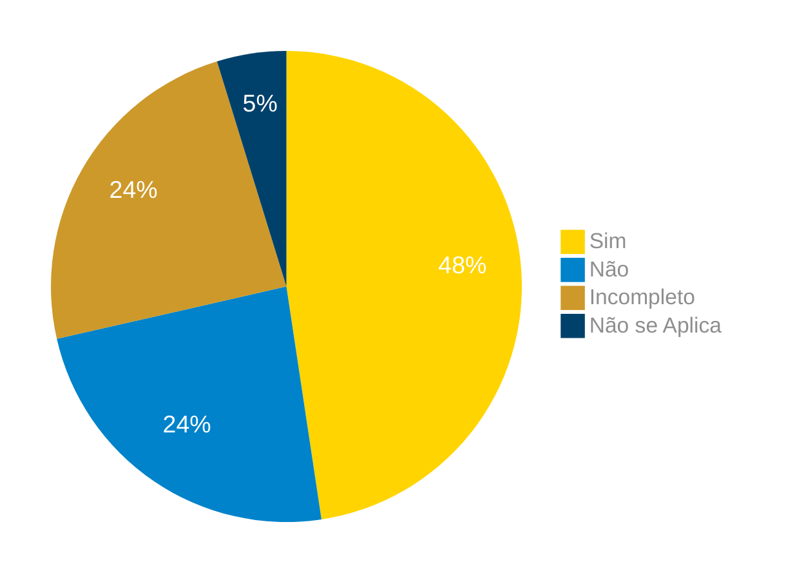

# Verificação do Artefato Planejamento da Avaliação do Protótipo de Alta Fidelidade

## Introdução

Neste artefato, está descrito os resultados da verificação do artefato de [Planejamento da Avaliação do Protótipo de Alta Fidelidade](https://interacao-humano-computador.github.io/2024.1-Correios/design_avaliacao/nivel_3/prototipo_alta_fidelidade/planejamento_da_avaliacao/) feito pelo [Grupo 03](https://interacao-humano-computador.github.io/2024.1-Correios/) da disciplina de Interação Humano Computador referente ao site [Correios](https://www.correios.com.br/). Lembrando que o foco não é apontar quem errou e sim os problemas presentes no artefato produzido, e por fim garantir os critérios de qualidade estabelecidos.

## Metodologia

Este artefato foi produzido por [Ricardo][RicardoGH] e verificado por [Pablo][PabloGH], seguindo a divisão planejada pelo grupo na [reunião 7](https://interacao-humano-computador.github.io/2024.1-Correios/atas/ata7/). Para a verificação do artefato, foi utilizada a versão `1.0` datada do dia 18/06/2024. Adotamos a metodologia de inspeção por [checklist](#checklist-de-verificacao) neste processo. Podemos ver pela Tabela 1 de exemplo, que para cada item do checklist teremos: descrição do item em verificação, resposta à avaliação (pode ser "Sim", "Não", "Incompleto" ou "Não se Aplica"), o número da referência bibliográfica e um link para um print da referência que o fundamenta o item. Ao final, na seção de [Problemas Encontrados](#problemas-encontrados), são comentados os itens negativos.

Tabela 1 - Perguntas elaboradas de acordo com as referências bibliográficas.

| ID | Descrição | Avaliação | Referência | Print |
| --- | --- | --- | --- | --- |
| **1** | Foi usado o framework DECIDE para realizar o planejamento? |   | [1.](#ref1) "Capítulo 11 - Planejamento da Avaliação de IHC" | [página 280](../../../../../assets/prints_verificacao/pablo/planejamento_avaliacao_hta/1.jpeg) |
| **2** | Foram elaboradas perguntas que detalhem os objetivos da avaliação? |   | [1.](#ref1) "Capítulo 11 - Planejamento da Avaliação de IHC" | [página 265](../../../../../assets/prints_verificacao/pablo/planejamento_avaliacao_hta/2%20e%203.jpeg) |
| **3** | A elaboração de perguntas considerou o público-alvo das atividades? |   | [1.](#ref1) "Capítulo 11 - Planejamento da Avaliação de IHC" | [página 265](../../../../../assets/prints_verificacao/pablo/planejamento_avaliacao_hta/2%20e%203.jpeg) |
| **4** | Escolheram os métodos de avaliação mais adequados para atingir os objetivos esperados, considerando prazo, orçamento, equipamentos disponíveis e experiência dos avaliadores? |   | [1.](#ref1) "Capítulo 11 - Planejamento da Avaliação de IHC" | [página 264](../../../../../assets/prints_verificacao/pablo/planejamento_avaliacao_hta/4.jpeg) |
| **5** | Foram seguidas as atividades básicas como método na avaliação incluindo preparação, coleta de dados, interpretação, consolidação e relato dos resultados? |   | [1.](#ref1) "Capítulo 11 - Planejamento da Avaliação de IHC" | [página 273](../../../../../assets/prints_verificacao/pablo/planejamento_avaliacao_hta/5.jpeg) |
| **6** | No caso de a avaliação encontrar problemas ou oportunidades de melhorias foram planejados um reprojeto do sistema? |   | [1.](#ref1) "Capítulo 11 - Planejamento da Avaliação de IHC" | [página 273](../../../../../assets/prints_verificacao/pablo/planejamento_avaliacao_hta/6.jpeg) |
| **7** | O planejamento da avaliação envolve as questões práticas, que incluem alocar pessoal, recursos e equipamentos, preparar o material de apoio, preparação do ambiente de teste, a realização de um teste-piloto, recrutamento dos participantes e as questões éticas? |   | [1.](#ref1) "Capítulo 11 - Planejamento da Avaliação de IHC" | [página 275](../../../../../assets/prints_verificacao/pablo/planejamento_avaliacao_hta/7.jpeg) |

Fonte: [Ricardo Augusto](https://github.com/avmricardo), 2024.

## Apresentação dos Dados

Aqui será apresentado os resultados do checklist e logo após as observações dos itens com resultado negativo.

### Checklist de verificação

Tabela 2 - Checklist preenchido na verificação

| ID | Descrição | Avaliação | Referência | Print |
| --- | --- | --- | --- | --- |
| **1** | Foi usado o framework DECIDE para realizar o planejamento? |   | [1.](#ref1) "Capítulo 11 - Planejamento da Avaliação de IHC" | [página 280](../../../../../assets/prints_verificacao/pablo/planejamento_avaliacao_hta/1.jpeg) |
| **2** | Foram elaboradas perguntas que detalhem os objetivos da avaliação? |   | [1.](#ref1) "Capítulo 11 - Planejamento da Avaliação de IHC" | [página 265](../../../../../assets/prints_verificacao/pablo/planejamento_avaliacao_hta/2%20e%203.jpeg) |
| **3** | A elaboração de perguntas considerou o público-alvo das atividades? |   | [1.](#ref1) "Capítulo 11 - Planejamento da Avaliação de IHC" | [página 265](../../../../../assets/prints_verificacao/pablo/planejamento_avaliacao_hta/2%20e%203.jpeg) |
| **4** | Escolheram os métodos de avaliação mais adequados para atingir os objetivos esperados, considerando prazo, orçamento, equipamentos disponíveis e experiência dos avaliadores? |   | [1.](#ref1) "Capítulo 11 - Planejamento da Avaliação de IHC" | [página 264](../../../../../assets/prints_verificacao/pablo/planejamento_avaliacao_hta/4.jpeg) |
| **5** | Foram seguidas as atividades básicas como método na avaliação incluindo preparação, coleta de dados, interpretação, consolidação e relato dos resultados? |   | [1.](#ref1) "Capítulo 11 - Planejamento da Avaliação de IHC" | [página 273](../../../../../assets/prints_verificacao/pablo/planejamento_avaliacao_hta/5.jpeg) |
| **6** | No caso de a avaliação encontrar problemas ou oportunidades de melhorias foram planejados um reprojeto do sistema? |   | [1.](#ref1) "Capítulo 11 - Planejamento da Avaliação de IHC" | [página 273](../../../../../assets/prints_verificacao/pablo/planejamento_avaliacao_hta/6.jpeg) |
| **7** | O planejamento da avaliação envolve as questões práticas, que incluem alocar pessoal, recursos e equipamentos, preparar o material de apoio, preparação do ambiente de teste, a realização de um teste-piloto, recrutamento dos participantes e as questões éticas? |   | [1.](#ref1) "Capítulo 11 - Planejamento da Avaliação de IHC" | [página 275](../../../../../assets/prints_verificacao/pablo/planejamento_avaliacao_hta/7.jpeg) |

Fonte: [Pablo][PabloGH], 2024.

### Gravação da verificação

<!-- para o iframe do vídeo, bote width = 560 e height = 315 -->

    <iframe width="560" height="315" src="https://www.youtube.com/embed" title="Apresentação 7 Interação Humano Computador 2024.1 - Grupo 3" frameborder="0" allow="accelerometer; autoplay; clipboard-write; encrypted-media; gyroscope; picture-in-picture; web-share" referrerpolicy="strict-origin-when-cross-origin" allowfullscreen></iframe>

    <a href="link"> Link para o vídeo </a>

### Problemas Encontrados

<!--- Aqui será apresentado todos os problemas identificados durante o processo de verificação do artefato de link do artefato. --->

- ID xx: Descrição
    - Avaliação:
    - Comentário:

### Sumário dos resultados

<!-- Conte as quantidade de ocorrencias e coloque no Grafico a quantidade em cada tipo de avaliação (se não ouver incidencia de um tipo como "não se aplica", apague a linha do mesmo)-->
A seguir, apresentamos a Figura 1 com o gráfico de pizza do sumário dos resultados.

Figura 1 - Gráfico de pizza do sumário dos resultados.

Fonte: [][], 2024.

## Bibliografia

> 1. Barbosa, S. D. J.; Silva, B. S. da; Silveira, M. S.; Gasparini, I.; Darin, T.; Barbosa, G. D. J. (2021) Interação Humano-Computador e Experiência do usuário. Autopublicação. ISBN: 978-65-00-19677-1. 

## Histórico de Versões

| Versão | Data | Descrição | Autor(es) | Revisor(es) |
| :----: | :--: | --------- | ----------- | ------ |
| `1.0`  | 25/06/2024 | Criação do documento | [Ricardo Augusto][RicardoGH] | [][] |

[ClaudioGH]: https://github.com/claudiohsc
[EliasGH]: https://github.com/EliasOliver21
[GabrielBGH]: https://github.com/Bertolazi
[GabrielFGH]: https://github.com/MMcLovin
[PabloGH]: https://github.com/pabloheika
[RicardoGH]: https://www.github.com/avmricardo