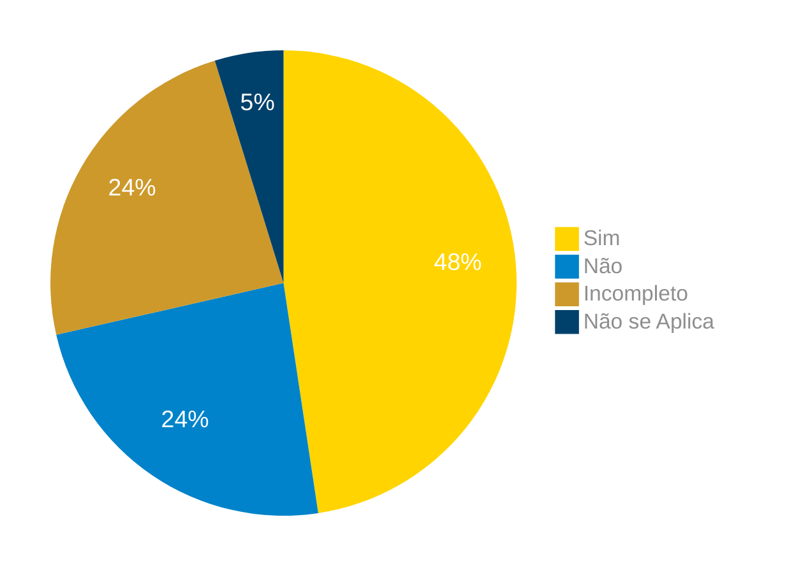
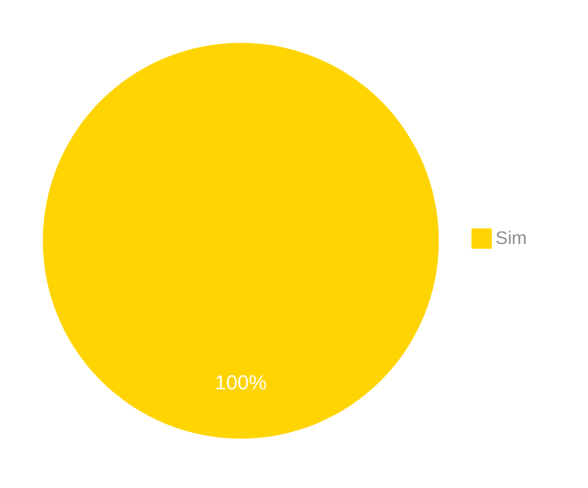
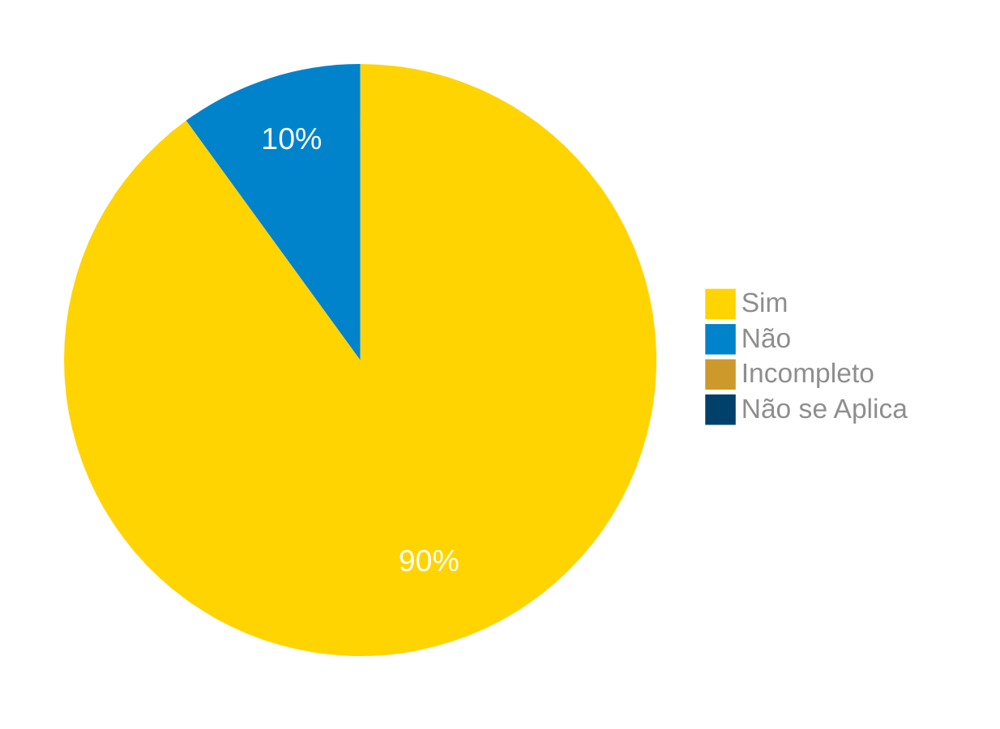
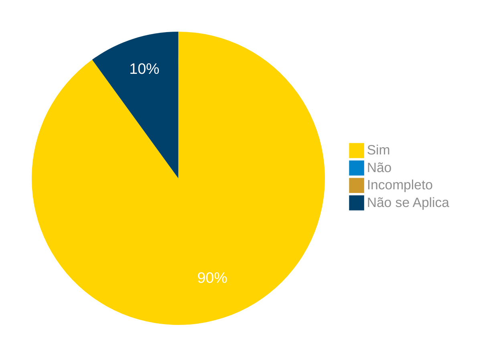
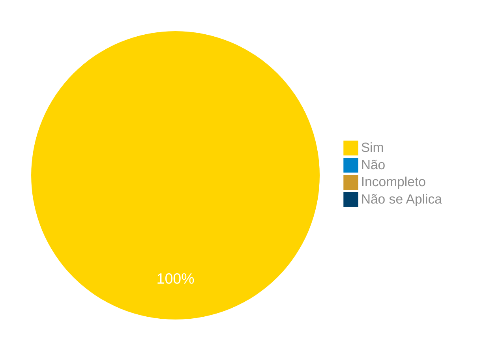

# Verificação do Artefato Análise Hierárquica de Tarefas (HTA)

## Introdução

Neste artefato, está descrito os resultados da verificação do artefato de [Análise Hierárquica de Tarefas (HTA)](https://interacao-humano-computador.github.io/2024.1-Correios/analise_de_requisitos/analise_tarefas/hta/) feito pelo [Grupo 03](https://interacao-humano-computador.github.io/2024.1-Correios/) da disciplina de Interação Humano Computador referente ao site [Correios](https://www.correios.com.br/). Lembrando que o foco não é apontar quem errou e sim os problemas presentes no artefato produzido, e por fim garantir os critérios de qualidade estabelecidos.

## Metodologia

Este artefato foi produzido por [Claudio Henrique][ClaudioGH] e verificado pelos integrantes do grupo, seguindo a divisão planejada pelo grupo na [reunião 7](https://interacao-humano-computador.github.io/2024.1-Correios/atas/ata7/). Para a verificação do artefato, foi utilizada a versão `1.1` datada do dia 01/06/2024. Adotamos a metodologia de inspeção por [checklist](#checklist-de-verificacao) neste processo. Podemos ver pela Tabela 1 de exemplo, que para cada item do checklist teremos: descrição do item em verificação, resposta à avaliação (pode ser "Sim", "Não", "Incompleto" ou "Não se Aplica"), o número da referência bibliográfica e um link para um print da referência que o fundamenta o item. Ao final, na seção de [Problemas Encontrados](#problemas-encontrados), são comentados os itens negativos.

Na Tabela 1 temos a lista de verificação elaborada, ja na Tabelas 2 a aplicação do checklist para os Aspectos Éticos. 

Tabela 1 - Perguntas elaboradas de acordo com as referências bibliográficas.

|ID| Descrição | Avaliação | Referência|Print|
|:--:|:--:|:--:|:--:|:--:|
|01| O diagrama HTA se inicia com as definições dos objetivos das tarefas?||<a href="#ref1"> REF1 </a>. Cap. 8.4.1 - Pgs. 179 | [Pg. 179][Pg. 179] e [Pg. 179.2][Pg. 179.2] |
|02| O diagrama HTA apresenta objetivos e operações(ações realizadas pelo usuário)? ||<a href="#ref1"> REF1 </a>. Cap. 8.4.1 - Pgs. 179| [Pg. 179][Pg. 179] e [Pg. 179.2][Pg. 179.2]|
|03| O diagrama HTA realiza de maneira correta a decomposição dos objetivos das tarefas? ||<a href="#ref1"> REF1 </a>. Cap. 8.4.1 - Pgs. 179|[Pg. 179][Pg. 179] e [Pg. 179.2][Pg. 179.2] |
|04| Os objetivos e operações são utilizados de maneira correta na análise? ||<a href="#ref1"> REF1 </a>. Cap. 8.4.1 - Pgs. 179| [Pg. 179][Pg. 179] e [Pg. 179.2][Pg. 179.2]|
|05| A análise apresenta uma operação nos níveis mais baixos de cada subobjetivo? ||<a href="#ref1"> REF1 </a>. Cap. 8.4.1 - Pgs. 179|[Pg. 179][Pg. 179] e [Pg. 179.2][Pg. 179.2] | 
|06| São utilizadas as relações de: seleção, sequencial ou paralelo nos subobjetivos que compõem o plano? ||<a href="#ref1"> REF1 </a>. Cap. 8.4.1 - Pgs. 179|[Pg. 179][Pg. 179] e [Pg. 179.2][Pg. 179.2] |
|07| As relações entre os subobjetivos são utilizadas de maneira correta? ||<a href="#ref1"> REF1 </a>. Cap. 8.4.1 - Pgs. 179|[Pg. 179][Pg. 179] e [Pg. 179.2][Pg. 179.2] |
|08| É apresentada a representação da análise em tabela?  ||<a href="#ref1"> REF1 </a>. Cap. 8.4.1 - Pgs. 179 e 180| [Pg. 179.2][Pg. 179.2] e [Pg. 180][Pg. 180] |
|09| As operações são especificadas com: inputs, actions e feedbacks? ||<a href="#ref1"> REF1 </a>. Cap. 8.4.1 - Pgs. 179 e 180|[Pg. 179.2][Pg. 179.2] e [Pg. 180][Pg. 180] |
|10| É utilizado como critério de parada das decomposições o critério p x c, ou identificação de um problema? ||<a href="#ref1"> REF1 </a>. Cap. 8.4.1 - Pgs.180|[Pg. 179.2][Pg. 179.2] e [Pg. 180][Pg. 180] |

[Pg. 179]:../../../../assets/prints_verificacao/elias/hta/179_1.png
[Pg. 179.2]:../../../../assets/prints_verificacao/elias/hta/179_2.png
[Pg. 180]:../../../../assets/prints_verificacao/elias/hta/180_1.png

Fonte: [Claudio Henrique][ClaudioGH], 2024.

## Apresentação dos Dados

Aqui será apresentado os resultados do checklist e logo após as observações dos itens com resultado negativo.

## HTA - Calculo de Preços e prazos

### Checklist de verificação

Tabela 2 - Checklist preenchido na verificação

|ID| Descrição | Avaliação | Referência|Print|
|:--:|:--:|:--:|:--:|:--:|
|01| O diagrama HTA se inicia com as definições dos objetivos das tarefas?|Sim.|<a href="#ref1"> REF1 </a>. Cap. 8.4.1 - Pgs. 179 | [Pg. 179][Pg. 179] e [Pg. 179.2][Pg. 179.2] |
|02| O diagrama HTA apresenta objetivos e operações(ações realizadas pelo usuário)? |Sim.|<a href="#ref1"> REF1 </a>. Cap. 8.4.1 - Pgs. 179| [Pg. 179][Pg. 179] e [Pg. 179.2][Pg. 179.2]|
|03| O diagrama HTA realiza de maneira correta a decomposição dos objetivos das tarefas? |Sim.|<a href="#ref1"> REF1 </a>. Cap. 8.4.1 - Pgs. 179|[Pg. 179][Pg. 179] e [Pg. 179.2][Pg. 179.2] |
|04| Os objetivos e operações são utilizados de maneira correta na análise? |Incompleto.|<a href="#ref1"> REF1 </a>. Cap. 8.4.1 - Pgs. 179| [Pg. 179][Pg. 179] e [Pg. 179.2][Pg. 179.2]|
|05| A análise apresenta uma operação nos níveis mais baixos de cada subobjetivo? |Não|<a href="#ref1"> REF1 </a>. Cap. 8.4.1 - Pgs. 179|[Pg. 179][Pg. 179] e [Pg. 179.2][Pg. 179.2] | 
|06| São utilizadas as relações de: seleção, sequencial ou paralelo nos subobjetivos que compõem o plano? |Sim.|<a href="#ref1"> REF1 </a>. Cap. 8.4.1 - Pgs. 179|[Pg. 179][Pg. 179] e [Pg. 179.2][Pg. 179.2] |
|07| As relações entre os subobjetivos são utilizadas de maneira correta? |Sim.|<a href="#ref1"> REF1 </a>. Cap. 8.4.1 - Pgs. 179|[Pg. 179][Pg. 179] e [Pg. 179.2][Pg. 179.2] |
|08| É apresentada a representação da análise em tabela?  |Sim.|<a href="#ref1"> REF1 </a>. Cap. 8.4.1 - Pgs. 179 e 180| [Pg. 179.2][Pg. 179.2] e [Pg. 180][Pg. 180] |
|09| As operações são especificadas com: inputs, actions e feedbacks? |Sim.|<a href="#ref1"> REF1 </a>. Cap. 8.4.1 - Pgs. 179 e 180|[Pg. 179.2][Pg. 179.2] e [Pg. 180][Pg. 180] |
|10| É utilizado como critério de parada das decomposições o critério p x c, ou identificação de um problema? |Não.|<a href="#ref1"> REF1 </a>. Cap. 8.4.1 - Pgs.180|[Pg. 179.2][Pg. 179.2] e [Pg. 180][Pg. 180] |

[Pg. 179]:../../../../assets/prints_verificacao/elias/hta/179_1.png
[Pg. 179.2]:../../../../assets/prints_verificacao/elias/hta/179_2.png
[Pg. 180]:../../../../assets/prints_verificacao/elias/hta/180_1.png

Fonte: [Elias Faria][EliasGH], 2024.

### Gravação da verificação

<!-- para o iframe do vídeo, bote width = 560 e height = 315 -->

    <iframe width="560" height="315" src="https://www.youtube.com/embed" title="Apresentação 7 Interação Humano Computador 2024.1 - Grupo 3" frameborder="0" allow="accelerometer; autoplay; clipboard-write; encrypted-media; gyroscope; picture-in-picture; web-share" referrerpolicy="strict-origin-when-cross-origin" allowfullscreen></iframe>

    <a href="link"> Link para o vídeo </a>

## Problemas Encontrados

<!--- Aqui será apresentado todos os problemas identificados durante o processo de verificação do artefato de link do artefato. --->

- ID 04: Os objetivos e operações são utilizados de maneira correta na análise?
    - Avaliação: Incompleto.
    - Comentário: Os objetivos e operações são usados de forma correta tirando somente o elemento "2.2.1" que é o nível mais baixo do subobjetivo, mas não esta com a estrutura correta que descreve uma operação.

- ID 05: A análise apresenta uma operação nos níveis mais baixos de cada subobjetivo?
    - Avaliação: Não.
    - Comentário: A operação 2.2.1 é apresentada como objetivo.

- ID 10: É utilizado como critério de parada das decomposições o critério p x c, ou identificação de um problema?
    - Avaliação: Não.
    - Comentário: Não é citado em nenhum lugar do artefato a utilização de um critério de parada de decomposição na analise de tarefas HTA.

## Sumário dos resultados

<!-- Conte as quantidade de ocorrencias e coloque no Grafico a quantidade em cada tipo de avaliação (se não ouver incidencia de um tipo como "não se aplica", apague a linha do mesmo)-->
A seguir, apresentamos a Figura 1 com o gráfico de pizza do sumário dos resultados.

Figura 1 - Gráfico de pizza do sumário dos resultados.

Fonte: [][], 2024.

## HTA - Pré-postagem	

### Checklist de verificação

Tabela 3 - Checklist preenchido na verificação

|ID| Descrição | Avaliação | Referência|Print|
|:--:|:--:|:--:|:--:|:--:|
|01| O diagrama HTA se inicia com as definições dos objetivos das tarefas?| Sim |<a href="#ref1"> REF1 </a>. Cap. 8.4.1 - Pgs. 179 | [Pg. 179][Pg. 179] e [Pg. 179.2][Pg. 179.2] |
|02| O diagrama HTA apresenta objetivos e operações(ações realizadas pelo usuário)? | Sim |<a href="#ref1"> REF1 </a>. Cap. 8.4.1 - Pgs. 179| [Pg. 179][Pg. 179] e [Pg. 179.2][Pg. 179.2]|
|03| O diagrama HTA realiza de maneira correta a decomposição dos objetivos das tarefas? | Sim |<a href="#ref1"> REF1 </a>. Cap. 8.4.1 - Pgs. 179|[Pg. 179][Pg. 179] e [Pg. 179.2][Pg. 179.2] |
|04| Os objetivos e operações são utilizados de maneira correta na análise? | Sim |<a href="#ref1"> REF1 </a>. Cap. 8.4.1 - Pgs. 179| [Pg. 179][Pg. 179] e [Pg. 179.2][Pg. 179.2]|
|05| A análise apresenta uma operação nos níveis mais baixos de cada subobjetivo? | Sim |<a href="#ref1"> REF1 </a>. Cap. 8.4.1 - Pgs. 179|[Pg. 179][Pg. 179] e [Pg. 179.2][Pg. 179.2] | 
|06| São utilizadas as relações de: seleção, sequencial ou paralelo nos subobjetivos que compõem o plano? | Sim |<a href="#ref1"> REF1 </a>. Cap. 8.4.1 - Pgs. 179|[Pg. 179][Pg. 179] e [Pg. 179.2][Pg. 179.2] |
|07| As relações entre os subobjetivos são utilizadas de maneira correta? | Sim |<a href="#ref1"> REF1 </a>. Cap. 8.4.1 - Pgs. 179|[Pg. 179][Pg. 179] e [Pg. 179.2][Pg. 179.2] |
|08| É apresentada a representação da análise em tabela?  | Sim |<a href="#ref1"> REF1 </a>. Cap. 8.4.1 - Pgs. 179 e 180| [Pg. 179.2][Pg. 179.2] e [Pg. 180][Pg. 180] |
|09| As operações são especificadas com: inputs, actions e feedbacks? | Sim |<a href="#ref1"> REF1 </a>. Cap. 8.4.1 - Pgs. 179 e 180|[Pg. 179.2][Pg. 179.2] e [Pg. 180][Pg. 180] |
|10| É utilizado como critério de parada das decomposições o critério p x c, ou identificação de um problema? | Sim |<a href="#ref1"> REF1 </a>. Cap. 8.4.1 - Pgs.180|[Pg. 179.2][Pg. 179.2] e [Pg. 180][Pg. 180] |

[Pg. 179]:../../../../assets/prints_verificacao/elias/hta/179_1.png
[Pg. 179.2]:../../../../assets/prints_verificacao/elias/hta/179_2.png
[Pg. 180]:../../../../assets/prints_verificacao/elias/hta/180_1.png

Fonte: [Pablo S. Costa][PabloGH], 2024.

### Gravação da verificação

<!-- para o iframe do vídeo, bote width = 560 e height = 315 -->

    <iframe width="560" height="315" src="https://www.youtube.com/embed/83iWhGCpd-Q?si=VUKDi8FaM79_WIYm" title="YouTube video player" frameborder="0" allow="accelerometer; autoplay; clipboard-write; encrypted-media; gyroscope; picture-in-picture; web-share" referrerpolicy="strict-origin-when-cross-origin" allowfullscreen></iframe>

    <a href="https://youtu.be/83iWhGCpd-Q"> Link para o vídeo </a>

### Problemas Encontrados

<!--- Aqui será apresentado todos os problemas identificados durante o processo de verificação do artefato de link do artefato. --->

Não foram encontrados problemas

### Sumário dos resultados

<!-- Conte as quantidade de ocorrencias e coloque no Grafico a quantidade em cada tipo de avaliação (se não ouver incidencia de um tipo como "não se aplica", apague a linha do mesmo)-->
A seguir, apresentamos a Figura 2 com o gráfico de pizza do sumário dos resultados.

Figura 2 - Gráfico de pizza do sumário dos resultados.

Fonte: [Pablo S. Costa][PabloGH], 2024.

## HTA - Loja Online dos Correios

### Checklist de verificação

Tabela 4 - Checklist preenchido na verificação

|ID| Descrição | Avaliação | Referência|Print|
|:--:|:--:|:--:|:--:|:--:|
|01| O diagrama HTA se inicia com as definições dos objetivos das tarefas?||<a href="#ref1"> REF1 </a>. Cap. 8.4.1 - Pgs. 179 | [Pg. 179][Pg. 179] e [Pg. 179.2][Pg. 179.2] |
|02| O diagrama HTA apresenta objetivos e operações(ações realizadas pelo usuário)? ||<a href="#ref1"> REF1 </a>. Cap. 8.4.1 - Pgs. 179| [Pg. 179][Pg. 179] e [Pg. 179.2][Pg. 179.2]|
|03| O diagrama HTA realiza de maneira correta a decomposição dos objetivos das tarefas? ||<a href="#ref1"> REF1 </a>. Cap. 8.4.1 - Pgs. 179|[Pg. 179][Pg. 179] e [Pg. 179.2][Pg. 179.2] |
|04| Os objetivos e operações são utilizados de maneira correta na análise? ||<a href="#ref1"> REF1 </a>. Cap. 8.4.1 - Pgs. 179| [Pg. 179][Pg. 179] e [Pg. 179.2][Pg. 179.2]|
|05| A análise apresenta uma operação nos níveis mais baixos de cada subobjetivo? ||<a href="#ref1"> REF1 </a>. Cap. 8.4.1 - Pgs. 179|[Pg. 179][Pg. 179] e [Pg. 179.2][Pg. 179.2] | 
|06| São utilizadas as relações de: seleção, sequencial ou paralelo nos subobjetivos que compõem o plano? ||<a href="#ref1"> REF1 </a>. Cap. 8.4.1 - Pgs. 179|[Pg. 179][Pg. 179] e [Pg. 179.2][Pg. 179.2] |
|07| As relações entre os subobjetivos são utilizadas de maneira correta? ||<a href="#ref1"> REF1 </a>. Cap. 8.4.1 - Pgs. 179|[Pg. 179][Pg. 179] e [Pg. 179.2][Pg. 179.2] |
|08| É apresentada a representação da análise em tabela?  ||<a href="#ref1"> REF1 </a>. Cap. 8.4.1 - Pgs. 179 e 180| [Pg. 179.2][Pg. 179.2] e [Pg. 180][Pg. 180] |
|09| As operações são especificadas com: inputs, actions e feedbacks? ||<a href="#ref1"> REF1 </a>. Cap. 8.4.1 - Pgs. 179 e 180|[Pg. 179.2][Pg. 179.2] e [Pg. 180][Pg. 180] |
|10| É utilizado como critério de parada das decomposições o critério p x c, ou identificação de um problema? ||<a href="#ref1"> REF1 </a>. Cap. 8.4.1 - Pgs.180|[Pg. 179.2][Pg. 179.2] e [Pg. 180][Pg. 180] |

[Pg. 179]:../../../../assets/prints_verificacao/elias/hta/179_1.png
[Pg. 179.2]:../../../../assets/prints_verificacao/elias/hta/179_2.png
[Pg. 180]:../../../../assets/prints_verificacao/elias/hta/180_1.png

Fonte: [][], 2024.

### Gravação da verificação

<!-- para o iframe do vídeo, bote width = 560 e height = 315 -->

    <iframe width="560" height="315" src="https://www.youtube.com/embed" title="Apresentação 7 Interação Humano Computador 2024.1 - Grupo 3" frameborder="0" allow="accelerometer; autoplay; clipboard-write; encrypted-media; gyroscope; picture-in-picture; web-share" referrerpolicy="strict-origin-when-cross-origin" allowfullscreen></iframe>

    <a href="link"> Link para o vídeo </a>

## Problemas Encontrados

<!--- Aqui será apresentado todos os problemas identificados durante o processo de verificação do artefato de link do artefato. --->

- ID xx: Descrição
    - Avaliação:
    - Comentário:

## Sumário dos resultados

<!-- Conte as quantidade de ocorrencias e coloque no Grafico a quantidade em cada tipo de avaliação (se não ouver incidencia de um tipo como "não se aplica", apague a linha do mesmo)-->
A seguir, apresentamos a Figura 1 com o gráfico de pizza do sumário dos resultados.

Figura 1 - Gráfico de pizza do sumário dos resultados.

Fonte: [][], 2024.

## HTA - Receber encomendas

### Checklist de verificação

Tabela 5 - Checklist preenchido na verificação

|ID| Descrição | Avaliação | Referência|Print|
|:--:|:--:|:--:|:--:|:--:|
|01| O diagrama HTA se inicia com as definições dos objetivos das tarefas?||<a href="#ref1"> REF1 </a>. Cap. 8.4.1 - Pgs. 179 | [Pg. 179][Pg. 179] e [Pg. 179.2][Pg. 179.2] |
|02| O diagrama HTA apresenta objetivos e operações(ações realizadas pelo usuário)? ||<a href="#ref1"> REF1 </a>. Cap. 8.4.1 - Pgs. 179| [Pg. 179][Pg. 179] e [Pg. 179.2][Pg. 179.2]|
|03| O diagrama HTA realiza de maneira correta a decomposição dos objetivos das tarefas? ||<a href="#ref1"> REF1 </a>. Cap. 8.4.1 - Pgs. 179|[Pg. 179][Pg. 179] e [Pg. 179.2][Pg. 179.2] |
|04| Os objetivos e operações são utilizados de maneira correta na análise? ||<a href="#ref1"> REF1 </a>. Cap. 8.4.1 - Pgs. 179| [Pg. 179][Pg. 179] e [Pg. 179.2][Pg. 179.2]|
|05| A análise apresenta uma operação nos níveis mais baixos de cada subobjetivo? ||<a href="#ref1"> REF1 </a>. Cap. 8.4.1 - Pgs. 179|[Pg. 179][Pg. 179] e [Pg. 179.2][Pg. 179.2] | 
|06| São utilizadas as relações de: seleção, sequencial ou paralelo nos subobjetivos que compõem o plano? ||<a href="#ref1"> REF1 </a>. Cap. 8.4.1 - Pgs. 179|[Pg. 179][Pg. 179] e [Pg. 179.2][Pg. 179.2] |
|07| As relações entre os subobjetivos são utilizadas de maneira correta? ||<a href="#ref1"> REF1 </a>. Cap. 8.4.1 - Pgs. 179|[Pg. 179][Pg. 179] e [Pg. 179.2][Pg. 179.2] |
|08| É apresentada a representação da análise em tabela?  ||<a href="#ref1"> REF1 </a>. Cap. 8.4.1 - Pgs. 179 e 180| [Pg. 179.2][Pg. 179.2] e [Pg. 180][Pg. 180] |
|09| As operações são especificadas com: inputs, actions e feedbacks? ||<a href="#ref1"> REF1 </a>. Cap. 8.4.1 - Pgs. 179 e 180|[Pg. 179.2][Pg. 179.2] e [Pg. 180][Pg. 180] |
|10| É utilizado como critério de parada das decomposições o critério p x c, ou identificação de um problema? ||<a href="#ref1"> REF1 </a>. Cap. 8.4.1 - Pgs.180|[Pg. 179.2][Pg. 179.2] e [Pg. 180][Pg. 180] |

[Pg. 179]:../../../../assets/prints_verificacao/elias/hta/179_1.png
[Pg. 179.2]:../../../../assets/prints_verificacao/elias/hta/179_2.png
[Pg. 180]:../../../../assets/prints_verificacao/elias/hta/180_1.png

Fonte: [][], 2024.

### Gravação da verificação

<!-- para o iframe do vídeo, bote width = 560 e height = 315 -->

    <iframe width="560" height="315" src="https://www.youtube.com/embed" title="Apresentação 7 Interação Humano Computador 2024.1 - Grupo 3" frameborder="0" allow="accelerometer; autoplay; clipboard-write; encrypted-media; gyroscope; picture-in-picture; web-share" referrerpolicy="strict-origin-when-cross-origin" allowfullscreen></iframe>

    <a href="link"> Link para o vídeo </a>

## Problemas Encontrados

<!--- Aqui será apresentado todos os problemas identificados durante o processo de verificação do artefato de link do artefato. --->

- ID xx: Descrição
    - Avaliação:
    - Comentário:

## Sumário dos resultados

<!-- Conte as quantidade de ocorrencias e coloque no Grafico a quantidade em cada tipo de avaliação (se não ouver incidencia de um tipo como "não se aplica", apague a linha do mesmo)-->
A seguir, apresentamos a Figura 1 com o gráfico de pizza do sumário dos resultados.

Figura 1 - Gráfico de pizza do sumário dos resultados.

Fonte: [][], 2024.

## HTA - Minhas importações

### Checklist de verificação

Tabela 6 - Checklist preenchido na verificação

|ID| Descrição | Avaliação | Referência|Print|
|:--:|:--:|:--:|:--:|:--:|
|01| O diagrama HTA se inicia com as definições dos objetivos das tarefas?|Sim|<a href="#ref1"> REF1 </a>. Cap. 8.4.1 - Pgs. 179 | [Pg. 179][Pg. 179] e [Pg. 179.2][Pg. 179.2] |
|02| O diagrama HTA apresenta objetivos e operações(ações realizadas pelo usuário)? |Sim|<a href="#ref1"> REF1 </a>. Cap. 8.4.1 - Pgs. 179| [Pg. 179][Pg. 179] e [Pg. 179.2][Pg. 179.2]|
|03| O diagrama HTA realiza de maneira correta a decomposição dos objetivos das tarefas? |Sim|<a href="#ref1"> REF1 </a>. Cap. 8.4.1 - Pgs. 179|[Pg. 179][Pg. 179] e [Pg. 179.2][Pg. 179.2] |
|04| Os objetivos e operações são utilizados de maneira correta na análise? |Sim|<a href="#ref1"> REF1 </a>. Cap. 8.4.1 - Pgs. 179| [Pg. 179][Pg. 179] e [Pg. 179.2][Pg. 179.2]|
|05| A análise apresenta uma operação nos níveis mais baixos de cada subobjetivo? |Sim|<a href="#ref1"> REF1 </a>. Cap. 8.4.1 - Pgs. 179|[Pg. 179][Pg. 179] e [Pg. 179.2][Pg. 179.2] | 
|06| São utilizadas as relações de: seleção, sequencial ou paralelo nos subobjetivos que compõem o plano? |Sim|<a href="#ref1"> REF1 </a>. Cap. 8.4.1 - Pgs. 179|[Pg. 179][Pg. 179] e [Pg. 179.2][Pg. 179.2] |
|07| As relações entre os subobjetivos são utilizadas de maneira correta? |Sim|<a href="#ref1"> REF1 </a>. Cap. 8.4.1 - Pgs. 179|[Pg. 179][Pg. 179] e [Pg. 179.2][Pg. 179.2] |
|08| É apresentada a representação da análise em tabela?  |Sim|<a href="#ref1"> REF1 </a>. Cap. 8.4.1 - Pgs. 179 e 180| [Pg. 179.2][Pg. 179.2] e [Pg. 180][Pg. 180] |
|09| As operações são especificadas com: inputs, actions e feedbacks? |Sim|<a href="#ref1"> REF1 </a>. Cap. 8.4.1 - Pgs. 179 e 180|[Pg. 179.2][Pg. 179.2] e [Pg. 180][Pg. 180] |
|10| É utilizado como critério de parada das decomposições o critério p x c, ou identificação de um problema? |Não|<a href="#ref1"> REF1 </a>. Cap. 8.4.1 - Pgs.180|[Pg. 179.2][Pg. 179.2] e [Pg. 180][Pg. 180] |

[Pg. 179]:../../../../assets/prints_verificacao/elias/hta/179_1.png
[Pg. 179.2]:../../../../assets/prints_verificacao/elias/hta/179_2.png
[Pg. 180]:../../../../assets/prints_verificacao/elias/hta/180_1.png

Fonte: [Ricardo Augusto][RicardoGH], 2024.

### Gravação da verificação

<!-- para o iframe do vídeo, bote width = 560 e height = 315 -->

    <iframe width="560" height="315" src="https://www.youtube.com/embed" title="Apresentação 7 Interação Humano Computador 2024.1 - Grupo 3" frameborder="0" allow="accelerometer; autoplay; clipboard-write; encrypted-media; gyroscope; picture-in-picture; web-share" referrerpolicy="strict-origin-when-cross-origin" allowfullscreen></iframe>

    <a href="link"> Link para o vídeo </a>

## Problemas Encontrados

<!--- Aqui será apresentado todos os problemas identificados durante o processo de verificação do artefato de link do artefato. --->

- ID 10: É utilizado como critério de parada das decomposições o critério p x c, ou identificação de um problema?
    - Avaliação: Não
    - Comentário: Não é citado esse critério no artefato

## Sumário dos resultados

<!-- Conte as quantidade de ocorrencias e coloque no Grafico a quantidade em cada tipo de avaliação (se não ouver incidencia de um tipo como "não se aplica", apague a linha do mesmo)-->
A seguir, apresentamos a Figura 1 com o gráfico de pizza do sumário dos resultados.

Figura 1 - Gráfico de pizza do sumário dos resultados.

Fonte: [Ricardo Augusto][RicardoGH], 2024.

## HTA - Rastrear encomendas

### Checklist de verificação

Tabela 7 - Checklist preenchido na verificação

|ID| Descrição | Avaliação | Referência|Print|
|:--:|:--:|:--:|:--:|:--:|
|01| O diagrama HTA se inicia com as definições dos objetivos das tarefas?|Sim|<a href="#ref1"> REF1 </a>. Cap. 8.4.1 - Pgs. 179 | [Pg. 179][Pg. 179] e [Pg. 179.2][Pg. 179.2] |
|02| O diagrama HTA apresenta objetivos e operações(ações realizadas pelo usuário)? |Sim|<a href="#ref1"> REF1 </a>. Cap. 8.4.1 - Pgs. 179| [Pg. 179][Pg. 179] e [Pg. 179.2][Pg. 179.2]|
|03| O diagrama HTA realiza de maneira correta a decomposição dos objetivos das tarefas? |Sim|<a href="#ref1"> REF1 </a>. Cap. 8.4.1 - Pgs. 179|[Pg. 179][Pg. 179] e [Pg. 179.2][Pg. 179.2] |
|04| Os objetivos e operações são utilizados de maneira correta na análise? |Sim|<a href="#ref1"> REF1 </a>. Cap. 8.4.1 - Pgs. 179| [Pg. 179][Pg. 179] e [Pg. 179.2][Pg. 179.2]|
|05| A análise apresenta uma operação nos níveis mais baixos de cada subobjetivo? |Sim|<a href="#ref1"> REF1 </a>. Cap. 8.4.1 - Pgs. 179|[Pg. 179][Pg. 179] e [Pg. 179.2][Pg. 179.2] | 
|06| São utilizadas as relações de: seleção, sequencial ou paralelo nos subobjetivos que compõem o plano? |Sim|<a href="#ref1"> REF1 </a>. Cap. 8.4.1 - Pgs. 179|[Pg. 179][Pg. 179] e [Pg. 179.2][Pg. 179.2] |
|07| As relações entre os subobjetivos são utilizadas de maneira correta? |Sim|<a href="#ref1"> REF1 </a>. Cap. 8.4.1 - Pgs. 179|[Pg. 179][Pg. 179] e [Pg. 179.2][Pg. 179.2] |
|08| É apresentada a representação da análise em tabela?  |Sim|<a href="#ref1"> REF1 </a>. Cap. 8.4.1 - Pgs. 179 e 180| [Pg. 179.2][Pg. 179.2] e [Pg. 180][Pg. 180] |
|09| As operações são especificadas com: inputs, actions e feedbacks? |Sim|<a href="#ref1"> REF1 </a>. Cap. 8.4.1 - Pgs. 179 e 180|[Pg. 179.2][Pg. 179.2] e [Pg. 180][Pg. 180] |
|10| É utilizado como critério de parada das decomposições o critério p x c, ou identificação de um problema? |Não se aplica|<a href="#ref1"> REF1 </a>. Cap. 8.4.1 - Pgs.180|[Pg. 179.2][Pg. 179.2] e [Pg. 180][Pg. 180] |

[Pg. 179]:../../../../assets/prints_verificacao/elias/hta/179_1.png
[Pg. 179.2]:../../../../assets/prints_verificacao/elias/hta/179_2.png
[Pg. 180]:../../../../assets/prints_verificacao/elias/hta/180_1.png

Fonte: [Claudio Henrique][ClaudioGH], 2024.

### Gravação da verificação

<!-- para o iframe do vídeo, bote width = 560 e height = 315 -->

<iframe width="560" height="315" src="https://www.youtube.com/embed/MG3WecUuYv8?si=TvyWhhcJjEMfD6Dq" title="YouTube video player" frameborder="0" allow="accelerometer; autoplay; clipboard-write; encrypted-media; gyroscope; picture-in-picture; web-share" referrerpolicy="strict-origin-when-cross-origin" allowfullscreen></iframe>

    <a href="https://www.youtube.com/watch?v=MG3WecUuYv8"> Link para o vídeo </a>

## Problemas Encontrados

Não foram encontrados problemas no HTA de Rastrear Encomendas. Seguiu a bibliografia corretamente e está bem implementado.

## Sumário dos resultados

<!-- Conte as quantidade de ocorrencias e coloque no Grafico a quantidade em cada tipo de avaliação (se não ouver incidencia de um tipo como "não se aplica", apague a linha do mesmo)-->
A seguir, apresentamos a Figura 6 com o gráfico de pizza do sumário dos resultados.

Figura 6 - Gráfico de pizza do sumário dos resultados.

Fonte: [Claudio Henrique][ClaudioGH], 2024.

## Sumário total dos resultados

<!-- Conte as quantidade de ocorrencias e coloque no Grafico a quantidade em cada tipo de avaliação (se não ouver incidencia de um tipo como "não se aplica", apague a linha do mesmo)-->
A seguir, apresentamos a Figura 7 com o gráfico de pizza do sumário total dos resultados.

Figura 7 - Gráfico de pizza do sumário total dos resultados.

Fonte: [Cláudio Henrique][ClaudioGH], [Elias F. Oliveira][EliasGH], [Gabriel B. Bertolazi][GabrielBGH], [Gabriel F. J. Silva][GabrielFGH], [Pablo S. Costa][PabloGH] e [Ricardo Augusto][RicardoGH], 2024.

## Bibliografia

> 1. Barbosa, S. D. J.; Silva, B. S. da; Silveira, M. S.; Gasparini, I.; Darin, T.; Barbosa, G. D. J. (2021) Interação Humano-Computador e Experiência do usuário. Autopublicação. ISBN: 978-65-00-19677-1. 

## Histórico de Versões

| Versão | Data | Descrição | Autor(es) | Revisor(es) |
| :----: | :--: | --------- | ----------- | ------ |
| `1.0`  | 25/06/2024 | Criação do documento | [Claudio Henrique][ClaudioGH] | [][] |

[ClaudioGH]: https://github.com/claudiohsc
[EliasGH]: https://github.com/EliasOliver21
[GabrielBGH]: https://github.com/Bertolazi
[GabrielFGH]: https://github.com/MMcLovin
[PabloGH]: https://github.com/pabloheika
[RicardoGH]: https://www.github.com/avmricardo