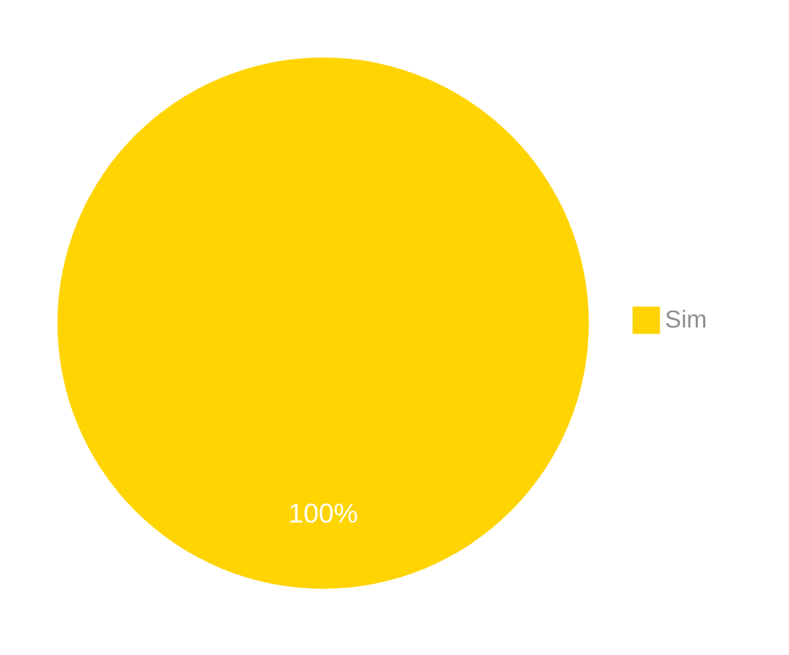
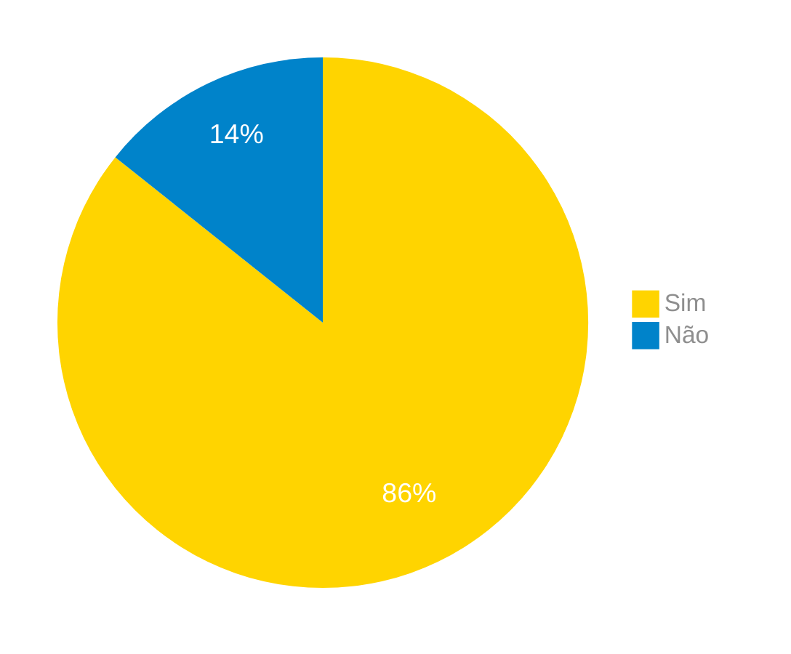
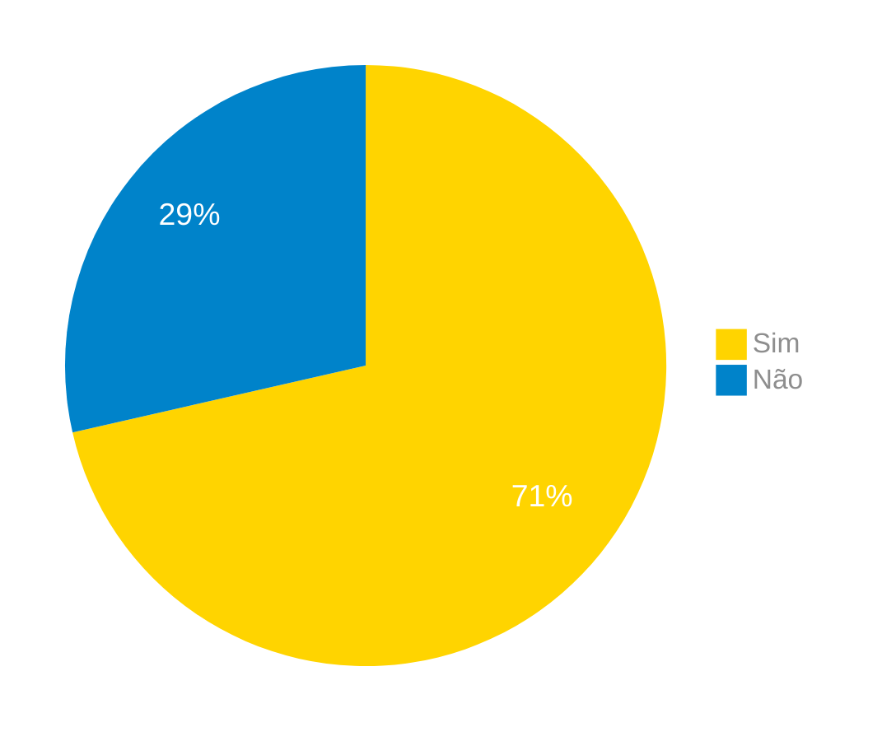
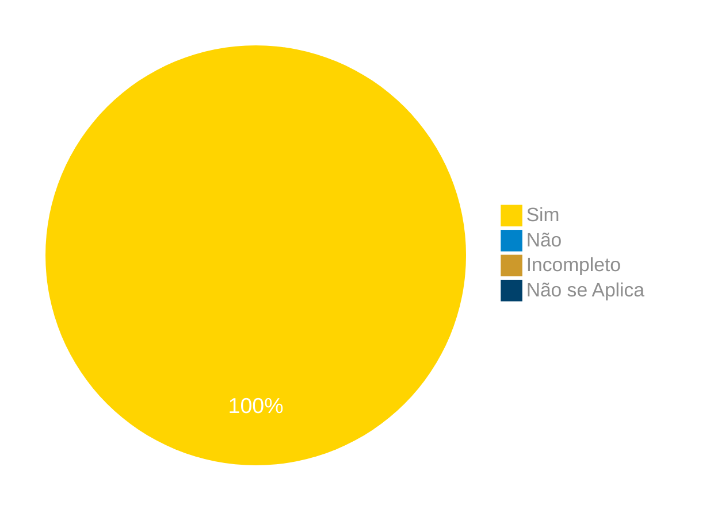
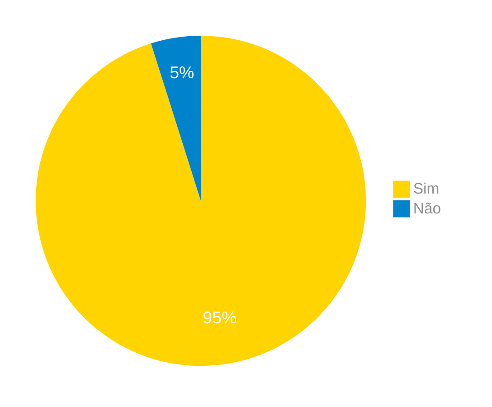

# Verificação da Análise tarefas - CMN-GOMS

## Introdução

Neste artefato, está descrito os resultados da verificação do artefato de [Análise tarefas - CMN-GOMS](../../../../analise_de_requisitos/analise_tarefas/cmn_goms.md) feito pelo [Grupo 03](https://interacao-humano-computador.github.io/2024.1-Correios/) da disciplina de Interação Humano Computador referente ao site [Correios](https://www.correios.com.br/). Lembrando que o foco não é apontar quem errou e sim os problemas presentes no artefato produzido, e por fim garantir os critérios de qualidade estabelecidos.

## Metodologia

Este artefato foi produzido por [Pablo S. Costa][PabloGH] e verificado por [Cláudio Henrique][ClaudioGH], [Elias F. Oliveira][EliasGH], [Gabriel B. Bertolazi][GabrielBGH], [Gabriel F. J. Silva][GabrielFGH], [Pablo S. Costa][PabloGH] e [Ricardo Augusto][RicardoGH], seguindo a divisão planejada pelo grupo na [reunião 7](https://interacao-humano-computador.github.io/2024.1-Correios/atas/ata7/). Para a verificação do artefato, foi utilizada a versão `1.1` datada do dia 03/06/2024. Adotamos a metodologia de inspeção por [checklist](#checklist-de-verificacao) neste processo. Podemos ver pela Tabela 1 de exemplo, que para cada item do checklist teremos: descrição do item em verificação, resposta à avaliação (pode ser "Sim", "Não", "Incompleto" ou "Não se Aplica"), o número da referência bibliográfica e um link para um print da referência que o fundamenta o item. Ao final, na seção de [Problemas Encontrados](#problemas-encontrados), são comentados os itens negativos.

Tabela 1 - Perguntas elaboradas de acordo com as referências bibliográficas.

| ID | Descrição | Avaliação | Referência | Print |
| --- | --- | --- | --- | --- |
| **01** | O GOMS possui objetivos, métodos, operadores e regras de seleção? |   | [REF1](#ref1) . Cap. 8.4.2 - Pgs. 181 | [pg. 181](../../../../assets/prints_verificacao/gabrielb/Pergunta%201%20pagina%20181%20GOMS.png) |
| **02** | OS objetivos demonstram o que o usuário pretende usando o software? |   | [REF1](#ref1) . Cap. 8.4.2 - Pgs. 181 | [pg. 181](../../../../assets/prints_verificacao/gabrielb/Pagina%20181%20e%20182.png) |
| **03** | Os operadores estão representando a ação concreta que o software permite que os usuários façam? |   | [REF1](#ref1) . Cap. 8.4.2 - Pgs. 182 | [pg. 182](../../../../assets/prints_verificacao/gabrielb/Pagina%20181%20e%20182.png) |
| **04** | Os métodos estão representados como subobjetivos que permitem atingir um objetivo maior? |   | [REF1](#ref1) . Cap. 8.4.2 - Pgs. 182 | [pg. 182](../../../../assets/prints_verificacao/gabrielb/Pagina%20181%20e%20182.png) |
| **05** | Todas as vezes que temos mais de um método para um mesmo objetivo temos uma regra de seleção? |   | [REF1](#ref1) . Cap. 8.4.2 - Pgs. 182 | [pg. 182](../../../../assets/prints_verificacao/gabrielb/Pagina%20181%20e%20182.png) |
| **06** | As regras de seleção representam tomadas de decisão do usuário sobre qual método utilizar? |   | [REF1](#ref1) . Cap. 8.4.2 - Pgs. 182 | [pg. 182](../../../../assets/prints_verificacao/gabrielb/Pagina%20181%20e%20182.png) |
| **07** | A identação do GOMS está da maneira correta? Como os operadores dentro dos métodos? |   | [REF1](#ref1) . Cap. 8.4.2 - Pgs. 182 | [pg. 182](../../../../assets/prints_verificacao/gabrielb/pg%20182.png) |

Fonte: [Pablo S. Costa][PabloGH], 2024.

## Apresentação dos Dados

Abaixo temos as tabelas de 2 a 7 com as listas verificadas para cada tarefa com suas gravações e as figuras de 1 a 6 com os graficos de pizza com o sumario de cada resultado.

## GOMS - Calculo de Preços e prazos

### Checklists verificação

Tabela 2 - Checklist preenchido na verificação

| ID | Descrição | Avaliação | Referência | Print |
| --- | --- | --- | --- | --- |
| **01** | O GOMS possui objetivos, métodos, operadores e regras de seleção? | Sim.  | [REF1](#ref1) . Cap. 8.4.2 - Pgs. 181 | [pg. 181](../../../../assets/prints_verificacao/gabrielb/Pergunta%201%20pagina%20181%20GOMS.png) |
| **02** | OS objetivos demonstram o que o usuário pretende usando o software? |  Sim. | [REF1](#ref1) . Cap. 8.4.2 - Pgs. 181 | [pg. 181](../../../../assets/prints_verificacao/gabrielb/Pagina%20181%20e%20182.png) |
| **03** | Os operadores estão representando a ação concreta que o software permite que os usuários façam? | Sim.  | [REF1](#ref1) . Cap. 8.4.2 - Pgs. 182 | [pg. 182](../../../../assets/prints_verificacao/gabrielb/Pagina%20181%20e%20182.png) |
| **04** | Os métodos estão representados como subobjetivos que permitem atingir um objetivo maior? | Sim.   | [REF1](#ref1) . Cap. 8.4.2 - Pgs. 182 | [pg. 182](../../../../assets/prints_verificacao/gabrielb/Pagina%20181%20e%20182.png) |
| **05** | Todas as vezes que temos mais de um método para um mesmo objetivo temos uma regra de seleção? |  Sim.  | [REF1](#ref1) . Cap. 8.4.2 - Pgs. 182 | [pg. 182](../../../../assets/prints_verificacao/gabrielb/Pagina%20181%20e%20182.png) |
| **06** | As regras de seleção representam tomadas de decisão do usuário sobre qual método utilizar? | Sim.   | [REF1](#ref1) . Cap. 8.4.2 - Pgs. 182 | [pg. 182](../../../../assets/prints_verificacao/gabrielb/Pagina%20181%20e%20182.png) |
| **07** | A identação do GOMS está da maneira correta? Como os operadores dentro dos métodos? | Sim.   | [REF1](#ref1) . Cap. 8.4.2 - Pgs. 182 | [pg. 182](../../../../assets/prints_verificacao/gabrielb/pg%20182.png) |

Fonte: [Elias F. Oliveira][EliasGH], 2024.

### Gravação da verificação

<!-- para o iframe do vídeo, bote width = 560 e height = 315 -->

    <iframe width="560" height="315" src="https://www.youtube.com/embed/pLu-JejsQf0" title="Apresentação 7 Interação Humano Computador 2024.1 - Grupo 3" frameborder="0" allow="accelerometer; autoplay; clipboard-write; encrypted-media; gyroscope; picture-in-picture; web-share" referrerpolicy="strict-origin-when-cross-origin" allowfullscreen></iframe>

    <a href="https://youtu.be/pLu-JejsQf0"> Link para o vídeo </a>

### Problemas Encontrados

<!--- Aqui será apresentado todos os problemas identificados durante o processo de verificação do artefato de link do artefato. --->

Nenhum problema foi encontrado.

### Sumário dos resultados

<!-- Conte as quantidade de ocorrencias e coloque no Grafico a quantidade em cada tipo de avaliação (se não ouver incidencia de um tipo como "não se aplica", apague a linha do mesmo)-->
A seguir, apresentamos a Figura 1 com o gráfico de pizza do sumário dos resultados.

Figura 1 - Gráfico de pizza do sumário dos resultados.

Fonte: [Pablo][PabloGH], 2024.

## GOMS - Pré-postagem

### Checklists verificação

Tabela 3 - Checklist preenchido na verificação

| ID | Descrição | Avaliação | Referência | Print |
| --- | --- | --- | --- | --- |
| **01** | O GOMS possui objetivos, métodos, operadores e regras de seleção? | Sim | [REF1](#ref1) . Cap. 8.4.2 - Pgs. 181 | [pg. 181](../../../../assets/prints_verificacao/gabrielb/Pergunta%201%20pagina%20181%20GOMS.png) |
| **02** | OS objetivos demonstram o que o usuário pretende usando o software? | Sim | [REF1](#ref1) . Cap. 8.4.2 - Pgs. 181 | [pg. 181](../../../../assets/prints_verificacao/gabrielb/Pagina%20181%20e%20182.png) |
| **03** | Os operadores estão representando a ação concreta que o software permite que os usuários façam? | Sim | [REF1](#ref1) . Cap. 8.4.2 - Pgs. 182 | [pg. 182](../../../../assets/prints_verificacao/gabrielb/Pagina%20181%20e%20182.png) |
| **04** | Os métodos estão representados como subobjetivos que permitem atingir um objetivo maior? | Sim | [REF1](#ref1) . Cap. 8.4.2 - Pgs. 182 | [pg. 182](../../../../assets/prints_verificacao/gabrielb/Pagina%20181%20e%20182.png) |
| **05** | Todas as vezes que temos mais de um método para um mesmo objetivo temos uma regra de seleção? | Sim | [REF1](#ref1) . Cap. 8.4.2 - Pgs. 182 | [pg. 182](../../../../assets/prints_verificacao/gabrielb/Pagina%20181%20e%20182.png) |
| **06** | As regras de seleção representam tomadas de decisão do usuário sobre qual método utilizar? | Sim | [REF1](#ref1) . Cap. 8.4.2 - Pgs. 182 | [pg. 182](../../../../assets/prints_verificacao/gabrielb/Pagina%20181%20e%20182.png) |
| **07** | A identação do GOMS está da maneira correta? Como os operadores dentro dos métodos? | Sim | [REF1](#ref1) . Cap. 8.4.2 - Pgs. 182 | [pg. 182](../../../../assets/prints_verificacao/gabrielb/pg%20182.png) |

Fonte: [Pablo S. Costa][PabloGH], 2024.

### Gravação da verificação

<!-- para o iframe do vídeo, bote width = 560 e height = 315 -->

    <iframe width="560" height="315" src="https://www.youtube.com/embed/KFPa7i0dnU4?si=nncVSe__YZiEHXpP" title="YouTube video player" frameborder="0" allow="accelerometer; autoplay; clipboard-write; encrypted-media; gyroscope; picture-in-picture; web-share" referrerpolicy="strict-origin-when-cross-origin" allowfullscreen></iframe>

    <a href="https://youtu.be/KFPa7i0dnU4"> Link para o vídeo </a>

### Problemas Encontrados

<!--- Aqui será apresentado todos os problemas identificados durante o processo de verificação do artefato de link do artefato. --->
Não foram encontrados problemas

### Sumário dos resultados

<!-- Conte as quantidade de ocorrencias e coloque no Grafico a quantidade em cada tipo de avaliação (se não ouver incidencia de um tipo como "não se aplica", apague a linha do mesmo)-->
A seguir, apresentamos a Figura 2 com o gráfico de pizza do sumário dos resultados.

Figura 2 - Gráfico de pizza do sumário dos resultados.

Fonte: [Pablo S. Costa][PabloGH], 2024.

## GOMS - Loja Online dos Correios

### Checklists verificação

Tabela 4 - Checklist preenchido na verificação

| ID | Descrição | Avaliação | Referência | Print |
| --- | --- | --- | --- | --- |
| **01** | O GOMS possui objetivos, métodos, operadores e regras de seleção? | Sim | [REF1](#ref1) . Cap. 8.4.2 - Pgs. 181 | [pg. 181](../../../../assets/prints_verificacao/gabrielb/Pergunta%201%20pagina%20181%20GOMS.png) |
| **02** | OS objetivos demonstram o que o usuário pretende usando o software? | Sim | [REF1](#ref1) . Cap. 8.4.2 - Pgs. 181 | [pg. 181](../../../../assets/prints_verificacao/gabrielb/Pagina%20181%20e%20182.png) |
| **03** | Os operadores estão representando a ação concreta que o software permite que os usuários façam? | Sim | [REF1](#ref1) . Cap. 8.4.2 - Pgs. 182 | [pg. 182](../../../../assets/prints_verificacao/gabrielb/Pagina%20181%20e%20182.png) |
| **04** | Os métodos estão representados como subobjetivos que permitem atingir um objetivo maior? | Sim | [REF1](#ref1) . Cap. 8.4.2 - Pgs. 182 | [pg. 182](../../../../assets/prints_verificacao/gabrielb/Pagina%20181%20e%20182.png) |
| **05** | Todas as vezes que temos mais de um método para um mesmo objetivo temos uma regra de seleção? | Sim | [REF1](#ref1) . Cap. 8.4.2 - Pgs. 182 | [pg. 182](../../../../assets/prints_verificacao/gabrielb/Pagina%20181%20e%20182.png) |
| **06** | As regras de seleção representam tomadas de decisão do usuário sobre qual método utilizar? | Não | [REF1](#ref1) . Cap. 8.4.2 - Pgs. 182 | [pg. 182](../../../../assets/prints_verificacao/gabrielb/Pagina%20181%20e%20182.png) |
| **07** | A identação do GOMS está da maneira correta? Como os operadores dentro dos métodos? | Sim | [REF1](#ref1) . Cap. 8.4.2 - Pgs. 182 | [pg. 182](../../../../assets/prints_verificacao/gabrielb/pg%20182.png) |

Fonte: [][], 2024.

### Gravação da verificação

<!-- para o iframe do vídeo, bote width = 560 e height = 315 -->

<iframe width="560" height="315" src="https://www.youtube.com/embed/lVlp2Jp4r_M?si=sbDIkdJBZmQkeMDV" title="YouTube video player" frameborder="0" allow="accelerometer; autoplay; clipboard-write; encrypted-media; gyroscope; picture-in-picture; web-share" referrerpolicy="strict-origin-when-cross-origin" allowfullscreen></iframe>

### Problemas Encontrados

<!--- Aqui será apresentado todos os problemas identificados durante o processo de verificação do artefato de link do artefato. --->

- ID 06:  As regras de seleção representam tomadas de decisão do usuário sobre qual método utilizar?
    - Avaliação: Não.
    - Comentário: Ao meu ver a regra de seleção, mostra uma condição da página e não uma tomada de decisão para qual método usar.

### Sumário dos resultados

<!-- Conte as quantidade de ocorrencias e coloque no Grafico a quantidade em cada tipo de avaliação (se não ouver incidencia de um tipo como "não se aplica", apague a linha do mesmo)-->
A seguir, apresentamos a Figura 3 com o gráfico de pizza do sumário dos resultados.

Figura 3 - Gráfico de pizza do sumário dos resultados.

Fonte: [][], 2024.

## GOMS - Receber encomendas

### Checklists verificação

Tabela 5 - Checklist preenchido na verificação

| ID | Descrição | Avaliação | Referência | Print |
| --- | --- | --- | --- | --- |
| **01** | O GOMS possui objetivos, métodos, operadores e regras de seleção? | sim | [REF1](#ref1) . Cap. 8.4.2 - Pgs. 181 | [pg. 181](../../../../assets/prints_verificacao/gabrielb/Pergunta%201%20pagina%20181%20GOMS.png) |
| **02** | OS objetivos demonstram o que o usuário pretende usando o software? | sim | [REF1](#ref1) . Cap. 8.4.2 - Pgs. 181 | [pg. 181](../../../../assets/prints_verificacao/gabrielb/Pagina%20181%20e%20182.png) |
| **03** | Os operadores estão representando a ação concreta que o software permite que os usuários façam? | sim | [REF1](#ref1) . Cap. 8.4.2 - Pgs. 182 | [pg. 182](../../../../assets/prints_verificacao/gabrielb/Pagina%20181%20e%20182.png) |
| **04** | Os métodos estão representados como subobjetivos que permitem atingir um objetivo maior? | sim | [REF1](#ref1) . Cap. 8.4.2 - Pgs. 182 | [pg. 182](../../../../assets/prints_verificacao/gabrielb/Pagina%20181%20e%20182.png) |
| **05** | Todas as vezes que temos mais de um método para um mesmo objetivo temos uma regra de seleção? | sim | [REF1](#ref1) . Cap. 8.4.2 - Pgs. 182 | [pg. 182](../../../../assets/prints_verificacao/gabrielb/Pagina%20181%20e%20182.png) |
| **06** | As regras de seleção representam tomadas de decisão do usuário sobre qual método utilizar? | sim | [REF1](#ref1) . Cap. 8.4.2 - Pgs. 182 | [pg. 182](../../../../assets/prints_verificacao/gabrielb/Pagina%20181%20e%20182.png) |
| **07** | A identação do GOMS está da maneira correta? Como os operadores dentro dos métodos? | não | [REF1](#ref1) . Cap. 8.4.2 - Pgs. 182 | [pg. 182](../../../../assets/prints_verificacao/gabrielb/pg%20182.png) |

Fonte: [Gabriel F. J. Silva][GabrielFGH], 2024.

### Gravação da verificação

<!-- para o iframe do vídeo, bote width = 560 e height = 315 -->

    <iframe width="560" height="315" src="https://www.youtube.com/embed/v_h41BWqQPY" title="(Entrega 6.2) Verificação:  CMN-GOMS - Receber Encomendas" frameborder="0" allow="accelerometer; autoplay; clipboard-write; encrypted-media; gyroscope; picture-in-picture; web-share" referrerpolicy="strict-origin-when-cross-origin" allowfullscreen></iframe>

    <a href="https://www.youtube.com/watch?v=v_h41BWqQPY"> Link para o vídeo </a>

### Problemas Encontrados

<!--- Aqui será apresentado todos os problemas identificados durante o processo de verificação do artefato de link do artefato. --->

- ID 04: Os métodos estão representados como subobjetivos que permitem atingir um objetivo maior?
    - Avaliação: sim
    - Comentário: na gravação a "avaliação" ficou como "não", mas depois de mais uma análise, foi mudada para "sim".

- ID 07: A identação do GOMS está da maneira correta? Como os operadores dentro dos métodos?
    - Avaliação: não
    - Comentário: os outros objetivos deveriam fazer parte do objetivo principal `GOAL 0`.

### Sumário dos resultados

<!-- Conte as quantidade de ocorrencias e coloque no Grafico a quantidade em cada tipo de avaliação (se não ouver incidencia de um tipo como "não se aplica", apague a linha do mesmo)-->
A seguir, apresentamos a Figura 4 com o gráfico de pizza do sumário dos resultados.

Figura 4 - Gráfico de pizza do sumário dos resultados.

Fonte: [Gabriel F. J. Silva][GabrielFGH], 2024.

## GOMS - Minhas importações

### Checklists verificação

Tabela 6 - Checklist preenchido na verificação

| ID | Descrição | Avaliação | Referência | Print |
| --- | --- | --- | --- | --- |
| **01** | O GOMS possui objetivos, métodos, operadores e regras de seleção? |  Sim | [REF1](#ref1) . Cap. 8.4.2 - Pgs. 181 | [pg. 181](../../../../assets/prints_verificacao/gabrielb/Pergunta%201%20pagina%20181%20GOMS.png) |
| **02** | OS objetivos demonstram o que o usuário pretende usando o software? |  Sim | [REF1](#ref1) . Cap. 8.4.2 - Pgs. 181 | [pg. 181](../../../../assets/prints_verificacao/gabrielb/Pagina%20181%20e%20182.png) |
| **03** | Os operadores estão representando a ação concreta que o software permite que os usuários façam? | Sim  | [REF1](#ref1) . Cap. 8.4.2 - Pgs. 182 | [pg. 182](../../../../assets/prints_verificacao/gabrielb/Pagina%20181%20e%20182.png) |
| **04** | Os métodos estão representados como subobjetivos que permitem atingir um objetivo maior? | Sim  | [REF1](#ref1) . Cap. 8.4.2 - Pgs. 182 | [pg. 182](../../../../assets/prints_verificacao/gabrielb/Pagina%20181%20e%20182.png) |
| **05** | Todas as vezes que temos mais de um método para um mesmo objetivo temos uma regra de seleção? |  Sim | [REF1](#ref1) . Cap. 8.4.2 - Pgs. 182 | [pg. 182](../../../../assets/prints_verificacao/gabrielb/Pagina%20181%20e%20182.png) |
| **06** | As regras de seleção representam tomadas de decisão do usuário sobre qual método utilizar? | Sim  | [REF1](#ref1) . Cap. 8.4.2 - Pgs. 182 | [pg. 182](../../../../assets/prints_verificacao/gabrielb/Pagina%20181%20e%20182.png) |
| **07** | A identação do GOMS está da maneira correta? Como os operadores dentro dos métodos? |  Sim | [REF1](#ref1) . Cap. 8.4.2 - Pgs. 182 | [pg. 182](../../../../assets/prints_verificacao/gabrielb/pg%20182.png) |

Fonte: [Ricardo Augusto][RicardoGH], 2024.

### Gravação da verificação

<!-- para o iframe do vídeo, bote width = 560 e height = 315 -->

<iframe width="560" height="315" src="https://www.youtube.com/embed/9j8B6bDrGbw?si=f1vcvayHoMuhPXEC" title="YouTube video player" frameborder="0" allow="accelerometer; autoplay; clipboard-write; encrypted-media; gyroscope; picture-in-picture; web-share" referrerpolicy="strict-origin-when-cross-origin" allowfullscreen></iframe>

    <a href="https://youtu.be/9j8B6bDrGbw"> Link para o vídeo </a>

### Problemas Encontrados

<!--- Aqui será apresentado todos os problemas identificados durante o processo de verificação do artefato de link do artefato. --->

Não foram identificados problemas.

### Sumário dos resultados

<!-- Conte as quantidade de ocorrencias e coloque no Grafico a quantidade em cada tipo de avaliação (se não ouver incidencia de um tipo como "não se aplica", apague a linha do mesmo)-->
A seguir, apresentamos a Figura 5 com o gráfico de pizza do sumário dos resultados.

Figura 5 - Gráfico de pizza do sumário dos resultados.

Fonte: [Ricardo Augusto][RicardoGH], 2024.

## GOMS - Rastrear encomendas

### Checklists verificação

Tabela 7 - Checklist preenchido na verificação

| ID | Descrição | Avaliação | Referência | Print |
| --- | --- | --- | --- | --- |
| **01** | O GOMS possui objetivos, métodos, operadores e regras de seleção? |Sim   | [REF1](#ref1) . Cap. 8.4.2 - Pgs. 181 | [pg. 181](../../../../assets/prints_verificacao/gabrielb/Pergunta%201%20pagina%20181%20GOMS.png) |
| **02** | OS objetivos demonstram o que o usuário pretende usando o software? | Sim  | [REF1](#ref1) . Cap. 8.4.2 - Pgs. 181 | [pg. 181](../../../../assets/prints_verificacao/gabrielb/Pagina%20181%20e%20182.png) |
| **03** | Os operadores estão representando a ação concreta que o software permite que os usuários façam? |  Sim | [REF1](#ref1) . Cap. 8.4.2 - Pgs. 182 | [pg. 182](../../../../assets/prints_verificacao/gabrielb/Pagina%20181%20e%20182.png) |
| **04** | Os métodos estão representados como subobjetivos que permitem atingir um objetivo maior? |  Sim | [REF1](#ref1) . Cap. 8.4.2 - Pgs. 182 | [pg. 182](../../../../assets/prints_verificacao/gabrielb/Pagina%20181%20e%20182.png) |
| **05** | Todas as vezes que temos mais de um método para um mesmo objetivo temos uma regra de seleção? | Sim  | [REF1](#ref1) . Cap. 8.4.2 - Pgs. 182 | [pg. 182](../../../../assets/prints_verificacao/gabrielb/Pagina%20181%20e%20182.png) |
| **06** | As regras de seleção representam tomadas de decisão do usuário sobre qual método utilizar? |  Sim | [REF1](#ref1) . Cap. 8.4.2 - Pgs. 182 | [pg. 182](../../../../assets/prints_verificacao/gabrielb/Pagina%20181%20e%20182.png) |
| **07** | A identação do GOMS está da maneira correta? Como os operadores dentro dos métodos? | Sim  | [REF1](#ref1) . Cap. 8.4.2 - Pgs. 182 | [pg. 182](../../../../assets/prints_verificacao/gabrielb/pg%20182.png) |

Fonte: [][], 2024.

### Gravação da verificação

<!-- para o iframe do vídeo, bote width = 560 e height = 315 -->

<iframe width="560" height="315" src="https://www.youtube.com/embed/bfJluwEobaI?si=KXMpiAGi4Ka66LnH" title="YouTube video player" frameborder="0" allow="accelerometer; autoplay; clipboard-write; encrypted-media; gyroscope; picture-in-picture; web-share" referrerpolicy="strict-origin-when-cross-origin" allowfullscreen></iframe>

    <a href="https://www.youtube.com/watch?v=bfJluwEobaI"> Link para o vídeo </a>

### Problemas Encontrados

Não foram encontrados problemas para o GOMS da tarefa de Rastrear Encomendas. 

### Sumário dos resultados

<!-- Conte as quantidade de ocorrencias e coloque no Grafico a quantidade em cada tipo de avaliação (se não ouver incidencia de um tipo como "não se aplica", apague a linha do mesmo)-->
A seguir, apresentamos a Figura 6 com o gráfico de pizza do sumário dos resultados.

Figura 6 - Gráfico de pizza do sumário dos resultados.

Fonte: [Claudio Henrique][ClaudioGH], 2024.

## Sumário total dos resultados

<!-- Conte as quantidade de ocorrencias e coloque no Grafico a quantidade em cada tipo de avaliação (se não ouver incidencia de um tipo como "não se aplica", apague a linha do mesmo)-->
A seguir, apresentamos a Figura 7 com o gráfico de pizza do sumário total dos resultados.

Figura 7 - Gráfico de pizza do sumário total dos resultados.

Fonte: [Cláudio Henrique][ClaudioGH], [Elias F. Oliveira][EliasGH], [Gabriel B. Bertolazi][GabrielBGH], [Gabriel F. J. Silva][GabrielFGH], [Pablo S. Costa][PabloGH] e [Ricardo Augusto][RicardoGH], 2024.

## Bibliografia

> 1. Barbosa, S. D. J.; Silva, B. S. da; Silveira, M. S.; Gasparini, I.; Darin, T.; Barbosa, G. D. J. (2021) Interação Humano-Computador e Experiência do usuário. Autopublicação. ISBN: 978-65-00-19677-1. 

## Histórico de Versões

| Versão | Data | Descrição | Autor(es) | Revisor(es) |
| :----: | :--: | --------- | ----------- | ------ |
| `1.0`  | 25/06/2024 | Criação do documento | [Pablo S. Costa][PabloGH] | [Claudio Henrique][ClaudioGH] |

[ClaudioGH]: https://github.com/claudiohsc
[EliasGH]: https://github.com/EliasOliver21
[GabrielBGH]: https://github.com/Bertolazi
[GabrielFGH]: https://github.com/MMcLovin
[PabloGH]: https://github.com/pabloheika
[RicardoGH]: https://www.github.com/avmricardo