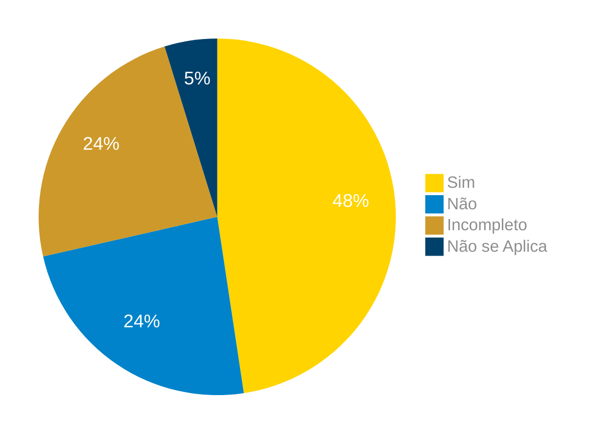

# Verificação do Artefato Aspectos Éticos de Pesquisas Envolvendo Pessoas

## Introdução

Neste artefato, está descrito os resultados da verificação do artefato de [Aspectos Éticos de Pesquisas Envolvendo Pessoas](https://interacao-humano-computador.github.io/2024.1-Correios/analise_de_requisitos/aspectos-eticos/) feito pelo [Grupo 03](https://interacao-humano-computador.github.io/2024.1-Correios/) da disciplina de Interação Humano Computador referente ao site [Correios](https://www.correios.com.br/). Lembrando que o foco não é apontar quem errou e sim os problemas presentes no artefato produzido, e por fim garantir os critérios de qualidade estabelecidos.

## Metodologia

Este artefato foi produzido por [Claudio Henrique][ClaudioGH] e verificado por [Elias Faria][EliasGH], seguindo a divisão planejada pelo grupo na [reunião 7](https://interacao-humano-computador.github.io/2024.1-Correios/atas/ata7/). Para a verificação do artefato, foi utilizada a versão `1.1` datada do dia 13/05/2024. Adotamos a metodologia de inspeção por [checklist](#checklist-de-verificacao) neste processo. Podemos ver pela Tabela 1 de exemplo, que para cada item do checklist teremos: descrição do item em verificação, resposta à avaliação (pode ser "Sim", "Não", "Incompleto" ou "Não se Aplica"), o número da referência bibliográfica e um link para um print da referência que o fundamenta o item. Ao final, na seção de [Problemas Encontrados](#problemas-encontrados), são comentados os itens negativos.

Na Tabela 1 temos a lista de verificação elaborada, ja na Tabelas 2 a aplicação do checklist para os Aspectos Éticos. 

Tabela 1 - Perguntas elaboradas de acordo com as referências bibliográficas.

| ID | Descrição | Avaliação | Referência | Print |
|:--:| --------- | :-------: | :--------: | :---: |
| **1** | No artefato desenvolvido eles citam evitar causar danos ou consequências negativas aos outros? tais como os perdas de informações, perdas de bens, danos a propriedades, ou impactos ambientais indesejados; respeitar a privacidade dos outros; e honrar a confidenciabilidade das informações; prejudicar ou causar danos a outras pessoas, seus bens, reputação um emprego. |  | <a href="#ref1">1.</a> "7.4 Aspectos Éticos de Pesquisas Envolvendo Pessoas"  | [página 140](../../../assets/prints_verificacao/pablo/aspectos_eticos/1.jpeg) |
| **2** | São levados em considerações os princípios de autonomia, beneficência, não maleficiência, justiça e equidade? |  | <a href="#ref1">1.</a> "7.4 Aspectos Éticos de Pesquisas Envolvendo Pessoas"  | [página 140](../../../assets/prints_verificacao/pablo/aspectos_eticos/2.jpeg) |
| **3** | Informado os objetivos da pesquisa aos participantes? dizendo exatamente como vai ser a participação deles; informando o que vai ocorrer durante a coleta de dados; o tempo aproximado da coleta; os tipos de dados que serão coletados; e ainda como eles serão analisados. |  | <a href="#ref1">1.</a> "7.4 Aspectos Éticos de Pesquisas Envolvendo Pessoas"  | [página 141](../../../assets/prints_verificacao/pablo/aspectos_eticos/3.jpeg) |
| **4** | São informados a confiabilidade e a privacidade durante o tratamento dos dados? Tração do como isso será tratado na divulgação dos resultados? |  | <a href="#ref1">1.</a> "7.4 Aspectos Éticos de Pesquisas Envolvendo Pessoas"  | [página 141](../../../assets/prints_verificacao/pablo/aspectos_eticos/4.jpeg) |
| **5** | É solicitado permissão para gravar voz ou imagem? |  | <a href="#ref1">1.</a> "7.4 Aspectos Éticos de Pesquisas Envolvendo Pessoas"  | [página 141](../../../assets/prints_verificacao/pablo/aspectos_eticos/5.jpeg) |
| **6** | O consentimento livre e esclarecido dos participantes é garantidos através de um termo de consentimento? |  | <a href="#ref1">1.</a> "7.4 Aspectos Éticos de Pesquisas Envolvendo Pessoas"  | [página 141](../../../assets/prints_verificacao/pablo/aspectos_eticos/6.jpeg) |
| **7** | É deixado claro para o participante o direito à Liberdade de se recusar a participar em qualquer momento ou fase da pesquisa? |  | <a href="#ref1">1.</a> "7.4 Aspectos Éticos de Pesquisas Envolvendo Pessoas"  | [página 142](../../../assets/prints_verificacao/pablo/aspectos_eticos/7.jpeg) |
| **8** | São explicadas ou tratadas as formas de incentivo para participar das pesquisas do projeto? |  | <a href="#ref1">1.</a> "7.4 Aspectos Éticos de Pesquisas Envolvendo Pessoas"  | [página 142](../../../assets/prints_verificacao/pablo/aspectos_eticos/8.jpeg) |
| **9** | No projeto é informado a validade e a confiabilidade dos dados coletados? |  | <a href="#ref1">1.</a> "7.4 Aspectos Éticos de Pesquisas Envolvendo Pessoas"  | [página 143](../../../assets/prints_verificacao/pablo/aspectos_eticos/9.jpeg) |
| **10** | No projeto é informado a necessidade ou não de assegurar a confiabilidade dos dados dos sistemas apresentados ao participante? como um acordo de confidenciabilidade? |  | <a href="#ref1">1.</a> "7.4 Aspectos Éticos de Pesquisas Envolvendo Pessoas"  | [página 143](../../../assets/prints_verificacao/pablo/aspectos_eticos/10.jpeg) |

Fonte: [Claudio Henrique][ClaudioGH], 2024.

## Apresentação dos Dados

Aqui será apresentado os resultados do checklist e logo após as observações dos itens com resultado negativo.

### Checklist de verificação

Tabela 2 - Checklist preenchido na verificação

| ID | Descrição | Avaliação | Referência | Print |
|:--:| --------- | :-------: | :--------: | :---: |
| **1** | No artefato desenvolvido eles citam evitar causar danos ou consequências negativas aos outros? tais como os perdas de informações, perdas de bens, danos a propriedades, ou impactos ambientais indesejados; respeitar a privacidade dos outros; e honrar a confidenciabilidade das informações; prejudicar ou causar danos a outras pessoas, seus bens, reputação um emprego. | Sim.  | <a href="#ref1">1.</a> "7.4 Aspectos Éticos de Pesquisas Envolvendo Pessoas"  | [página 140](../../../assets/prints_verificacao/pablo/aspectos_eticos/1.jpeg) |
| **2** | São levados em considerações os princípios de autonomia, beneficência, não maleficiência, justiça e equidade? | Sim. | <a href="#ref1">1.</a> "7.4 Aspectos Éticos de Pesquisas Envolvendo Pessoas"  | [página 140](../../../assets/prints_verificacao/pablo/aspectos_eticos/2.jpeg) |
| **3** | Informado os objetivos da pesquisa aos participantes? dizendo exatamente como vai ser a participação deles; informando o que vai ocorrer durante a coleta de dados; o tempo aproximado da coleta; os tipos de dados que serão coletados; e ainda como eles serão analisados. | Incompleto.| <a href="#ref1">1.</a> "7.4 Aspectos Éticos de Pesquisas Envolvendo Pessoas"  | [página 141](../../../assets/prints_verificacao/pablo/aspectos_eticos/3.jpeg) |
| **4** | São informados a confiabilidade e a privacidade durante o tratamento dos dados? Tração do como isso será tratado na divulgação dos resultados? | Sim.  | <a href="#ref1">1.</a> "7.4 Aspectos Éticos de Pesquisas Envolvendo Pessoas"  | [página 141](../../../assets/prints_verificacao/pablo/aspectos_eticos/4.jpeg) |
| **5** | É solicitado permissão para gravar voz ou imagem? | Sim. | <a href="#ref1">1.</a> "7.4 Aspectos Éticos de Pesquisas Envolvendo Pessoas"  | [página 141](../../../assets/prints_verificacao/pablo/aspectos_eticos/5.jpeg) |
| **6** | O consentimento livre e esclarecido dos participantes é garantidos através de um termo de consentimento? | Sim. | <a href="#ref1">1.</a> "7.4 Aspectos Éticos de Pesquisas Envolvendo Pessoas"  | [página 141](../../../assets/prints_verificacao/pablo/aspectos_eticos/6.jpeg) |
| **7** | É deixado claro para o participante o direito à Liberdade de se recusar a participar em qualquer momento ou fase da pesquisa? | Sim.| <a href="#ref1">1.</a> "7.4 Aspectos Éticos de Pesquisas Envolvendo Pessoas"  | [página 142](../../../assets/prints_verificacao/pablo/aspectos_eticos/7.jpeg) |
| **8** | São explicadas ou tratadas as formas de incentivo para participar das pesquisas do projeto? | Sim. | <a href="#ref1">1.</a> "7.4 Aspectos Éticos de Pesquisas Envolvendo Pessoas"  | [página 142](../../../assets/prints_verificacao/pablo/aspectos_eticos/8.jpeg) |
| **9** | No projeto é informado a validade e a confiabilidade dos dados coletados? | Sim. | <a href="#ref1">1.</a> "7.4 Aspectos Éticos de Pesquisas Envolvendo Pessoas"  | [página 143](../../../assets/prints_verificacao/pablo/aspectos_eticos/9.jpeg) |
| **10** | No projeto é informado a necessidade ou não de assegurar a confiabilidade dos dados dos sistemas apresentados ao participante? como um acordo de confidenciabilidade? | Sim. | <a href="#ref1">1.</a> "7.4 Aspectos Éticos de Pesquisas Envolvendo Pessoas"  | [página 143](../../../assets/prints_verificacao/pablo/aspectos_eticos/10.jpeg) |

Fonte: [Elias Faria][EliasGH], 2024.

Problemas Encontrados:

ID 03: Informado os objetivos da pesquisa aos participantes? dizendo exatamente como vai ser a participação deles; informando o que vai ocorrer durante a coleta de dados; o tempo aproximado da coleta; os tipos de dados que serão coletados; e ainda como eles serão analisados. | Incompleto.| <a href="#ref1">1.</a> "7.4 Aspectos Éticos de Pesquisas Envolvendo Pessoas"

- Avaliação: Incompleto.
- Comentário: É informado apenas que será utlizado os dados obtidos nas entrevistas e em outros métodos, mas não informa como acontecerá as etapas da coleta de dados como: quanto tempo durará a coleta de dados?, tipos de dados coletados e etc. 

### Gravação da verificação

<!-- para o iframe do vídeo, bote width = 560 e height = 315 -->

    <iframe width="560" height="315" src="https://www.youtube.com/embed" title="Apresentação 7 Interação Humano Computador 2024.1 - Grupo 3" frameborder="0" allow="accelerometer; autoplay; clipboard-write; encrypted-media; gyroscope; picture-in-picture; web-share" referrerpolicy="strict-origin-when-cross-origin" allowfullscreen></iframe>

    <a href="link"> Link para o vídeo </a>

## Problemas Encontrados

<!--- Aqui será apresentado todos os problemas identificados durante o processo de verificação do artefato de link do artefato. --->

- ID xx: Descrição
    - Avaliação:
    - Comentário:

## Sumário dos resultados

<!-- Conte as quantidade de ocorrencias e coloque no Grafico a quantidade em cada tipo de avaliação (se não ouver incidencia de um tipo como "não se aplica", apague a linha do mesmo)-->
A seguir, apresentamos a Figura 1 com o gráfico de pizza do sumário dos resultados.

Figura 1 - Gráfico de pizza do sumário dos resultados.

Fonte: [][], 2024.

## Bibliografia

> 1. Barbosa, S. D. J.; Silva, B. S. da; Silveira, M. S.; Gasparini, I.; Darin, T.; Barbosa, G. D. J. (2021) Interação Humano-Computador e Experiência do usuário. Autopublicação. ISBN: 978-65-00-19677-1. 

## Histórico de Versões

| Versão | Data | Descrição | Autor(es) | Revisor(es) |
| :----: | :--: | --------- | ----------- | ------ |
| `1.0`  | 25/06/2024 | Criação do documento | [Claudio Henrique][ClaudioGH] | [][] |

[ClaudioGH]: https://github.com/claudiohsc
[EliasGH]: https://github.com/EliasOliver21
[GabrielBGH]: https://github.com/Bertolazi
[GabrielFGH]: https://github.com/MMcLovin
[PabloGH]: https://github.com/pabloheika
[RicardoGH]: https://www.github.com/avmricardo