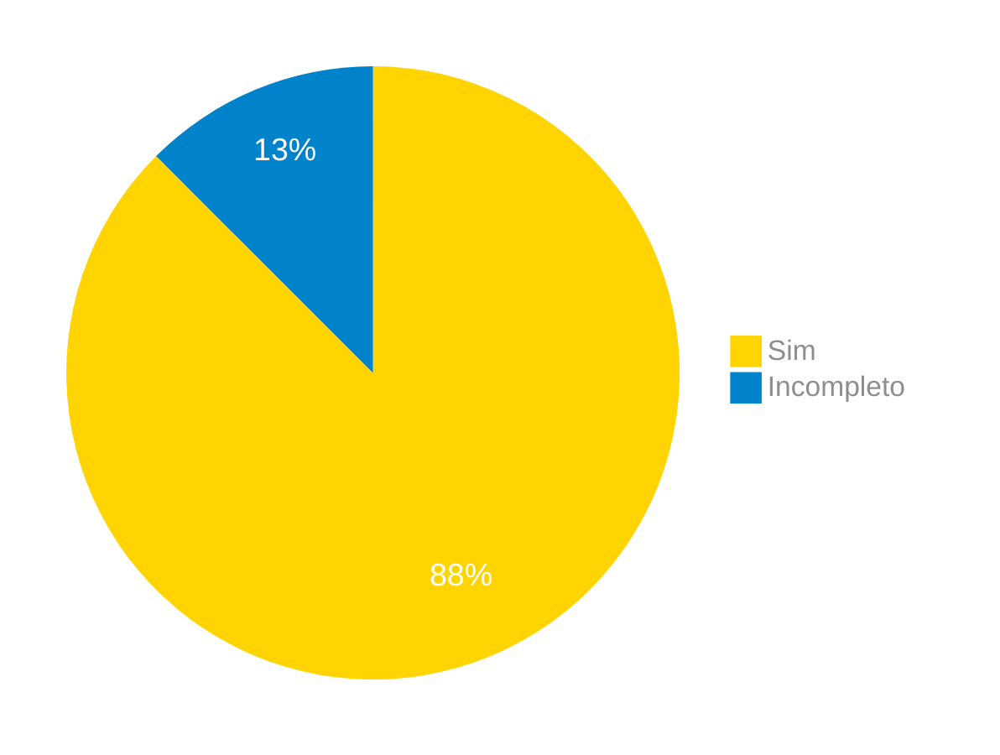
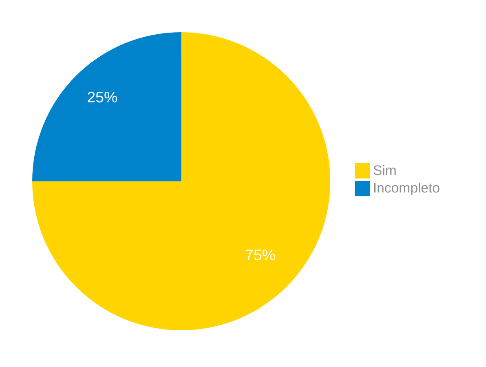
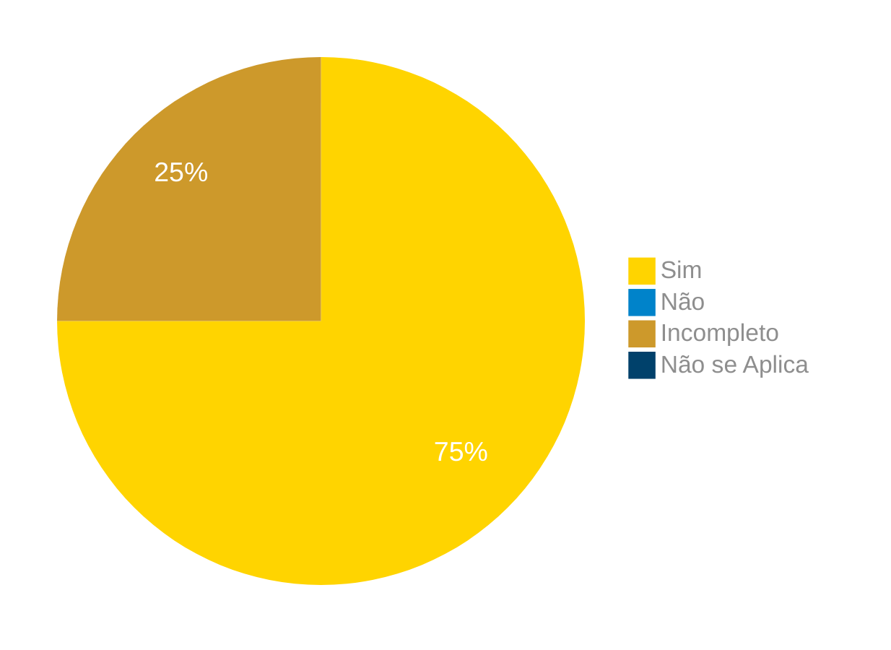
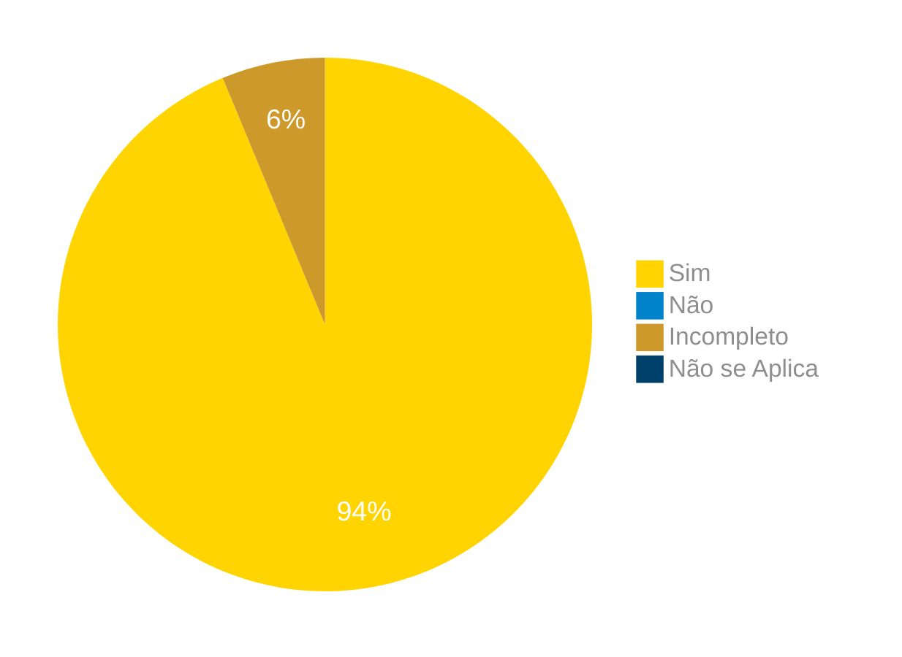

# Verificação do Artefato Cenários

## Introdução

Neste artefato, está descrito os resultados da verificação do artefato de [Cenários](https://interacao-humano-computador.github.io/2024.1-Correios/analise_de_requisitos/cenarios/) do nosso grupo da disciplina de Interação Humano Computador referente ao site dos [Correios](https://correios.com.br) .

## Objetivo

O objetivo dessa verificação é detectar prováveis problemas no [artefato](https://interacao-humano-computador.github.io/2024.1-Correios/analise_de_requisitos/cenarios/) produzido pelo nosso grupo nas etapas anteriores do projeto.

## Metodologia

O checklist foi elaborado por [Elias F. Oiveira][EliasGH] e cada integrante verificou ao menos  um cenário, seguindo a divisão planejada pelo grupo na [reunião 7](https://interacao-humano-computador.github.io/2024.1-Correios/atas/ata7/). Para a verificação do artefato, foi utilizada a versão `1.0` datada do dia 21/04/2024. Adotamos a metodologia de inspeção por [checklist](#checklist-de-verificacao) neste processo. Podemos ver pela Tabela 1 de exemplo, que para cada item do checklist teremos: descrição do item em verificação, resposta à avaliação (pode ser "Sim", "Não", "Incompleto" ou "Não se Aplica"), o número da referência bibliográfica e um link para um print da referência que o fundamenta o item. Ao final, na seção de [Problemas Encontrados](#problemas-encontrados), são comentados os itens negativos.

### Checklist dos Cenários

Abaixo, na tabela 1, está apresentado o checklist para os cenários.

Tabela 1 - Checklist de Verificação dos Cenários.

|ID| Descrição | Avaliação | Referência| Print|
|:--:|:--:|:--:|:--:|:----:|
|1| O cenário possui os elementos básicos: ambiente ou contexto, atores, objetivos, planejamento, ações, eventos e avaliação? |  | <a href="#ref2">REF2</a>. pg 172 | [Página 172](../../../assets/prints_verificacao/claudio/pag172cenariosDef.png)  |
|2| O modo para atingir o objetivo está descrito no cenário ? |  | <a href="#ref1">REF1</a>. pg 49 |   [Página 49](../../../assets/prints_verificacao/claudio/pag49cenarios.png)   |
|3|  O contexto descreve o estado inicial: suas pré-condições, o local (físico) e o tempo? |  | <a href="#ref1">REF1</a>. pg 49 |   [Página 49](../../../assets/prints_verificacao/claudio/pag49cenarios.png)   |
|4|  As características pessoais dos atores são relevantes ao cenário? |  | <a href="#ref2">REF2</a>. pg 172 | [Página 172](../../../assets/prints_verificacao/claudio/pag172cenarios.png)  |
|5|  Cada episódio representa uma ação realizada por um ator onde participam outros atores utilizando recursos disponíveis? |  | <a href="#ref1">REF1</a>. pg 49 |  [Página 49](../../../assets/prints_verificacao/claudio/pag49cenarios.png)   |
|6|  Os episódios do cenário seguem uma ordem lógica para atingir o objetivo?	 |  | <a href="#ref1">REF1</a>. pg 50 | [Página 50](../../../assets/prints_verificacao/claudio/pag50cenarios.png) |
|7| O título do cenário é autoexplicativo?	 |  | <a href="#ref1">REF1</a>. pg 49 |  [Página 49](../../../assets/prints_verificacao/claudio/pag49cenarios.png)  |
|8| Caso os cenários sejam utilizados em conjunto com personas, os atores dos cenários são as personas elaboradas previamente?	 |  | <a href="#ref2">REF2</a>. pg 172 |  [Página 172](../../../assets/prints_verificacao/claudio/pag172cenariosPersonas.png) |

Fonte: [Claudio Henrique](https://github.com/claudiohsc), 2024.

## Apresentação dos Dados
Após as verificações dos itens, os que possuirem resultado negativo serão comentados na seção de [Problemas Encontrados](#problemas-encontrados). A aplicação do checklist para cenário está nas tabelas de 2 a 8.

## Cenário 01 - Cálculo de Preços e prazos

Tabela 2 - Cenário Cálculo de Preços e prazos 

|ID| Descrição | Avaliação | Referência| Print|
|:--:|:--:|:--:|:--:|:----:|
|1| O cenário possui os elementos básicos: ambiente ou contexto, atores, objetivos, planejamento, ações, eventos e avaliação? | Sim.  | <a href="#ref2">REF2</a>. pg 172 | [Página 172](../../../assets/prints_verificacao/claudio/pag172cenariosDef.png)  |
|2| O modo para atingir o objetivo está descrito no cenário ? | Sim. | <a href="#ref1">REF1</a>. pg 49 |   [Página 49](../../../assets/prints_verificacao/claudio/pag49cenarios.png)   |
|3|  O contexto descreve o estado inicial: suas pré-condições, o local (físico) e o tempo? | Sim. | <a href="#ref1">REF1</a>. pg 49 |   [Página 49](../../../assets/prints_verificacao/claudio/pag49cenarios.png)   |
|4|  As características pessoais dos atores são relevantes ao cenário? | Sim. | <a href="#ref2">REF2</a>. pg 172 | [Página 172](../../../assets/prints_verificacao/claudio/pag172cenarios.png)  |
|5|  Cada episódio representa uma ação realizada por um ator onde participam outros atores utilizando recursos disponíveis? | Não.  | <a href="#ref1">REF1</a>. pg 49 |  [Página 49](../../../assets/prints_verificacao/claudio/pag49cenarios.png)   |
|6|  Os episódios do cenário seguem uma ordem lógica para atingir o objetivo?	 | Sim. | <a href="#ref1">REF1</a>. pg 50 | [Página 50](../../../assets/prints_verificacao/claudio/pag50cenarios.png) |
|7| O título do cenário é autoexplicativo?	 | Sim. | <a href="#ref1">REF1</a>. pg 49 |  [Página 49](../../../assets/prints_verificacao/claudio/pag49cenarios.png)  |
|8| Caso os cenários sejam utilizados em conjunto com personas, os atores dos cenários são as personas elaboradas previamente?	 | Sim.  | <a href="#ref2">REF2</a>. pg 172 |  [Página 172](../../../assets/prints_verificacao/claudio/pag172cenariosPersonas.png) |

Fonte: [Elias F. oliveira][EliasGH], 2024.

#### Problemas Encontrados

Aqui será apresentado todos os problemas identificados durante o processo de verificação do artefato de [Cenários](https://interacao-humano-computador.github.io/2024.1-Correios/analise_de_requisitos/cenarios/).

- ID 05:  Cada episódio representa uma ação realizada por um ator onde participam outros atores utilizando recursos disponíveis?
    - Avaliação: Não.
    - Comentário: No cenário apenas é descrito o ator Gabriel Anacleto que é uma persona, não apresentando nenhum outro ator especificamente.

## Cenário 02 - Realização de Pré-Postagem

Tabela 2 - Cenário de Pré-Postagem 

| ID | Descrição | Avaliação | Referência | Print |
| --- | --- | --- | --- | --- |
| 1 | O cenário possui os elementos básicos: ambiente ou contexto, atores, objetivos, planejamento, ações, eventos e avaliação? | Incompleto | [REF2](#ref2). pg 172 | [Página 172](../../../assets/prints_verificacao/claudio/pag172cenariosDef.png) |
| 2 | O modo para atingir o objetivo está descrito no cenário ? | Sim | [REF1](#ref1). pg 49 | [Página 49](../../../assets/prints_verificacao/claudio/pag49cenarios.png) |
| 3 | O contexto descreve o estado inicial: suas pré-condições, o local (físico) e o tempo? | Sim | [REF1](#ref1). pg 49 | [Página 49](../../../assets/prints_verificacao/claudio/pag49cenarios.png) |
| 4 | As características pessoais dos atores são relevantes ao cenário? | Sim | [REF2](#ref2). pg 172 | [Página 172](../../../assets/prints_verificacao/claudio/pag172cenarios.png) |
| 5 | Cada episódio representa uma ação realizada por um ator onde participam outros atores utilizando recursos disponíveis? | Sim | [REF1](#ref1). pg 49 | [Página 49](../../../assets/prints_verificacao/claudio/pag49cenarios.png) |
| 6 | Os episódios do cenário seguem uma ordem lógica para atingir o objetivo? | Sim | [REF1](#ref1). pg 50 | [Página 50](../../../assets/prints_verificacao/claudio/pag50cenarios.png) |
| 7 | O título do cenário é autoexplicativo? | Sim | [REF1](#ref1). pg 49 | [Página 49](../../../assets/prints_verificacao/claudio/pag49cenarios.png) |
| 8 | Caso os cenários sejam utilizados em conjunto com personas, os atores dos cenários são as personas elaboradas previamente? | Sim | [REF2](#ref2). pg 172 | [Página 172](../../../assets/prints_verificacao/claudio/pag172cenariosPersonas.png) |

Fonte: [Pablo S. Costa][PabloGH], 2024.

### Gravação da verificação

<!-- para o iframe do vídeo, bote width = 560 e height = 315 -->

    <iframe width="560" height="315" src="https://www.youtube.com/embed/7zLTZyF2S1s?si=0OqdsbmYLCfJ5dy8" title="YouTube video player" frameborder="0" allow="accelerometer; autoplay; clipboard-write; encrypted-media; gyroscope; picture-in-picture; web-share" referrerpolicy="strict-origin-when-cross-origin" allowfullscreen></iframe>

    <a href="https://youtu.be/7zLTZyF2S1s?si=0OqdsbmYLCfJ5dy8"> Link para o vídeo </a>

### Problemas Encontrados

Aqui será apresentado todos os problemas identificados durante o processo de verificação do artefato de [Cenários](https://interacao-humano-computador.github.io/2024.1-Correios/analise_de_requisitos/cenarios/).

*   ID 1: O cenário possui os elementos básicos: ambiente ou contexto, atores, objetivos, planejamento, ações, eventos e avaliação?
    *   Avaliação: Incompleto
    *   Comentário: Durante a leitura pude constar que há avaliação quanto uma etapa de preenchimento, porém não há avaliação final quanto à satisfação ao usar a ferramenta de pré postagem.

### Sumário dos resultados

<!-- Conte as quantidade de ocorrencias e coloque no Grafico a quantidade em cada tipo de avaliação (se não ouver incidencia de um tipo como "não se aplica", apague a linha do mesmo)-->
A seguir, apresentamos a Figura 2 com o gráfico de pizza do sumário dos resultados.

Figura 2 - Gráfico de pizza do sumário dos resultados.

Fonte: [Pablo S. Costa][PabloGH], 2024.

## Cenário 03 - Loja Online

Tabela 2 - Cenário x 

|ID| Descrição | Avaliação | Referência| Print|
|:--:|:--:|:--:|:--:|:----:|
|1| O cenário possui os elementos básicos: ambiente ou contexto, atores, objetivos, planejamento, ações, eventos e avaliação? | Sim | <a href="#ref2">REF2</a>. pg 172 | [Página 172](../../../assets/prints_verificacao/claudio/pag172cenariosDef.png)  |
|2| O modo para atingir o objetivo está descrito no cenário ? | Sim | <a href="#ref1">REF1</a>. pg 49 |   [Página 49](../../../assets/prints_verificacao/claudio/pag49cenarios.png)   |
|3|  O contexto descreve o estado inicial: suas pré-condições, o local (físico) e o tempo? | Sim | <a href="#ref1">REF1</a>. pg 49 |   [Página 49](../../../assets/prints_verificacao/claudio/pag49cenarios.png)   |
|4|  As características pessoais dos atores são relevantes ao cenário? | Sim | <a href="#ref2">REF2</a>. pg 172 | [Página 172](../../../assets/prints_verificacao/claudio/pag172cenarios.png)  |
|5|  Cada episódio representa uma ação realizada por um ator onde participam outros atores utilizando recursos disponíveis? | Sim | <a href="#ref1">REF1</a>. pg 49 |  [Página 49](../../../assets/prints_verificacao/claudio/pag49cenarios.png)   |
|6|  Os episódios do cenário seguem uma ordem lógica para atingir o objetivo?	 | Sim | <a href="#ref1">REF1</a>. pg 50 | [Página 50](../../../assets/prints_verificacao/claudio/pag50cenarios.png) |
|7| O título do cenário é autoexplicativo?	 | Sim | <a href="#ref1">REF1</a>. pg 49 |  [Página 49](../../../assets/prints_verificacao/claudio/pag49cenarios.png)  |
|8| Caso os cenários sejam utilizados em conjunto com personas, os atores dos cenários são as personas elaboradas previamente?	 | Sim | <a href="#ref2">REF2</a>. pg 172 |  [Página 172](../../../assets/prints_verificacao/claudio/pag172cenariosPersonas.png) |

Fonte: [Gabriel B. Bertolazi][GabrielBGH], 2024.

#### Problemas Encontrados

Aqui será apresentado todos os problemas identificados durante o processo de verificação do artefato de [Cenários](https://interacao-humano-computador.github.io/2024.1-Correios/analise_de_requisitos/cenarios/).

Não foram encontrados problemas.

## Cenário 04 - Recebimento de Encomendas 

Tabela 2 - Cenário x 

| ID | Descrição | Avaliação | Referência | Print |
| --- | --- | --- | --- | --- |
| 1 | O cenário possui os elementos básicos: ambiente ou contexto, atores, objetivos, planejamento, ações, eventos e avaliação? | sim | [REF2](#ref2). pg 172 | [Página 172](../../../assets/prints_verificacao/claudio/pag172cenariosDef.png) |
| 2 | O modo para atingir o objetivo está descrito no cenário ? | sim | [REF1](#ref1). pg 49 | [Página 49](../../../assets/prints_verificacao/claudio/pag49cenarios.png) |
| 3 | O contexto descreve o estado inicial: suas pré-condições, o local (físico) e o tempo? | incompleto | [REF1](#ref1). pg 49 | [Página 49](../../../assets/prints_verificacao/claudio/pag49cenarios.png) |
| 4 | As características pessoais dos atores são relevantes ao cenário? | sim | [REF2](#ref2). pg 172 | [Página 172](../../../assets/prints_verificacao/claudio/pag172cenarios.png) |
| 5 | Cada episódio representa uma ação realizada por um ator onde participam outros atores utilizando recursos disponíveis? | sim | [REF1](#ref1). pg 49 | [Página 49](../../../assets/prints_verificacao/claudio/pag49cenarios.png) |
| 6 | Os episódios do cenário seguem uma ordem lógica para atingir o objetivo? | sim | [REF1](#ref1). pg 50 | [Página 50](../../../assets/prints_verificacao/claudio/pag50cenarios.png) |
| 7 | O título do cenário é autoexplicativo? | incompleto | [REF1](#ref1). pg 49 | [Página 49](../../../assets/prints_verificacao/claudio/pag49cenarios.png) |
| 8 | Caso os cenários sejam utilizados em conjunto com personas, os atores dos cenários são as personas elaboradas previamente? | sim | [REF2](#ref2). pg 172 | [Página 172](../../../assets/prints_verificacao/claudio/pag172cenariosPersonas.png) |

Fonte: [Gabriel F. J. Silva][GabrielFGH], 2024.

#### Gravação da Verificação

    <iframe width="560" height="315" src="https://www.youtube.com/embed/ntXGajFrB_I" title="(Entrega 6.2) Verificação: Cenários - Receber Encomendas (Editar)" frameborder="0" allow="accelerometer; autoplay; clipboard-write; encrypted-media; gyroscope; picture-in-picture; web-share" referrerpolicy="strict-origin-when-cross-origin" allowfullscreen></iframe>

    <a href="https://www.youtube.com/watch?v=ntXGajFrB_I"> Link para o vídeo </a>

#### Problemas Encontrados

detalhar problemas

Aqui será apresentado todos os problemas identificados durante o processo de verificação do artefato de Cenário para [Recebimento de Encomendas](https://interacao-humano-computador.github.io/2024.1-Correios/analise_de_requisitos/cenarios/#recebimento-de-encomendas).

- ID 02: O contexto descreve o estado inicial: suas pré-condições, o local (físico) e o tempo?
    - Avaliação: incompleto
    - Comentário: não apresenta pré-condições e nem o tempo 
- ID 02: O título do cenário é autoexplicativo?
- Avaliação: incompleto
- Comentário: é possível entender que se trata do recebimento de encomendas, mas não da alteração do endereço de entrega

### Sumário dos resultados

<!-- Conte as quantidade de ocorrencias e coloque no Grafico a quantidade em cada tipo de avaliação (se não ouver incidencia de um tipo como "não se aplica", apague a linha do mesmo)-->
A seguir, apresentamos a Figura 2 com o gráfico de pizza do sumário dos resultados.

Figura 2 - Gráfico de pizza do sumário dos resultados.

## Cenário 05 - Minhas Importações

Tabela 2 - Cenário x 

|ID| Descrição | Avaliação | Referência| Print|
|:--:|:--:|:--:|:--:|:----:|
|1| O cenário possui os elementos básicos: ambiente ou contexto, atores, objetivos, planejamento, ações, eventos e avaliação? | Sim | <a href="#ref2">REF2</a>. pg 172 | [Página 172](../../../assets/prints_verificacao/claudio/pag172cenariosDef.png)  |
|2| O modo para atingir o objetivo está descrito no cenário ? | Sim | <a href="#ref1">REF1</a>. pg 49 |   [Página 49](../../../assets/prints_verificacao/claudio/pag49cenarios.png)   |
|3|  O contexto descreve o estado inicial: suas pré-condições, o local (físico) e o tempo? | Sim | <a href="#ref1">REF1</a>. pg 49 |   [Página 49](../../../assets/prints_verificacao/claudio/pag49cenarios.png)   |
|4|  As características pessoais dos atores são relevantes ao cenário? | Não | <a href="#ref2">REF2</a>. pg 172 | [Página 172](../../../assets/prints_verificacao/claudio/pag172cenarios.png)  |
|5|  Cada episódio representa uma ação realizada por um ator onde participam outros atores utilizando recursos disponíveis? | Sim | <a href="#ref1">REF1</a>. pg 49 |  [Página 49](../../../assets/prints_verificacao/claudio/pag49cenarios.png)   |
|6|  Os episódios do cenário seguem uma ordem lógica para atingir o objetivo?	 | Sim | <a href="#ref1">REF1</a>. pg 50 | [Página 50](../../../assets/prints_verificacao/claudio/pag50cenarios.png) |
|7| O título do cenário é autoexplicativo?	 | Sim | <a href="#ref1">REF1</a>. pg 49 |  [Página 49](../../../assets/prints_verificacao/claudio/pag49cenarios.png)  |
|8| Caso os cenários sejam utilizados em conjunto com personas, os atores dos cenários são as personas elaboradas previamente?	 | Sim | <a href="#ref2">REF2</a>. pg 172 |  [Página 172](../../../assets/prints_verificacao/claudio/pag172cenariosPersonas.png) |

Fonte: [Ricardo Augusto][RicardoGH], 2024.

#### Problemas Encontrados

Aqui será apresentado todos os problemas identificados durante o processo de verificação do artefato de [Cenários](https://interacao-humano-computador.github.io/2024.1-Correios/analise_de_requisitos/cenarios/).

Não foram encontrados problemas.

## Cenário 06 - Rastreamento de Encomendas

Tabela 7 - Cenário Rastreamento de Encomendas 

|ID| Descrição | Avaliação | Referência| Print|
|:--:|:--:|:--:|:--:|:----:|
|1| O cenário possui os elementos básicos: ambiente ou contexto, atores, objetivos, planejamento, ações, eventos e avaliação? | Sim | <a href="#ref2">REF2</a>. pg 172 | [Página 172](../../../assets/prints_verificacao/claudio/pag172cenariosDef.png)  |
|2| O modo para atingir o objetivo está descrito no cenário ? | Sim | <a href="#ref1">REF1</a>. pg 49 |   [Página 49](../../../assets/prints_verificacao/claudio/pag49cenarios.png)   |
|3|  O contexto descreve o estado inicial: suas pré-condições, o local (físico) e o tempo? | Sim | <a href="#ref1">REF1</a>. pg 49 |   [Página 49](../../../assets/prints_verificacao/claudio/pag49cenarios.png)   |
|4|  As características pessoais dos atores são relevantes ao cenário? |Incompleto  | <a href="#ref2">REF2</a>. pg 172 | [Página 172](../../../assets/prints_verificacao/claudio/pag172cenarios.png)  |
|5|  Cada episódio representa uma ação realizada por um ator onde participam outros atores utilizando recursos disponíveis? |Sim  | <a href="#ref1">REF1</a>. pg 49 |  [Página 49](../../../assets/prints_verificacao/claudio/pag49cenarios.png)   |
|6|  Os episódios do cenário seguem uma ordem lógica para atingir o objetivo?	 | Sim | <a href="#ref1">REF1</a>. pg 50 | [Página 50](../../../assets/prints_verificacao/claudio/pag50cenarios.png) |
|7| O título do cenário é autoexplicativo?	 | Sim | <a href="#ref1">REF1</a>. pg 49 |  [Página 49](../../../assets/prints_verificacao/claudio/pag49cenarios.png)  |
|8| Caso os cenários sejam utilizados em conjunto com personas, os atores dos cenários são as personas elaboradas previamente?	 | Incompleto | <a href="#ref2">REF2</a>. pg 172 |  [Página 172](../../../assets/prints_verificacao/claudio/pag172cenariosPersonas.png) |

Fonte: [x](x), 2024.

#### Problemas Encontrados

Aqui será apresentado todos os problemas identificados durante o processo de verificação do artefato de [Cenários](https://interacao-humano-computador.github.io/2024.1-Correios/analise_de_requisitos/cenarios/).

- ID 04,08:  As características pessoais dos atores são relevantes ao cenário? / Caso os cenários sejam utilizados em conjunto com personas, os atores dos cenários são as personas elaboradas previamente?
    - Avaliação: Incompleto
    - Comentário: Nesse caso, a persona escolhida tem uma profissão e ações diferentes no cenário, sendo que na definição das personas ela possui outra profissão.

### Gravação da verificação

<!-- para o iframe do vídeo, bote width = 560 e height = 315 -->

<iframe width="560" height="315" src="https://www.youtube.com/embed/fClYl_ROj_Y?si=_64KSXmlFqs1lMs0" title="YouTube video player" frameborder="0" allow="accelerometer; autoplay; clipboard-write; encrypted-media; gyroscope; picture-in-picture; web-share" referrerpolicy="strict-origin-when-cross-origin" allowfullscreen></iframe>

    <a href="https://www.youtube.com/watch?v=fClYl_ROj_Y"> Link para o vídeo </a>

### Sumário dos resultados

<!-- Conte as quantidade de ocorrencias e coloque no Grafico a quantidade em cada tipo de avaliação (se não ouver incidencia de um tipo como "não se aplica", apague a linha do mesmo)-->
A seguir, apresentamos a Figura 1 com o gráfico de pizza do sumário dos resultados.

Figura 1 - Gráfico de pizza do sumário dos resultados.

Fonte: [Claudio Henrique][ClaudioGH], 2024.

## Sumário total dos resultados

<!-- Conte as quantidade de ocorrencias e coloque no Grafico a quantidade em cada tipo de avaliação (se não ouver incidencia de um tipo como "não se aplica", apague a linha do mesmo)-->
A seguir, apresentamos a Figura 7 com o gráfico de pizza do sumário total dos resultados.

Figura 7 - Gráfico de pizza do sumário total dos resultados.

Fonte: [][], 2024.

## Bibliografia

> 1<a id="ref1">.</a> LEITE, Julio, BALANGUER, Frederico, MAIORANA, Vanessa. Enhancing a Requirements Baseline with Scenarios.IEEE, 1997. Disponível em: <https://www-di.inf.puc-rio.br/~julio/bnncap3.pdf>

> 2<a id="ref2">.</a> Barbosa, S. D. J.; Silva, B. S. da; Silveira, M. S.; Gasparini, I.; Darin, T.; Barbosa, G. D. J. (2021) Interação Humano-Computador e Experiência do usuário. Autopublicação. ISBN: 978-65-00-19677-1.

## Histórico de Versões

| Versão | Data | Descrição | Autor(es) | Revisor(es) |
| :----: | :--: | --------- | ----------- | ------ |
| `1.0`  | 25/06/2024 | Criação do documento |[Elias F. Oliveira][EliasGH]| |

[ClaudioGH]: https://github.com/claudiohsc
[EliasGH]: https://github.com/EliasOliver21
[GabrielBGH]: https://github.com/Bertolazi
[GabrielFGH]: https://github.com/MMcLovin
[PabloGH]: https://github.com/pabloheika
[RicardoGH]: https://www.github.com/avmricardo