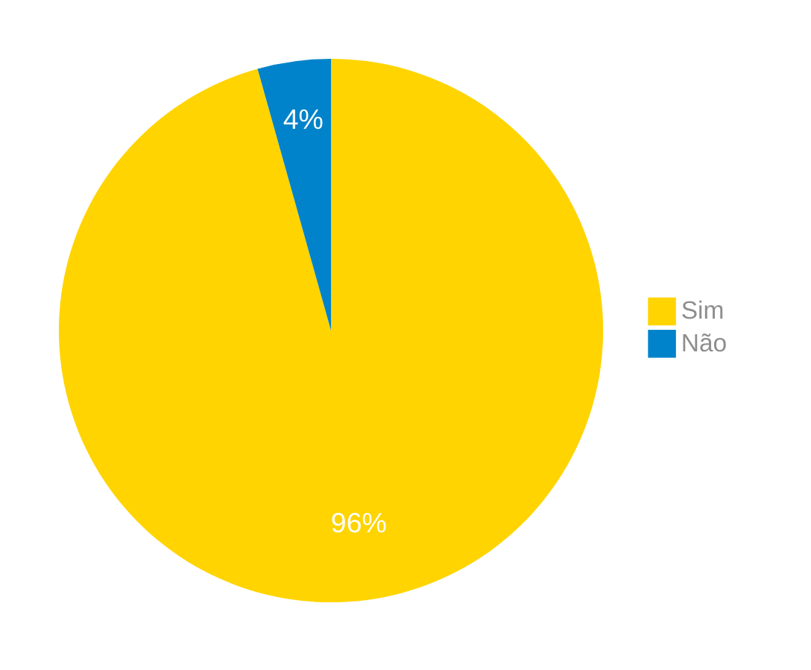

# Verificação do Artefato Guia de Estilo

## Introdução

Neste artefato, está descrito os resultados da verificação do artefato de [Guia de Estilo](https://interacao-humano-computador.github.io/2024.1-Correios/analise_de_requisitos2/guia_de_estilo/) feito pelo [Grupo 03](https://interacao-humano-computador.github.io/2024.1-Correios/) da disciplina de Interação Humano Computador referente ao site [Correios](https://www.correios.com.br/). Lembrando que o foco não é apontar quem errou e sim os problemas presentes no artefato produzido, e por fim garantir os critérios de qualidade estabelecidos.

## Metodologia

Este artefato foi produzido por [Gabriel F. J. Silva][GabrielFGH] e verificado por [Elias F. Oliveira][EliasGH], seguindo a divisão planejada pelo grupo na [reunião 7](https://interacao-humano-computador.github.io/2024.1-Correios/atas/ata7/). Para a verificação do artefato, foi utilizada a versão `1.0` datada do dia 10/05/2024. Adotamos a metodologia de inspeção por [checklist](#checklist-de-verificacao) neste processo. Podemos ver pela Tabela 1 de exemplo, que para cada item do checklist teremos: descrição do item em verificação, resposta à avaliação (pode ser "Sim", "Não", "Incompleto" ou "Não se Aplica"), o número da referência bibliográfica e um link para um print da referência que o fundamenta o item. Ao final, na seção de [Problemas Encontrados](#problemas-encontrados), são comentados os itens negativos.

Tabela 1 - Perguntas elaboradas de acordo com as referências bibliográficas.

| ID  | Descrição | Avaliação | Referência | Print |
|:--:|------|:-------:|:-----:|:-----:|
| **1** | Nesse artefato temos as principais decisões de design tomadas? | | <a href="#ref1">1</a> | [pag.257](../../../assets/prints_verificacao/gabrielb/primeira.png) |                          
| **2** | No guia de estilo temos os 6 elementos principais? (layout, tipografia, simbolismo, cores, visualização de informação e design de telas e elementos de interface) | | <a href="#ref1">1</a> | [pag.257](../../../assets/prints_verificacao/gabrielb/segunda.png) |
| **3** | Na introdução, temos os objetivos? | | <a href="#ref1">1</a> | [pag.258](../../../assets/prints_verificacao/gabrielb/3%20a%2017.png) |
| **4** | Na introdução, temos a organização do conteúdo? | | <a href="#ref1">1</a> | [pag.258](../../../assets/prints_verificacao/gabrielb/3%20a%2017.png) |
| **5** | Na introdução, temos descrito o público-alvo? | | <a href="#ref1">1</a> | [pag.258](../../../assets/prints_verificacao/gabrielb/3%20a%2017.png) |
| **6** | Na introdução, temos um tutorial de como usar o guia?  | | <a href="#ref1">1</a> | [pag.258](../../../assets/prints_verificacao/gabrielb/3%20a%2017.png) |
| **7** | Na introdução, temos como manter o guia? | | <a href="#ref1">1</a> | [pag.258](../../../assets/prints_verificacao/gabrielb/3%20a%2017.png) |
| **8** | Nos resultados das análises temos a descrição do ambiente de trabalho? | | <a href="#ref1">1</a> | [pag.258](../../../assets/prints_verificacao/gabrielb/3%20a%2017.png) |
| **9** | Nos elementos de interface, temos a disposição espacial e grid? | | <a href="#ref1">1</a> | [pag.258](../../../assets/prints_verificacao/gabrielb/3%20a%2017.png) |
| **10** | Nos elementos de interface, temos as janelas? | | <a href="#ref1">1</a> | [pag.258](../../../assets/prints_verificacao/gabrielb/3%20a%2017.png) |
| **11** | Nos elementos de interface, temos a tipografia?| | <a href="#ref1">1</a> | [pag.258](../../../assets/prints_verificacao/gabrielb/3%20a%2017.png) |
| **12** | Nos elementos de interface, temos os símbolos não tipográficos? | | <a href="#ref1">1</a> | [pag.258](../../../assets/prints_verificacao/gabrielb/3%20a%2017.png) |
| **13** | Nos elementos de interface, temos as cores? | | <a href="#ref1">1</a> | [pag.258](../../../assets/prints_verificacao/gabrielb/3%20a%2017.png) |
| **14** | Nos elementos de interface, temos as animações?| | <a href="#ref1">1</a> | [pag.258](../../../assets/prints_verificacao/gabrielb/3%20a%2017.png) |
| **15** | Nos elementos de interação, temos os estilos de interação? | | <a href="#ref1">1</a> | [pag.258](../../../assets/prints_verificacao/gabrielb/3%20a%2017.png) |
| **16** | Nos elementos de interação, temos a seleção de um estilo?  | | <a href="#ref1">1</a> | [pag.258](../../../assets/prints_verificacao/gabrielb/3%20a%2017.png) |  
| **17** | Nos elementos de interação, temos os aceleradores (teclas de atalho)? | | <a href="#ref1">1</a> | [pag.258](../../../assets/prints_verificacao/gabrielb/3%20a%2017.png) |
| **18** | Nos elementos de ação, temos o preenchimento de campos?  | | <a href="#ref1">1</a> | [pag.258](../../../assets/prints_verificacao/gabrielb/resto.png) |
| **19** | Nos elementos de ação, temos a seleção?  | | <a href="#ref1">1</a> | [pag.258](../../../assets/prints_verificacao/gabrielb/resto.png) |     
| **20** | Nos elementos de ação, temos a ativação?  | | <a href="#ref1">1</a> | [pag.258](../../../assets/prints_verificacao/gabrielb/resto.png) |            
| **21** | No vocabulário e padrões, temos a terminologia?  | | <a href="#ref1">1</a> | [pag.258](../../../assets/prints_verificacao/gabrielb/resto.png) |                     
| **23** | No vocabulário e padrões, temos as sequências de diálogos (e.g., para feedback ou confirmação de uma operação)? | | <a href="#ref1">1</a> | [pag.258](../../../assets/prints_verificacao/gabrielb/resto.png) |

Fonte: [Gabriel F. J. Silva][GabrielFGH], 2024.

## Apresentação dos Dados

Aqui será apresentado os resultados do checklist e logo após as observações dos itens com resultado negativo.

### Checklist de verificação

Tabela 2 - Checklist preenchido na verificação

| ID  | Descrição | Avaliação | Referência | Print |
|:--:|------|:-------:|:-----:|:-----:|
| **1** | Nesse artefato temos as principais decisões de design tomadas? | sim. | <a href="#ref1">1</a> | [pag.257](../../../assets/prints_verificacao/gabrielb/primeira.png) |                          
| **2** | No guia de estilo temos os 6 elementos principais? (layout, tipografia, simbolismo, cores, visualização de informação e design de telas e elementos de interface) | Sim. | <a href="#ref1">1</a> | [pag.257](../../../assets/prints_verificacao/gabrielb/segunda.png) |
| **3** | Na introdução, temos os objetivos? | Sim. | <a href="#ref1">1</a> | [pag.258](../../../assets/prints_verificacao/gabrielb/3%20a%2017.png) |
| **4** | Na introdução, temos a organização do conteúdo? | Sim. | <a href="#ref1">1</a> | [pag.258](../../../assets/prints_verificacao/gabrielb/3%20a%2017.png) |
| **5** | Na introdução, temos descrito o público-alvo? | Sim.| <a href="#ref1">1</a> | [pag.258](../../../assets/prints_verificacao/gabrielb/3%20a%2017.png) |
| **6** | Na introdução, temos um tutorial de como usar o guia?  | Sim.| <a href="#ref1">1</a> | [pag.258](../../../assets/prints_verificacao/gabrielb/3%20a%2017.png) |
| **7** | Na introdução, temos como manter o guia? | Sim. | <a href="#ref1">1</a> | [pag.258](../../../assets/prints_verificacao/gabrielb/3%20a%2017.png) |
| **8** | Nos resultados das análises temos a descrição do ambiente de trabalho? | Sim. | <a href="#ref1">1</a> | [pag.258](../../../assets/prints_verificacao/gabrielb/3%20a%2017.png) |
| **9** | Nos elementos de interface, temos a disposição espacial e grid? |Sim. | <a href="#ref1">1</a> | [pag.258](../../../assets/prints_verificacao/gabrielb/3%20a%2017.png) |
| **10** | Nos elementos de interface, temos as janelas? | Sim. | <a href="#ref1">1</a> | [pag.258](../../../assets/prints_verificacao/gabrielb/3%20a%2017.png) |
| **11** | Nos elementos de interface, temos a tipografia?| Sim.| <a href="#ref1">1</a> | [pag.258](../../../assets/prints_verificacao/gabrielb/3%20a%2017.png) |
| **12** | Nos elementos de interface, temos os símbolos não tipográficos? | Sim. | <a href="#ref1">1</a> | [pag.258](../../../assets/prints_verificacao/gabrielb/3%20a%2017.png) |
| **13** | Nos elementos de interface, temos as cores? | Sim.| <a href="#ref1">1</a> | [pag.258](../../../assets/prints_verificacao/gabrielb/3%20a%2017.png) |
| **14** | Nos elementos de interface, temos as animações?| Não. | <a href="#ref1">1</a> | [pag.258](../../../assets/prints_verificacao/gabrielb/3%20a%2017.png) |
| **15** | Nos elementos de interação, temos os estilos de interação? | Sim. | <a href="#ref1">1</a> | [pag.258](../../../assets/prints_verificacao/gabrielb/3%20a%2017.png) |
| **16** | Nos elementos de interação, temos a seleção de um estilo?  | Sim. | <a href="#ref1">1</a> | [pag.258](../../../assets/prints_verificacao/gabrielb/3%20a%2017.png) |  
| **17** | Nos elementos de interação, temos os aceleradores (teclas de atalho)? | Sim. | <a href="#ref1">1</a> | [pag.258](../../../assets/prints_verificacao/gabrielb/3%20a%2017.png) |
| **18** | Nos elementos de ação, temos o preenchimento de campos?  | Sim. | <a href="#ref1">1</a> | [pag.258](../../../assets/prints_verificacao/gabrielb/resto.png) |
| **19** | Nos elementos de ação, temos a seleção?  |Sim. | <a href="#ref1">1</a> | [pag.258](../../../assets/prints_verificacao/gabrielb/resto.png) |     
| **20** | Nos elementos de ação, temos a ativação?  |Sim. | <a href="#ref1">1</a> | [pag.258](../../../assets/prints_verificacao/gabrielb/resto.png) |            
| **21** | No vocabulário e padrões, temos a terminologia?  | Sim.| <a href="#ref1">1</a> | [pag.258](../../../assets/prints_verificacao/gabrielb/resto.png) |                     
| **23** | No vocabulário e padrões, temos as sequências de diálogos (e.g., para feedback ou confirmação de uma operação)? | Sim. | <a href="#ref1">1</a> | [pag.258](../../../assets/prints_verificacao/gabrielb/resto.png) |

Fonte: [Elias F. Oliveira][EliasGH], 2024.

### Gravação da verificação

<!-- para o iframe do vídeo, bote width = 560 e height = 315 -->

    <iframe width="560" height="315" src="https://www.youtube.com/embed/M1EGuUF-AQM" title="Apresentação 7 Interação Humano Computador 2024.1 - Grupo 3" frameborder="0" allow="accelerometer; autoplay; clipboard-write; encrypted-media; gyroscope; picture-in-picture; web-share" referrerpolicy="strict-origin-when-cross-origin" allowfullscreen></iframe>

[Link do Vídeo](https://youtu.be/M1EGuUF-AQM)

## Problemas Encontrados

<!--- Aqui será apresentado todos os problemas identificados durante o processo de verificação do artefato de link do artefato. --->

- ID 14: Nos elementos de interface, temos as animações?
    - Avaliação: Não.
    - Comentário: O artefato não possui as animações nos elementos de interface.

## Sumário dos resultados

<!-- Conte as quantidade de ocorrencias e coloque no Grafico a quantidade em cada tipo de avaliação (se não ouver incidencia de um tipo como "não se aplica", apague a linha do mesmo)-->
A seguir, apresentamos a Figura 1 com o gráfico de pizza do sumário dos resultados.

Figura 1 - Gráfico de pizza do sumário dos resultados.

Fonte: [Pablo][PabloGH], 2024.

## Bibliografia

> 1. Barbosa, S. D. J.; Silva, B. S. da; Silveira, M. S.; Gasparini, I.; Darin, T.; Barbosa, G. D. J. (2021) Interação Humano-Computador e Experiência do usuário. Autopublicação. ISBN: 978-65-00-19677-1. 

## Histórico de Versões

| Versão | Data | Descrição | Autor(es) | Revisor(es) |
| :----: | :--: | --------- | ----------- | ------ |
| `1.0`  | 25/06/2024 | Criação do documento | [Gabriel F. J. Silva][GabrielFGH] | [][] |
| `1.1`  | 26/06/2024 | Aplicação do Checklist | [Elias F. Oliveira][EliasGH] | [][] |

[ClaudioGH]: https://github.com/claudiohsc
[EliasGH]: https://github.com/EliasOliver21
[GabrielBGH]: https://github.com/Bertolazi
[GabrielFGH]: https://github.com/MMcLovin
[PabloGH]: https://github.com/pabloheika
[RicardoGH]: https://www.github.com/avmricardo

