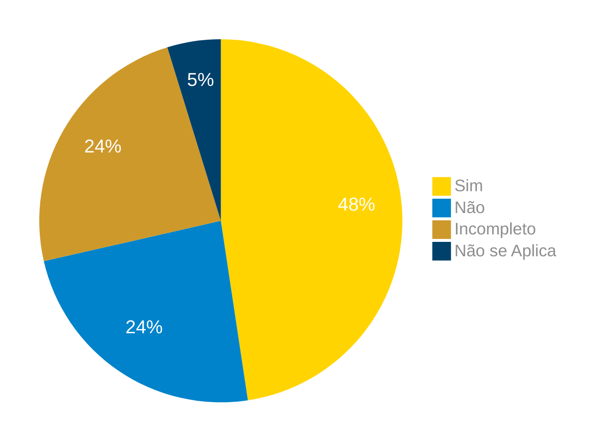

# Verificação do Artefato Metas de Usabilidade

## Introdução

Neste artefato, está descrito os resultados da verificação do artefato de [Metas de Usabilidade](https://interacao-humano-computador.github.io/2024.1-Correios/analise_de_requisitos2/metas-usabilidade/) feito pelo [Grupo 03](https://interacao-humano-computador.github.io/2024.1-Correios/) da disciplina de Interação Humano Computador referente ao site [Correios](https://www.correios.com.br/). Lembrando que o foco não é apontar quem errou e sim os problemas presentes no artefato produzido, e por fim garantir os critérios de qualidade estabelecidos.

## Metodologia

Este artefato foi produzido por [Claudio Henrique][ClaudioGH] e verificado por [Elias Faria][EliasGH], seguindo a divisão planejada pelo grupo na [reunião 7](https://interacao-humano-computador.github.io/2024.1-Correios/atas/ata7/). Para a verificação do artefato, foi utilizada a versão `1.0` datada do dia 12/05/2024. Adotamos a metodologia de inspeção por [checklist](#checklist-de-verificacao) neste processo. Podemos ver pela Tabela 1 de exemplo, que para cada item do checklist teremos: descrição do item em verificação, resposta à avaliação (pode ser "Sim", "Não", "Incompleto" ou "Não se Aplica"), o número da referência bibliográfica e um link para um print da referência que o fundamenta o item. Ao final, na seção de [Problemas Encontrados](#problemas-encontrados), são comentados os itens negativos.

Na Tabela 1 temos a lista de verificação elaborada, ja na Tabelas 2 a aplicação do checklist para os Aspectos Éticos. 

Tabela 1 - Perguntas elaboradas de acordo com as referências bibliográficas.

|ID| Descrição | Avaliação | Referência|Print|
|:--:|:--:|:--:|:--:|:--:|
|01| No documento são elencadas as metas de usabilidade almejadas? ||<a href="#ref1"> REF1 </a>. Cap. 3.2.1 - Pgs. 35 e 36 | [Pg. 35][Pg. 35] e [Pg. 36][Pg. 36] |
|02| No artefato são apresentados os motivos e métodos para a escolha das metas de usabilidade? ||<a href="#ref1"> REF1 </a>. Cap. 3.2.1 - Pgs. 35 e 36|[Pg. 35][Pg. 35] e [Pg. 36][Pg. 36] |
|03| É apresentada a definição das metas de usabilidade? ||<a href="#ref1"> REF1 </a>. Cap. 3.2.1 - Pgs. 35 e 36|[Pg. 35][Pg. 35] e [Pg. 36][Pg. 36] |
|04| São elencadas no artefato as metas de usabilidade de: facilidade de aprendizado, memorabilidade, eficiência, segurança e satisfação do usuário? ||<a href="#ref1"> REF1 </a>. Cap. 3.2.1 - Pgs. 35 e 36|[Pg. 35][Pg. 35] e [Pg. 36][Pg. 36] |
|05| É apresentado no artefato a  meta de usabilidade: facilidade de aprendizado ? ||<a href="#ref1"> REF1 </a>. Cap. 3.2.1 - Pgs. 35 e 36|[Pg. 35][Pg. 35] e [Pg. 36][Pg. 36] |
|06| A verificação da meta de usabilidade de facilidade de aprendizado está adequada? ||<a href="#ref1"> REF1 </a>. Cap. 3.2.1 - Pgs. 35 e 36|[Pg. 35][Pg. 35] e [Pg. 36][Pg. 36] | 
|07| A verificação da meta de usabilidade de memorabilidade está adequada? ||<a href="#ref1"> REF1 </a>. Cap. 3.2.1 - Pgs. 35 e 36|[Pg. 35][Pg. 35] e [Pg. 36][Pg. 36] |
|08| A verificação da meta de usabilidade de eficiência está adequada? ||<a href="#ref1"> REF1 </a>. Cap. 3.2.1 - Pgs. 35 e 36|[Pg. 35][Pg. 35] e [Pg. 36][Pg. 36] |
|09| A verificação da meta de usabilidade de segurança está adequada? ||<a href="#ref1"> REF1 </a>. Cap. 3.2.1 - Pgs. 35 e 36|[Pg. 35][Pg. 35] e [Pg. 36][Pg. 36] |
|10| A verificação da meta de usabilidade de satisfação do usuário está adequada? ||<a href="#ref1"> REF1 </a>. Cap. 3.2.1 - Pgs. 35 e 36|[Pg. 35][Pg. 35] e [Pg. 36][Pg. 36] |

[Pg. 35]:../../../assets/prints_verificacao/elias/metas/35.png
[Pg. 36]:../../../assets/prints_verificacao/elias/metas/36.png

Fonte: [Claudio Henrique][ClaudioGH], 2024.

## Apresentação dos Dados

Aqui será apresentado os resultados do checklist e logo após as observações dos itens com resultado negativo.

### Checklist de verificação

Tabela 2 - Checklist preenchido na verificação

|ID| Descrição | Avaliação | Referência|Print|
|:--:|:--:|:--:|:--:|:--:|
|01| No documento são elencadas as metas de usabilidade almejadas? ||<a href="#ref1"> REF1 </a>. Cap. 3.2.1 - Pgs. 35 e 36 | [Pg. 35][Pg. 35] e [Pg. 36][Pg. 36] |
|02| No artefato são apresentados os motivos e métodos para a escolha das metas de usabilidade? ||<a href="#ref1"> REF1 </a>. Cap. 3.2.1 - Pgs. 35 e 36|[Pg. 35][Pg. 35] e [Pg. 36][Pg. 36] |
|03| É apresentada a definição das metas de usabilidade? ||<a href="#ref1"> REF1 </a>. Cap. 3.2.1 - Pgs. 35 e 36|[Pg. 35][Pg. 35] e [Pg. 36][Pg. 36] |
|04| São elencadas no artefato as metas de usabilidade de: facilidade de aprendizado, memorabilidade, eficiência, segurança e satisfação do usuário? ||<a href="#ref1"> REF1 </a>. Cap. 3.2.1 - Pgs. 35 e 36|[Pg. 35][Pg. 35] e [Pg. 36][Pg. 36] |
|05| É apresentado no artefato a  meta de usabilidade: facilidade de aprendizado ? ||<a href="#ref1"> REF1 </a>. Cap. 3.2.1 - Pgs. 35 e 36|[Pg. 35][Pg. 35] e [Pg. 36][Pg. 36] |
|06| A verificação da meta de usabilidade de facilidade de aprendizado está adequada? ||<a href="#ref1"> REF1 </a>. Cap. 3.2.1 - Pgs. 35 e 36|[Pg. 35][Pg. 35] e [Pg. 36][Pg. 36] | 
|07| A verificação da meta de usabilidade de memorabilidade está adequada? ||<a href="#ref1"> REF1 </a>. Cap. 3.2.1 - Pgs. 35 e 36|[Pg. 35][Pg. 35] e [Pg. 36][Pg. 36] |
|08| A verificação da meta de usabilidade de eficiência está adequada? ||<a href="#ref1"> REF1 </a>. Cap. 3.2.1 - Pgs. 35 e 36|[Pg. 35][Pg. 35] e [Pg. 36][Pg. 36] |
|09| A verificação da meta de usabilidade de segurança está adequada? ||<a href="#ref1"> REF1 </a>. Cap. 3.2.1 - Pgs. 35 e 36|[Pg. 35][Pg. 35] e [Pg. 36][Pg. 36] |
|10| A verificação da meta de usabilidade de satisfação do usuário está adequada? ||<a href="#ref1"> REF1 </a>. Cap. 3.2.1 - Pgs. 35 e 36|[Pg. 35][Pg. 35] e [Pg. 36][Pg. 36] |

[Pg. 35]:../../../assets/prints_verificacao/elias/metas/35.png
[Pg. 36]:../../../assets/prints_verificacao/elias/metas/36.png

Fonte: [Elias Faria][EliasGH], 2024.

### Gravação da verificação

<!-- para o iframe do vídeo, bote width = 560 e height = 315 -->

    <iframe width="560" height="315" src="https://www.youtube.com/embed" title="Apresentação 7 Interação Humano Computador 2024.1 - Grupo 3" frameborder="0" allow="accelerometer; autoplay; clipboard-write; encrypted-media; gyroscope; picture-in-picture; web-share" referrerpolicy="strict-origin-when-cross-origin" allowfullscreen></iframe>

    <a href="link"> Link para o vídeo </a>

## Problemas Encontrados

<!--- Aqui será apresentado todos os problemas identificados durante o processo de verificação do artefato de link do artefato. --->

- ID xx: Descrição
    - Avaliação:
    - Comentário:

## Sumário dos resultados

<!-- Conte as quantidade de ocorrencias e coloque no Grafico a quantidade em cada tipo de avaliação (se não ouver incidencia de um tipo como "não se aplica", apague a linha do mesmo)-->
A seguir, apresentamos a Figura 1 com o gráfico de pizza do sumário dos resultados.

Figura 1 - Gráfico de pizza do sumário dos resultados.

Fonte: [][], 2024.

## Bibliografia

> 1. Barbosa, S. D. J.; Silva, B. S. da; Silveira, M. S.; Gasparini, I.; Darin, T.; Barbosa, G. D. J. (2021) Interação Humano-Computador e Experiência do usuário. Autopublicação. ISBN: 978-65-00-19677-1. 

## Histórico de Versões

| Versão | Data | Descrição | Autor(es) | Revisor(es) |
| :----: | :--: | --------- | ----------- | ------ |
| `1.0`  | 25/06/2024 | Criação do documento | [Claudio Henrique][ClaudioGH] | [][] |

[ClaudioGH]: https://github.com/claudiohsc
[EliasGH]: https://github.com/EliasOliver21
[GabrielBGH]: https://github.com/Bertolazi
[GabrielFGH]: https://github.com/MMcLovin
[PabloGH]: https://github.com/pabloheika
[RicardoGH]: https://www.github.com/avmricardo